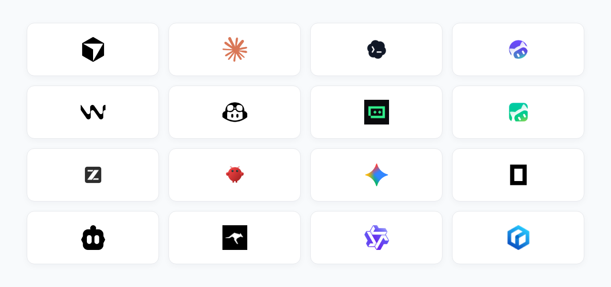

<div align="center"><a name="readme-top"></a>


# CloudBase AI Toolkit

**AI writes the code. CloudBase runs the backend.**

The CloudBase integration layer for AI coding tools: Plugin installs the stack, Skills steer how code is written, MCP operates databases, functions, storage, and deploys from chat.

**English** · [简体中文](./README.zh-CN.md) · [Docs][docs] · [Changelog][changelog] · [Issues][github-issues-link]

[![][npm-version-shield]][npm-link]
[![][npm-downloads-shield]][npm-link]
[![][github-stars-shield]][github-stars-link]
[![][github-forks-shield]][github-forks-link]
[![][github-issues-shield]][github-issues-link]
![][github-license-shield]
![][github-contributors-shield]
[![][cnb-shield]][cnb-link]
[![][deepwiki-shield]][deepwiki-link]

</div>

## Recent updates

**v2.24.x** (2026-07)

- Plugin: Open Plugin Spec; `npx plugins add` for MCP / Skills / Hooks
- PostgreSQL: schema changes default to `applyMigration` (explicit `migrationVersion`)
- Env & observability: `manageEnv` contract fixes; tool calls can attach client info

[Releases][changelog] · [Star][github-stars-link] · Watch → Releases

## What it is

AI IDEs (Cursor, Claude Code, Codex, CodeBuddy, and others) are strong at generating code. What usually blocks you is the backend: schemas, permissions, functions, storage, environments, and release.

[CloudBase](https://docs.cloudbase.net/) is Tencent Cloud’s AI-native all-in-one backend (database, storage, auth, cloud functions, Cloud Run, and more). This repo is the Toolkit that connects that backend to AI tools:

| Piece | Role |
|------|------|
| **Plugin** | Installs MCP Server, Agent Skills, and Hooks together—less per-IDE wiring |
| **Agent Skills** | Scenario skills (Web / Mini Program / database / auth / functions, etc.) toward workable CloudBase practice |
| **MCP** | Login, query and change data, manage functions and hosting, read logs—from the conversation |

This repository ships the npm package `@cloudbase/cloudbase-mcp`, Skills, and AI plugins.

You still need your own CloudBase environment, and you should confirm sensitive actions the AI proposes. The Toolkit provides capability and path—not judgment.

### Related repositories

Publishing and sync repos live under [TencentCloudBase](https://github.com/TencentCloudBase). Directly related to this Toolkit:

| Repository | Contents | Typical entry |
|------|------|----------|
| [CloudBase-AI-Toolkit](https://github.com/TencentCloudBase/CloudBase-AI-Toolkit) (this repo) | MCP Server source; marketplace source for Claude Code / Codex | `npx @cloudbase/cloudbase-mcp@latest` |
| [cloudbase-plugin](https://github.com/TencentCloudBase/cloudbase-plugin) | Open Plugin Spec publish repo (CI-synced): MCP + Skills + Hooks | `npx plugins add TencentCloudBase/cloudbase-plugin` |
| [cloudbase-sites-plugin](https://github.com/TencentCloudBase/cloudbase-sites-plugin) | Sites plugin: Vite Web create & deploy | `npx plugins add TencentCloudBase/cloudbase-sites-plugin` |
| [cloudbase-skills](https://github.com/TencentCloudBase/cloudbase-skills) | Agent Skills collection | `npx skills add TencentCloudBase/cloudbase-skills` |
| [skills](https://github.com/TencentCloudBase/skills) | Per-skill install catalog (also on [skills.sh](https://skills.sh)) | `npx skills add tencentcloudbase/skills --skill <name>` |
| [awesome-cloudbase-examples](https://github.com/TencentCloudBase/awesome-cloudbase-examples) | CloudBase examples and case studies | Browse / clone examples |
| [OpenVibeCoding](https://github.com/TencentCloudBase/OpenVibeCoding) | Vibecoding template on CloudBase | Use as a project starter |

Prefer Plugin for the full stack; Skills alone when you only need knowledge constraints. For marketplace IDEs use this repo—do not also run `npx plugins add` on the same tool.

## Quick start

Pick one default path for your tool.

| Your tool | Suggested path |
|----------|----------|
| Claude Code / Codex (native marketplace) | Add this repo as marketplace, then install the `cloudbase` plugin ([plugin docs](https://docs.cloudbase.net/ai/cloudbase-ai-toolkit/ai-agent-plugins)) |
| Open Plugin Spec tools | `npx plugins add TencentCloudBase/cloudbase-plugin` |
| Prefer one CLI for many tools | [CloudBase AI CLI](https://docs.cloudbase.net/cli-v1/ai/introduce): `npm i -g @cloudbase/cli && tcb ai` |
| CodeBuddy / WorkBuddy / ZCode (built-in) | Use the IDE’s built-in CloudBase plugin or connector |
| Other MCP-capable IDEs | MCP config only (below) |

### Plugin

```bash
npx plugins add TencentCloudBase/cloudbase-plugin
```

Details and IDE differences: [AI plugin docs](https://docs.cloudbase.net/ai/cloudbase-ai-toolkit/ai-agent-plugins).

### MCP only

```json
{
  "mcpServers": {
    "cloudbase": {
      "command": "npx",
      "args": ["@cloudbase/cloudbase-mcp@latest"]
    }
  }
}
```

Hosted HTTP, self-hosted Cloud Mode, and plugin scoping: [Install & connect](#install--connect).

### First prompts

```
Login to CloudBase
```

```
Use CloudBase Skills to build a todo app with login, database and permissions, then deploy
```

Skills shape structure and practice; MCP handles environment and resources. You should be able to verify data and APIs in your own environment—not only get local source files.

### Supported AI IDEs



| Tool | Platform | Guide |
|------|------|------|
| [CloudBase AI CLI](https://docs.cloudbase.net/cli-v1/ai/introduce) | CLI | [Guide](https://docs.cloudbase.net/cli-v1/ai/introduce) |
| [OpenClaw](https://docs.cloudbase.net/ai/cloudbase-ai-toolkit/ide-setup/openclaw) | CLI | [Guide](https://docs.cloudbase.net/ai/cloudbase-ai-toolkit/ide-setup/openclaw) |
| [WorkBuddy](https://docs.cloudbase.net/ai/cloudbase-ai-toolkit/ide-setup/workbuddy) | Standalone IDE | [Guide](https://docs.cloudbase.net/ai/cloudbase-ai-toolkit/ide-setup/workbuddy) |
| [ZCode](https://docs.cloudbase.net/ai/cloudbase-ai-toolkit/ide-setup/zcode) | Standalone IDE (≥ 3.4.1 built-in) | [Guide](https://docs.cloudbase.net/ai/cloudbase-ai-toolkit/ide-setup/zcode) |
| [Codex App](https://docs.cloudbase.net/ai/cloudbase-ai-toolkit/ide-setup/codex) | App | [Guide](https://docs.cloudbase.net/ai/cloudbase-ai-toolkit/ide-setup/codex) |
| [Cursor](https://docs.cloudbase.net/ai/cloudbase-ai-toolkit/ide-setup/cursor) | Standalone IDE | [Guide](https://docs.cloudbase.net/ai/cloudbase-ai-toolkit/ide-setup/cursor) |
| [WindSurf](https://docs.cloudbase.net/ai/cloudbase-ai-toolkit/ide-setup/windsurf) | IDE / plugins | [Guide](https://docs.cloudbase.net/ai/cloudbase-ai-toolkit/ide-setup/windsurf) |
| [CodeBuddy](https://docs.cloudbase.net/ai/cloudbase-ai-toolkit/ide-setup/codebuddy) | Standalone IDE (built-in) | [Guide](https://docs.cloudbase.net/ai/cloudbase-ai-toolkit/ide-setup/codebuddy) |
| [CLINE](https://docs.cloudbase.net/ai/cloudbase-ai-toolkit/ide-setup/cline) | VS Code plugin | [Guide](https://docs.cloudbase.net/ai/cloudbase-ai-toolkit/ide-setup/cline) |
| [GitHub Copilot](https://docs.cloudbase.net/ai/cloudbase-ai-toolkit/ide-setup/github-copilot) | VS Code plugin | [Guide](https://docs.cloudbase.net/ai/cloudbase-ai-toolkit/ide-setup/github-copilot) |
| [Trae](https://docs.cloudbase.net/ai/cloudbase-ai-toolkit/ide-setup/trae) | Standalone IDE | [Guide](https://docs.cloudbase.net/ai/cloudbase-ai-toolkit/ide-setup/trae) |
| [Tongyi Lingma](https://docs.cloudbase.net/ai/cloudbase-ai-toolkit/ide-setup/tongyi-lingma) | IDE / plugins | [Guide](https://docs.cloudbase.net/ai/cloudbase-ai-toolkit/ide-setup/tongyi-lingma) |
| [RooCode](https://docs.cloudbase.net/ai/cloudbase-ai-toolkit/ide-setup/roocode) | VS Code plugin | [Guide](https://docs.cloudbase.net/ai/cloudbase-ai-toolkit/ide-setup/roocode) |
| [Baidu Comate](https://docs.cloudbase.net/ai/cloudbase-ai-toolkit/ide-setup/baidu-comate) | Plugins | [Guide](https://docs.cloudbase.net/ai/cloudbase-ai-toolkit/ide-setup/baidu-comate) |
| [Augment Code](https://docs.cloudbase.net/ai/cloudbase-ai-toolkit/ide-setup/augment-code) | Plugins | [Guide](https://docs.cloudbase.net/ai/cloudbase-ai-toolkit/ide-setup/augment-code) |
| [Claude Code](https://docs.cloudbase.net/ai/cloudbase-ai-toolkit/ide-setup/claude-code) | CLI | [Guide](https://docs.cloudbase.net/ai/cloudbase-ai-toolkit/ide-setup/claude-code) |
| [Gemini CLI](https://docs.cloudbase.net/ai/cloudbase-ai-toolkit/ide-setup/gemini-cli) | CLI | [Guide](https://docs.cloudbase.net/ai/cloudbase-ai-toolkit/ide-setup/gemini-cli) |
| [Codex CLI](https://docs.cloudbase.net/ai/cloudbase-ai-toolkit/ide-setup/openai-codex-cli) | CLI | [Guide](https://docs.cloudbase.net/ai/cloudbase-ai-toolkit/ide-setup/openai-codex-cli) |
| [OpenCode](https://docs.cloudbase.net/ai/cloudbase-ai-toolkit/ide-setup/opencode) | CLI | [Guide](https://docs.cloudbase.net/ai/cloudbase-ai-toolkit/ide-setup/opencode) |
| [Qwen Code](https://docs.cloudbase.net/ai/cloudbase-ai-toolkit/ide-setup/qwen-code) | CLI | [Guide](https://docs.cloudbase.net/ai/cloudbase-ai-toolkit/ide-setup/qwen-code) |

Full setup: [IDE guides](https://docs.cloudbase.net/ai/cloudbase-ai-toolkit/ide-setup/).

## Capabilities

After setup, the AI can do typical backend work in your environment (confirm critical steps):

- **Database**: PostgreSQL and document DB, data models, CRUD, permissions and security rules
- **Compute**: author, deploy, invoke, and debug cloud functions / Cloud Run
- **Auth & storage**: login methods, object storage, permission linkage with data
- **Release & ops**: static hosting / Mini Program publish; inspect logs and redeploy

Fits Web, WeChat Mini Programs, and backend services. Platform overview: [CloudBase docs](https://docs.cloudbase.net/).

### Evaluation

Under controlled conditions, the same Todo application brief and frontend scaffold were used to compare two backend paths: a traditional cloud VM (self-managed runtime, process, and network exposure) and CloudBase (managed database, anonymous auth, and related backend services). An AI agent performed end-to-end development and verification. Given the model and task setup, the CloudBase path was more favorable in completion latency, token usage, and tool-call count. These outcomes are conditioned on the model, agent framework, and task definition, and should not be generalized beyond that scope.

Methods, data, and limits: [Same-task evaluation: cloud VM vs CloudBase](https://docs.cloudbase.net/solutions/vibe-coding-platform/vm-vs-cloudbase-comparison)

## Install & connect

### Prerequisites

- Node.js v18.15.0+
- A [CloudBase environment](https://tcb.cloud.tencent.com/dev)
- An AI tool that supports Plugin / Skills / MCP

### Setup options

1. **Plugin** (when the tool supports it)  
   `npx plugins add TencentCloudBase/cloudbase-plugin`
2. **CloudBase AI CLI**  
   `npm i -g @cloudbase/cli && tcb ai`
3. **Manual MCP** (write the IDE config file)

<details>
<summary>Cursor (.cursor/mcp.json)</summary>

```json
{
  "mcpServers": {
    "cloudbase": {
      "command": "npx",
      "args": ["@cloudbase/cloudbase-mcp@latest"]
    }
  }
}
```

</details>

<details>
<summary>WindSurf (.windsurf/settings.json)</summary>

```json
{
  "mcpServers": {
    "cloudbase": {
      "command": "npx",
      "args": ["@cloudbase/cloudbase-mcp@latest"]
    }
  }
}
```

</details>

<details>
<summary>CodeBuddy</summary>

CloudBase is built in (MCP / Skills); manual config is usually unnecessary.

</details>

Others: [IDE setup guide](https://docs.cloudbase.net/ai/cloudbase-ai-toolkit/ide-setup/).

### MCP connection modes

**Local** (default): `npx` on your machine—full features, including local filesystem upload/templates.

**Hosted**: IDE connects over HTTP to Tencent Cloud MCP; no local Node. Some local-file features are unavailable.

```json
{
  "mcpServers": {
    "cloudbase": {
      "type": "http",
      "url": "https://tcb-api.cloud.tencent.com/mcp/v1?env_id=<env_id>",
      "headers": {
        "X-TencentCloud-SecretId": "<Tencent Cloud Secret ID>",
        "X-TencentCloud-SecretKey": "<Tencent Cloud Secret Key>"
      }
    }
  }
}
```

Hosted URLs can use `enable_plugins` / `disable_plugins`. Canonical names live in `mcp/src/server.ts`.

**Self-hosted Cloud Mode**: set `CLOUDBASE_MCP_CLOUD_MODE=true` (or `MCP_CLOUD_MODE=true`) so local file and process tools are disabled for remote callers.

| Scenario | Suggestion |
|------|------|
| Personal | Local `npx` |
| Team / zero ops | Hosted HTTP |
| Self-hosted MCP | Cloud Mode required |

## Example

**Online Gomoku**: describe the need; get Web + cloud database / realtime and deploy.  
Demo: [Gomoku](https://cloud1-5g39elugeec5ba0f-1300855855.tcloudbaseapp.com/gobang/#/) · More: [tutorials](https://docs.cloudbase.net/ai/cloudbase-ai-toolkit/tutorials)

## Docs

- [MCP tools](doc/mcp-tools.md) ([tools.json](scripts/tools.json))
- [Getting started](https://docs.cloudbase.net/ai/cloudbase-ai-toolkit/getting-started)
- [IDE setup](https://docs.cloudbase.net/ai/cloudbase-ai-toolkit/ide-setup/)
- [AI plugins](https://docs.cloudbase.net/ai/cloudbase-ai-toolkit/ai-agent-plugins)
- [Templates](https://docs.cloudbase.net/ai/cloudbase-ai-toolkit/templates)
- [FAQ](https://docs.cloudbase.net/ai/cloudbase-ai-toolkit/faq)

## FAQ

<details>
<summary>How is this different from Vercel / Netlify?</summary>

Those focus on shipping frontends or containers. CloudBase provides backend building blocks (database, auth, functions). The Toolkit lets AI tools use them in chat. Deploy is only part of the path.

</details>

<details>
<summary>Can I use this without a GUI IDE?</summary>

Yes. Any tool that can configure an MCP Server or install the matching Plugin / Skills works—including Claude Code, Gemini CLI, OpenCode. [Support list](#supported-ai-ides)

</details>

<details>
<summary>Where does my code go?</summary>

Deploy targets your own CloudBase environment. In local mode MCP runs on your machine; code need not leave until you deploy. Cloud traffic uses HTTPS.

</details>

<details>
<summary>Is self-hosting the MCP server safe?</summary>

Local `npx` is equivalent to running tools yourself. For remote hosts, set `CLOUDBASE_MCP_CLOUD_MODE=true` to disable local file/process tools. Tencent Cloud hosted HTTP includes this protection.

</details>

<details>
<summary>Cost?</summary>

The Toolkit (including MCP) is open source under MIT. CloudBase has free quotas; usage beyond that is billed—see [billing](https://cloud.tencent.com/document/product/876/39095).

</details>

<details>
<summary>Login says environment does not exist?</summary>

Confirm an environment exists and is healthy in the [console](https://tcb.cloud.tencent.com/), then login again and pick the right one.

</details>

## Community

| | |
|--|--|
| Docs | [docs.cloudbase.net](https://docs.cloudbase.net/) |
| Issues | [GitHub Issues](https://github.com/TencentCloudBase/CloudBase-AI-Toolkit/issues) |
| Releases | [Changelog][changelog] |

## Activity


## Contributors

[](https://github.com/TencentCloudBase/CloudBase-AI-Toolkit/graphs/contributors)

---

[MIT](LICENSE) · [TencentCloudBase](https://github.com/TencentCloudBase)

<!-- Links -->
[docs]: https://docs.cloudbase.net/ai/cloudbase-ai-toolkit/
[changelog]: https://github.com/TencentCloudBase/CloudBase-AI-Toolkit/releases
[github-issues-link]: https://github.com/TencentCloudBase/CloudBase-AI-Toolkit/issues
[github-stars-link]: https://github.com/TencentCloudBase/CloudBase-AI-Toolkit/stargazers
[github-forks-link]: https://github.com/TencentCloudBase/CloudBase-AI-Toolkit/network/members
[npm-link]: https://www.npmjs.com/package/@cloudbase/cloudbase-mcp
[cnb-link]: https://cnb.cool/tencent/cloud/cloudbase/CloudBase-AI-Toolkit
[deepwiki-link]: https://deepwiki.com/TencentCloudBase/CloudBase-AI-Toolkit

<!-- Shields -->
[npm-version-shield]: https://img.shields.io/npm/v/@cloudbase/cloudbase-mcp?color=3B82F6&label=npm&logo=npm&style=flat-square
[npm-downloads-shield]: https://img.shields.io/npm/dw/@cloudbase/cloudbase-mcp?color=10B981&label=downloads&logo=npm&style=flat-square
[github-stars-shield]: https://img.shields.io/github/stars/TencentCloudBase/CloudBase-AI-Toolkit?color=F59E0B&label=stars&logo=github&style=flat-square
[github-forks-shield]: https://img.shields.io/github/forks/TencentCloudBase/CloudBase-AI-Toolkit?color=8B5CF6&label=forks&logo=github&style=flat-square
[github-issues-shield]: https://img.shields.io/github/issues/TencentCloudBase/CloudBase-AI-Toolkit?color=EC4899&label=issues&logo=github&style=flat-square
[github-license-shield]: https://img.shields.io/badge/license-MIT-6366F1?logo=github&style=flat-square
[github-contributors-shield]: https://img.shields.io/github/contributors/TencentCloudBase/CloudBase-AI-Toolkit?color=06B6D4&label=contributors&logo=github&style=flat-square
[cnb-shield]: https://img.shields.io/badge/CNB-CloudBase--AI--Toolkit-3B82F6?logo=data:image/svg+xml;base64,PHN2ZyB3aWR0aD0iMTIiIGhlaWdodD0iMTIiIHZpZXdCb3g9IjAgMCAxMiAxMiIgZmlsbD0ibm9uZSIgeG1sbnM9Imh0dHA6Ly93d3cudzMub3JnLzIwMDAvc3ZnIj48cmVjdCB3aWR0aD0iMTIiIGhlaWdodD0iMTIiIHJ4PSIyIiBmaWxsPSIjM0I4MkY2Ii8+PHBhdGggZD0iTTUgM0g3VjVINSIgc3Ryb2tlPSJ3aGl0ZSIgc3Ryb2tlLXdpZHRoPSIxLjUiLz48cGF0aCBkPSJNNSA3SDdWOUg1IiBzdHJva2U9IndoaXRlIiBzdHJva2Utd2lkdGg9IjEuNSIvPjwvc3ZnPg==&style=flat-square
[deepwiki-shield]: https://deepwiki.com/badge.svg
