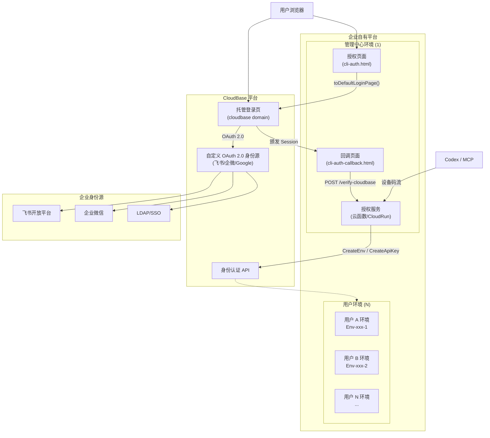
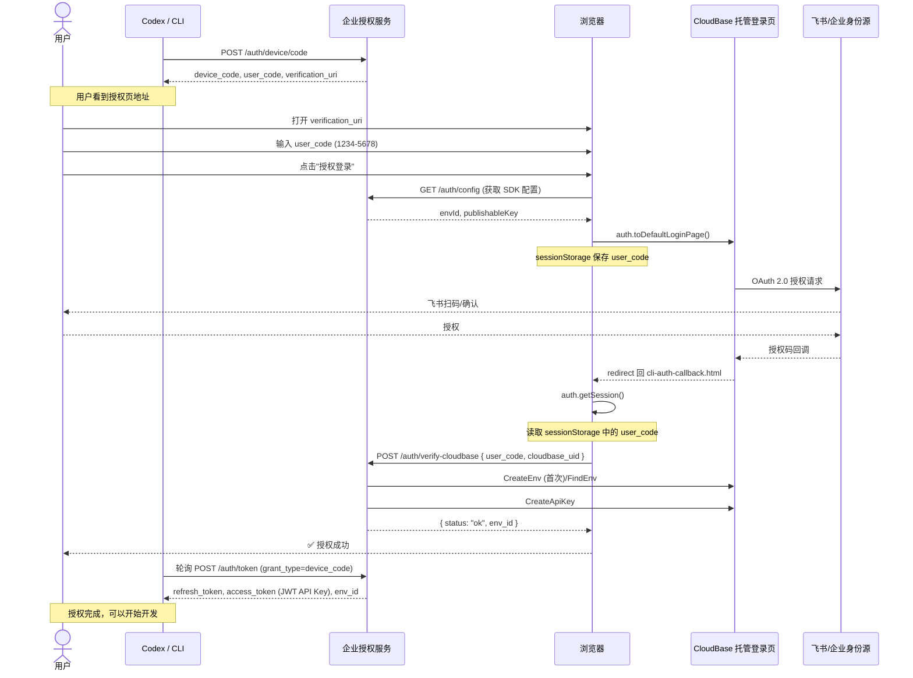
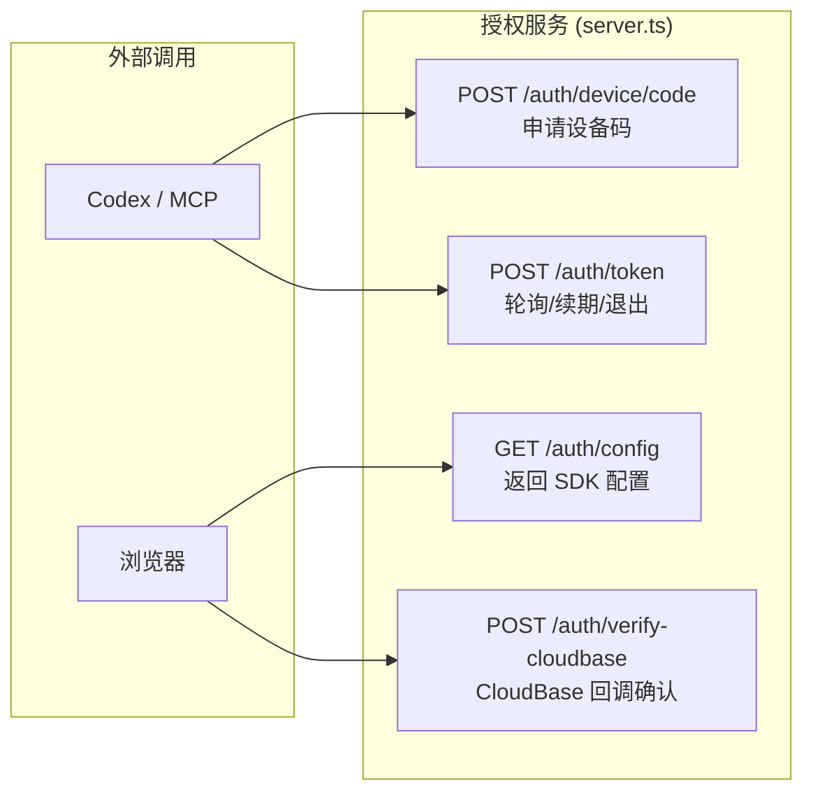

# 企业自有品牌 AI 平台对接指南 — 飞书/企业微信 SSO 集成方案

> 参考代码：[`examples/cloudbase-auth-endpoint-with-feishu/`](https://github.com/TencentCloudBase/CloudBase-MCP/tree/main/examples/cloudbase-auth-endpoint-with-feishu) + CloudBase 托管登录页 + 自定义 OAuth 2.0 身份源

---

## 1. 背景

企业 AI 平台（如 Coding Agent、MCP 工具台等）需要对接客户现有账号体系时，面临两个关键问题：

1. **用户不感知腾讯云**：需要在企业自有域名下完成认证
2. **对接企业身份源**：用户希望使用飞书/企业微信/LDAP 等现有账号登录

CloudBase 提供了 **托管登录页 + 自定义 OAuth 2.0 身份源** 方案，企业只需在控制台配置身份源，无需自行实现飞书 OAuth 回调、token 交换、用户信息拉取等复杂逻辑。

参考代码见 [`examples/cloudbase-auth-endpoint-with-feishu/`](https://github.com/TencentCloudBase/CloudBase-MCP/tree/main/examples/cloudbase-auth-endpoint-with-feishu)，配合 CloudBase 托管登录页，实现完整的企业自有品牌授权流程。

---

## 2. 整体架构（1+N）



**架构说明**：

- **1 个管理中心环境**：部署授权服务（含设备码 API + 授权页 + 回调页），在 CloudBase 控制台配置自定义 OAuth 2.0 身份源
- **N 个用户环境**：每个用户成功认证后自动创建独立环境，签发 API Key，环境间资源完全隔离
- **CloudBase 托管登录页**：统一的 SSO 入口，展示所有已配置的身份源，处理后端 OAuth 回调

---

## 3. 前提条件

### 3.1 云开发环境

| 资源 | 说明 |
|------|------|
| 管理中心环境 | 1 个 CloudBase 环境，用于部署授权服务 |
| Publishable Key | 控制台「身份认证 → 应用管理」获取 |
| **腾讯云 API 密钥** | 控制台「访问管理 → API 密钥管理」获取（需具备 `tcb:CreateEnv` + `tcb:CreateApiKey` 权限） |

### 3.2 企业身份源

以飞书为例，需要在飞书开放平台创建企业自建应用：

| 配置项 | 说明 |
|--------|------|
| App ID | 飞书应用唯一标识 |
| App Secret | 飞书应用密钥 |
| 授权回调地址 | 填入 CloudBase 控制台提供的托管登录页回调地址 |

> 企业微信、Google Workspace 等其他 OAuth 2.0 身份源配置步骤类似，区别在于身份源侧的授权端点不同。

### 3.3 CloudBase 控制台配置

1. 登录 [CloudBase 控制台](https://tcb.cloud.tencent.com/dev)，进入管理中心环境
2. 左侧菜单 → **身份认证 → 企业身份源**
3. 添加自定义 OAuth 2.0 身份源：
   - 名称：如 "飞书"
   - 授权端点：飞书 OAuth 授权 URL
   - Token 端点：飞书 OAuth Token URL
   - Client ID：飞书 App ID
   - Client Secret：飞书 App Secret
   - 回调地址：复制控制台提供的地址，填入飞书开放平台
4. 进入 **身份认证 → 托管登录页**，勾选刚配置的身份源，保存

> 控制台配置一次即可，后续所有应用自动继承，无需修改代码。

---

## 4. 部署授权服务

### 4.1 克隆示例代码

```bash
# 从 GitHub 克隆仓库
git clone https://github.com/TencentCloudBase/CloudBase-MCP.git
cd CloudBase-MCP/examples/cloudbase-auth-endpoint-with-feishu
npm install
```

### 4.2 配置环境变量

```bash
cp .env.example .env
```

编辑 `.env` 文件：

```env
# 服务端口（SCF HTTP 函数固定为 9000）
PORT=9000
# 授权服务基础地址（替换为实际部署后的网关 URL）
BASE_URL=https://{your-gateway-domain}/{path-prefix}

# CloudBase 管理中心环境
CLOUDBASE_ENV_ID=your-management-env-id
CLOUDBASE_PUBLISHABLE_KEY=your-publishable-key
CLOUDBASE_REGION=ap-shanghai

# 腾讯云 API 密钥（用于创建用户环境 + 签发 API Key）
TENCENTCLOUD_SECRET_ID=your-secret-id
TENCENTCLOUD_SECRET_KEY=your-secret-key
```

### 4.3 本地开发运行

```bash
npm run dev
```

### 4.4 部署到云开发

推荐在 AI 开发工具中配置 CloudBase MCP，然后通过自然语言让 AI 自动完成部署。

**前提**：确保 AI 开发工具已启用 CloudBase MCP（参见[配置指南](https://docs.cloudbase.net/ai/cloudbase-ai-toolkit/ide-setup/codebuddy)）。

**数据库集合准备**：授权服务使用 CloudBase NoSQL 文档数据库存储设备码和令牌记录，部署前需要在环境中创建以下集合（MCP 工具会自动创建，或手动在控制台创建）：

| 集合名 | 用途 |
|--------|------|
| `auth_devices` | 存储设备码记录及用户-环境-API Key 关联关系 |
| `auth_refresh_tokens` | 存储 refresh token 用于续期和退出 |

在 AI 对话中输入：

> 帮我将 `examples/cloudbase-auth-endpoint-with-feishu` 目录部署为 SCF HTTP 函数，函数名 `auth-service`，runtime Nodejs18.15，超时 120 秒，环境变量从 `.env` 文件中读取。部署后再添加一个网关路由指向该函数。

AI 会自动使用 MCP 工具完成以下操作：

1. **创建云函数**：调用 `manageFunctions`，上传代码、安装依赖、配置环境变量
2. **配置网关**：调用 `manageGateway`，为云函数创建 HTTP 访问入口
3. **返回访问地址**：部署完成后返回网关 URL

**注意事项**：
- 网关路由不要使用 `domain: "*"` 的通配域名，会拦截 CloudBase 内置的 `__auth/` 托管登录页
- **网关 `path` 参数与 `TCB_AUTH_OAUTH_ENDPOINT` 直接相关**：创建 HTTP 访问入口时指定的 `path` 就是后续配置中的路径前缀。例如 `path=/auth` 时，endpoint 为 `https://{gateway-domain}/auth`；工具箱会自动拼接 `/device/code`、`/token` 等子路径。如果修改了 path，需同步更新 `TCB_AUTH_OAUTH_ENDPOINT` 环境变量
- 首次部署后可绑定企业自有域名（如 `auth.your-company.com`）
- 后续更新代码只需让 AI 调用 `updateFunctionCode` 即可

### 4.5 验证服务

```bash
# 测试设备码申请接口（将 {base-url} 替换为实际网关地址）
curl -X POST https://{base-url}/auth/device/code \
  -H 'Content-Type: application/json' \
  -d '{}'

# 响应示例
{
  "device_code": "a1b2c3d4...",
  "user_code": "1234-5678",
  "verification_uri": "https://{base-url}/cli-auth.html",
  "expires_in": 600,
  "interval": 3
}
```

---

## 5. 对接 Codex

### 5.1 安装插件

在 Codex 中安装 `cloudbase-auth` 插件，或手动配置 MCP 环境变量：

```json
{
  "mcp_servers": {
    "cloudbase": {
      "command": "npx",
      "args": ["@cloudbase/cloudbase-mcp@latest"],
      "env": {
        "INTEGRATION_IDE": "Codex",
        "TCB_AUTH_OAUTH_ENDPOINT": "https://{your-gateway-domain}/{path-prefix}"
      }
    }
  }
}
```

> **关于 `TCB_AUTH_OAUTH_ENDPOINT` 的值**：根据网关创建 HTTP 访问入口时的 `path` 参数决定。例如网关 path 设为 `/auth`，则 endpoint 为 `https://{gateway-domain}/auth`。该值与网关 path 前缀一致，工具箱内部会自动拼接 `/device/code`、`/token` 等子路径。

**可选配置项：**

| 环境变量 | 说明 | 默认值 |
|---------|------|--------|
| `TCB_AUTH_CLIENT_ID` | 自定义 device-code 登录 client_id（高级可选） | 不设则使用默认 client_id |
| `TCB_AUTH_OAUTH_CUSTOM` | 自定义 endpoint 返回格式开关（高级可选） | 未配置 endpoint 时默认 `false`；配置 endpoint 后默认 `true` |

### 5.2 设备码登录

配置好 `TCB_AUTH_OAUTH_ENDPOINT` 后，Codex 会在自动执行设备码授权流程，CLI 会输出设备码和授权页地址：

```
Device confirmation requested. Open the following URL in your browser:
  https://{base-url}/cli-auth.html

Enter the code: 1234-5678
Waiting for authorization...
```

### 5.3 浏览器授权

打开授权页，输入设备码，点击「授权登录」：



### 5.4 验证开发能力

登录成功后，Codex 中的 MCP 工具即可通过自然语言操作用户环境：

> **查看环境信息**：输入"查看当前环境信息"或"列出所有环境"
>
> **部署云函数**：输入"帮我部署一个 hello-world 云函数"或"将当前目录下的函数部署到云端"
>
> **操作数据库**：输入"查询 users 集合中的所有数据"或"在数据库中创建一个新表"
>
> **管理存储**：输入"上传文件到云存储"或"列出存储桶中的文件"

AI 会自动调用相应的 MCP 工具完成操作，无需手动输入 CLI 命令。

---

## 6. 关键文件说明

### 6.1 服务端代码

| 文件 | 说明 |
|------|------|
| `src/server.ts` | HTTP 入口，定义核心端点（设备码申请、CloudBase 回调确认、Token 轮询、SDK 配置等） |
| `src/config.ts` | 环境变量读取 |
| `src/types.ts` | 设备码记录、Token 记录、请求体类型 |
| `src/utils/auth.ts` | CloudBase HTTP API 的 `access_token` 归属校验工具 |
| `src/utils/oauth.ts` | 设备码/用户码生成、OAuth 错误结构 |
| `src/utils/device-store.ts` | 设备码记录存储（示例用内存，生产可用数据库） |
| `src/utils/tcb.ts` | CloudBase API 调用（CreateEnv/CreateApiKey） |

### 6.2 前端页面

| 文件 | 说明 |
|------|------|
| `public/cli-auth.html` | 授权页：用户输入设备码，跳转托管登录页 |
| `public/cli-auth-callback.html` | 回调页：处理 OAuth 回调，完成设备码授权 |

### 6.3 server.ts 核心端点



---

## 7. 扩展方向

| 扩展项 | 说明 |
|--------|------|
| **持久化存储** | 将内存 deviceStore / refreshTokenStore 替换为 Redis 或数据库 |
| **权限收敛** | API Key 以 `api_key` 类型签发（完整管理员权限），可结合 `publish_key`（前端只读）使用 |
| **审计日志** | 记录每次设备码申请、授权、续期操作 |
| **限流** | 对设备码申请、Token 轮询等接口增加频率限制 |
| **多源同时启用** | 在控制台同时启用飞书 + 企业微信 + LDAP，用户自由选择 |
| **SAML 身份源** | 支持 SAML 协议的企业身份源 |
| **CI/CD 集成** | 将授权服务部署纳入 CI/CD 流程 |

---

## 8. FAQ

**Q: 用户一定需要飞书账号吗？**
A: 不需要。企业可以在 CloudBase 控制台配置任意数量的身份源。可以同时启用飞书、企业微信、LDAP 等，用户在登录页自行选择。

**Q: 托管登录页的域名是什么？**
A: 托管登录页在 CloudBase 域名下，但用户授权流程的入口（授权页）在企业自有域名下，用户感知不到 CloudBase 的存在。

**Q: 环境创建需要多久？**
A: CreateEnv 操作通常需要 10-30 秒。在环境创建期间，MCP 轮询 `/auth/token` 会持续返回 `authorization_pending`，创建完成后返回凭证。

**Q: 如何处理用户删除/离职？**
A: 在飞书/身份源侧禁用账号后，下次尝试获取新 Token 时认证失败。已有 Session 在过期后失效。可以扩展授权服务增加主动注销 API。

**Q: 这个方案支持现有的 API Key 对接方式吗？**
A: 支持。上述方案通过 `CreateApiKey` API（详见 [文档](https://cloud.tencent.com/document/api/876/129835)）为每个用户环境签发 `api_key` 类型凭证。也可以改用 `publish_key` 类型（前端只读）。
