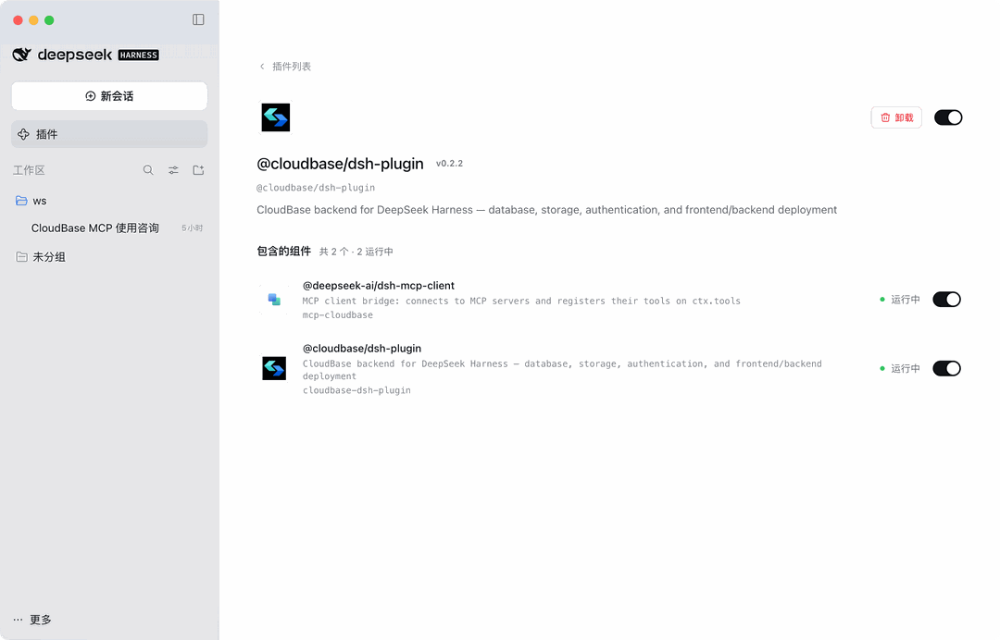

import IDESelector from '../components/IDESelector';
import RelatedResources from '../components/RelatedResources';

# DeepSeek Harness 配置指南

[DeepSeek Harness](https://github.com/deepseek-ai/deepseek-harness)（简称 DSH）是 DeepSeek 的桌面端 Agent 应用。安装 `@cloudbase/dsh-plugin` 后，可以在对话里直接建表、上传文件、部署前后端。

配置后，你可以在 DSH 的对话中直接操作 CloudBase 服务。

**例如：**

- "用云开发做一个微信小程序点餐系统" - AI 搭页面、建云数据库、写云函数并引导预览
- "做一个预约管理系统，支持用户下单和后台改状态" - AI 用 CloudBase PostgreSQL 建模、配权限并接好前后端
- "给 Web 应用加上手机号登录" - AI 启用认证方式并接入 CloudBase SDK

无需切换到云控制台，所有操作都可以在 DSH 中用自然语言完成。

## 前置条件

在开始配置之前，请确保满足以下条件：

<details>
<summary><strong>已准备好 DSH 与 Node.js 环境</strong></summary>

**DSH 版本：** 兼容 `>=0.1.0-rc.6 <0.3.0`（已在 `0.2.0-rc.2` 上验证）。终端执行 `dsh --version` 查看当前版本。

**Node.js 环境：** 确保已安装 Node.js v18 或更高版本：

```bash
node --version
```

如果未安装，请从 [Node.js 官网](https://nodejs.org/en/download) 下载安装。

**云开发环境：** 请参考文档 [开通云开发环境](../../../quick-start/create-env)。新用户可以免费开通体验。

</details>

---

<IDESelector defaultIDE="deepseek-harness" />

## 安装

插件有两种安装形态，按需要选择：

| 形态 | 包含内容 | 适用场景 |
| --- | --- | --- |
| Web UI | MCP 工具 + 会话内的结果表格、部署预览等界面 | 日常使用 |
| Headless | 只有 MCP 工具，不需要前端构建 | 只要工具能力，或环境里跑不了前端构建 |

### Web UI（推荐）

一键脚本会完成安装与依赖准备：

```bash
curl -fsSL https://raw.githubusercontent.com/TencentCloudBase/CloudBase-AI-Toolkit/main/dsh-plugin/scripts/install.sh | bash
```

也可以手动执行，等价于下面几步：

```bash
dsh plugin --profile web add @cloudbase/dsh-plugin
# pnpm ≥9 默认禁止依赖 install 脚本（protobufjs 会失败），一键脚本已包含这一步
echo "enable-scripts=true" >> ~/.dsh/profiles/web/.npmrc
(cd ~/.dsh/profiles/web && pnpm install)
dsh --profile web
```

### Headless

只要 MCP 工具、不需要界面时：

```bash
dsh plugin --profile headless add @cloudbase/dsh-plugin
dsh --profile headless "列出所有 mcp__cloudbase__ 工具"
```

## 装好之后怎么用

打开 DSH 的插件页，能看到 `@cloudbase/dsh-plugin` 已就位，包含的组件显示 **运行中**。插件装完后由两个组件协作：

| 组件 | 作用 |
| --- | --- |
| `@deepseek-ai/dsh-mcp-client` | DSH 自带的 MCP 客户端桥，把 MCP 服务暴露的工具注册进来 |
| `@cloudbase/dsh-plugin` | CloudBase 插件本体，提供 31 个技能与 MCP 工具 |



首次使用需要登录一次（见下一节），之后新开会话直接说需求即可。

写操作（执行 SQL、上传文件、删除数据）不会静默执行，会回到会话里等你确认。

## 登录（device-code，不需要 API Key）

插件不传 CloudBase 环境、不传 API Key，登录走 cloudbase-mcp 自身的 device-code 流程。本机已有 `tcb login` 登录态时会直接复用。

没有登录态时，对模型说：

```
调用 mcp__cloudbase__auth，action=start_auth，authMode=device，把 verification URL 给我。
```

在浏览器里授权一次，登录态就会持久化。再用 `mcp__cloudbase__auth` 的 `action=set_env` 选择环境，后续工具自动使用该环境。

> **注意：** 不要给插件配置 `CLOUDBASE_API_KEY`。无效的 Key 会挡住 device-code 登录，登录与环境选择全部走 `mcp__cloudbase__auth`。

## 注意事项

1. **Web UI 插件需要重建 DSH web 前端**：装完在界面上看不到插件卡片时，从 DSH 安装目录执行 `pnpm run build:web` 再重启 DSH；Headless 不需要。
2. **首次拉包可能要 10–90 秒**：headless 第一轮工具列表可能为空，重试即可。
3. **技能由插件注册**，不会拷进 `~/.dsh/skills`；环境用 `auth` 的 `set_env` 绑定，用 `action=status` 查看。
4. **凭据只存在本机**（tcb 登录态或 `~/.dsh/.credentials.yaml`，权限 600），插件不上传密钥，读操作只访问你自己的 CloudBase 环境。

## 验证连接

在对话中输入：

```
检查 CloudBase 工具是否可用
```

或直接提一个具体需求：

```
帮我查一下当前 CloudBase 环境的状态
```

## 常见问题

**Q: 插件页里看不到 CloudBase 插件？**
A: Web UI 形态需要重建一次 DSH web 前端（见上方注意事项第 1 条），然后重启 DSH。

**Q: 工具列表是空的？**
A: 首次安装需要下载依赖，等 10–90 秒后重试；确认本机 Node.js 可用、网络连接正常。

**Q: 一直提示未登录 / 登录失败？**
A: 检查是否给插件配了 `CLOUDBASE_API_KEY`，有的话删掉再重新走一次 device-code 登录。

**Q: 工具数量显示为 0？**
A: 请参考[常见问题](../faq#mcp-显示工具数量为-0-怎么办)。

更多问题请查看：[完整 FAQ](../faq)

<RelatedResources ideName="DeepSeek Harness" ideDocUrl="https://github.com/deepseek-ai/deepseek-harness" />
