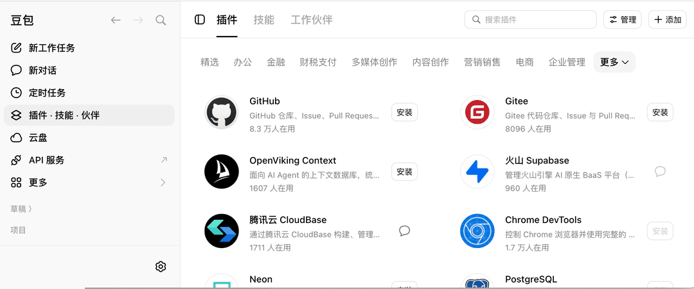
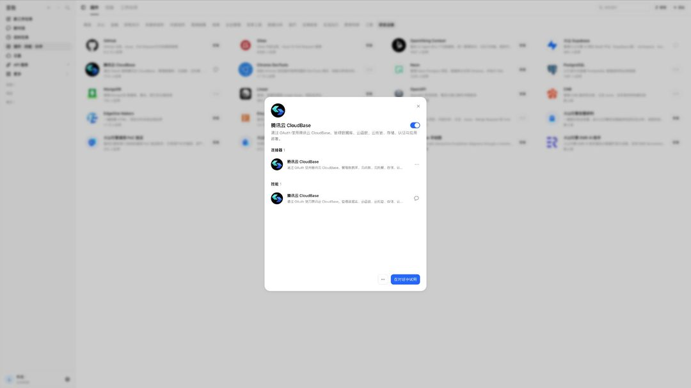
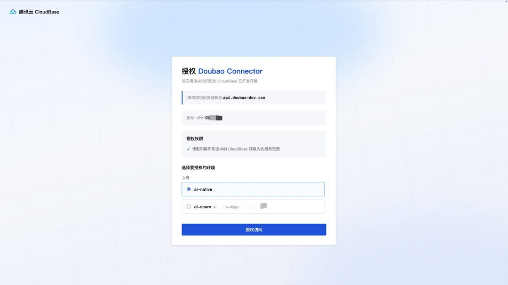
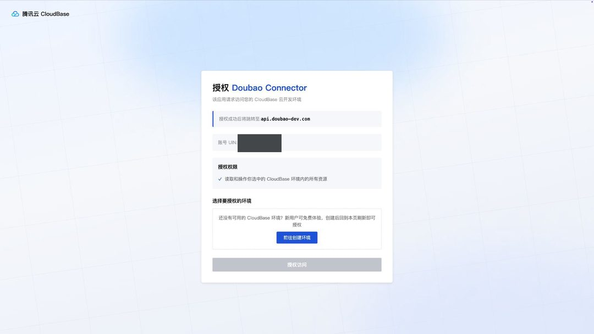

import IDESelector from '../components/IDESelector';
import RelatedResources from '../components/RelatedResources';

# 豆包配置指南

[豆包](https://www.doubao.com/) 是字节跳动推出的 AI 助手，**桌面端与网页版**都已支持 CloudBase 插件。插件已在豆包插件市场的 **精选** 分类上架，位于 **研发运维** 分组。

配置后，你可以在豆包的对话中直接操作 CloudBase 服务。

**例如：**

- "用云开发做一个微信小程序点餐系统" - AI 搭页面、建云数据库、写云函数并引导预览
- "做一个预约管理系统，支持用户下单和后台改状态" - AI 用 CloudBase PostgreSQL 建模、配权限并接好前后端
- "给 Web 应用加上手机号登录" - AI 启用认证方式并接入 CloudBase SDK

无需切换到云控制台，所有操作都可以在豆包中用自然语言完成。

## 前置条件

在开始配置之前，请确保满足以下条件：

<details>
<summary><strong>已准备好腾讯云账号和云开发环境</strong></summary>

**豆包：** 桌面端与网页版均可，建议升级到最新版本。

**腾讯云账号：** 授权时会读取当前登录的腾讯云账号，请先确认该账号下已开通云开发。

**云开发环境：** 请参考文档 [开通云开发环境](../../../quick-start/create-env)。新用户可以免费开通体验。

</details>

---

<IDESelector defaultIDE="doubao" />

## 通过插件市场安装

豆包内置插件市场，CloudBase 已上架「精选」分类：

1. 打开豆包，在左侧导航点击 **插件·技能·伙伴**
2. 顶部切换到 **插件** 标签，分类选择 **精选**
3. 往下拉到 **研发运维** 分组，找到 **腾讯云 CloudBase** 卡片
4. 点击卡片右侧的 **安装**
5. 点击右上角 **管理**，确认 **腾讯云 CloudBase** 的开关已打开





安装后插件由 **1 个连接器**（腾讯云 CloudBase）和同名技能组成。

> 网页版（[doubao.com](https://www.doubao.com/)）的插件入口在左侧导航，安装方式与桌面端一致。

## 首次授权

第一次使用时，豆包会跳转到 CloudBase 的授权页：

1. 页面上方显示当前登录的腾讯云账号 UIN
2. 页面的授权说明是「读取和操作您选中的 CloudBase 环境内的所有资源」
3. 在环境下拉框中选择一个要授权的环境
4. 点击 **授权访问**

授权成功后，页面会跳转回 `api.doubao-dev.com`。



整个流程不需要你填写任何 SecretId 或 API Key。

**如果账号下还没有环境**，授权页会提示先创建一个：



新用户可以免费开通云开发环境，创建完成后回到授权页刷新，就能在下拉框中选中新环境。

### 换一个环境

想换到别的环境上开发，重新走一遍授权、在授权页里选择另一个环境即可，不需要修改任何配置。

> **注意：** 如果你在开发微信小程序，登录 CloudBase 时请选择 **微信公众平台登录**。

## 验证连接

授权完成后，在对话中输入：

```
检查 CloudBase 工具是否可用
```

或直接提一个具体需求：

```
帮我查一下当前 CloudBase 环境的状态
```

## 常见问题

**Q: 精选分类里找不到「腾讯云 CloudBase」？**
A: 在插件页顶部的搜索框里搜索 `CloudBase`；仍找不到时请先升级豆包到最新版本。

**Q: 卡片右侧不是「安装」按钮？**
A: 说明这个插件已经装过了 —— 已安装的卡片会把 **安装** 换成进入对话的图标。想确认状态，打开右上角 **管理** 看开关。

**Q: 授权页里选不到环境？**
A: 说明当前腾讯云账号下还没有云开发环境，先在授权页按提示免费开通一个，再回到授权页刷新。

**Q: 工具数量显示为 0？**
A: 请参考[常见问题](../faq#mcp-显示工具数量为-0-怎么办)。

更多问题请查看：[完整 FAQ](../faq)

<RelatedResources ideName="豆包" ideDocUrl="https://www.doubao.com/" />
