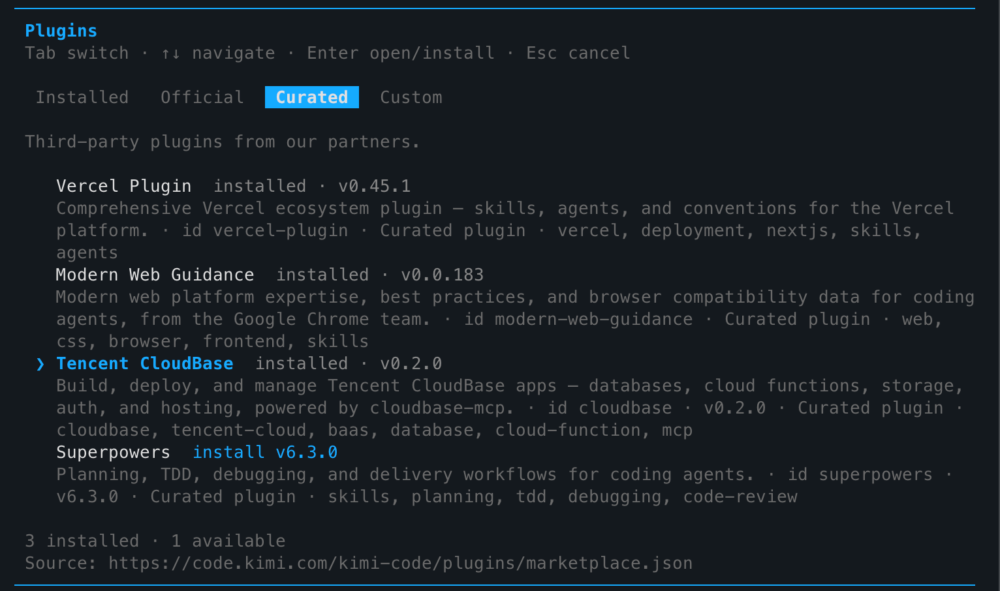

import IDESelector from '../components/IDESelector';
import RelatedResources from '../components/RelatedResources';

# Kimi Code 配置指南

[Kimi Code](https://kimi.com/) 是月之暗面（Moonshot AI）推出的终端优先 AI 编程客户端，支持插件市场与 MCP。本页说明如何在 Kimi Code 中启用 CloudBase 插件。

配置后，你可以在 Kimi Code 的 AI 对话中直接操作 CloudBase 服务。

**例如：**

- "用云开发做一个微信小程序点餐系统" - AI 搭页面、建云数据库、写云函数并引导预览
- "做一个预约管理系统，支持用户下单和后台改状态" - AI 用 CloudBase PostgreSQL 建模、配权限并接好前后端
- "给 Web 应用加上手机号登录" - AI 启用认证方式并接入 CloudBase SDK

无需切换到云控制台，所有操作都可以在 Kimi Code 中用自然语言完成。

## 前置条件

在开始配置之前，请确保满足以下条件：

<details>
<summary><strong>已准备好 Node.js 环境和云开发环境</strong></summary>

**Kimi Code 版本：** 请使用已支持插件市场的版本（`/plugins` 命令可用）。

**Node.js 环境：** 确保已安装 Node.js v18.15.0 或更高版本：

```bash
node --version
```

如果未安装，请从 [Node.js 官网](https://nodejs.org/en/download) 下载安装。

**云开发环境：** 请参考文档 [开通云开发环境](../../quick-start/create-env)。新用户可以免费开通体验。

</details>

---

<IDESelector defaultIDE="kimi-code" showInstallButton={false} />

## 通过插件市场安装（推荐）

Kimi Code 内置插件市场，CloudBase 已作为 Curated（精选）插件上架：

1. 在 Kimi Code 中输入 `/plugins` 打开插件面板
2. 切换到 **Curated** 标签页
3. 找到 **Tencent CloudBase**（id: `cloudbase`），回车选择 **install**
4. 安装完成后显示 `installed · v0.x.x`



> 插件市场数据源：`https://code.kimi.com/kimi-code/plugins/marketplace.json`

安装后重启 Kimi Code 或新开对话，CloudBase 的 29+ 技能和 MCP 工具即可自动加载。

## 手动配置 MCP（可选）

若需手动配置或调试，可编辑 Kimi Code 的 MCP 配置文件：

### 配置路径

```bash
~/.kimi-code/mcp.json
```

### JSON 配置

```json
{
  "mcpServers": {
    "cloudbase": {
      "command": "npx",
      "args": ["-y", "@cloudbase/cloudbase-mcp@latest"],
      "env": {
        "INTEGRATION_IDE": "Kimi Code"
      }
    }
  }
}
```

## 验证连接

配置完成后，在 Kimi Code 对话中输入：

```
检查 CloudBase 工具是否可用
```

或尝试一个具体任务：

```
帮我查一下当前 CloudBase 环境的状态
```

## 常见问题

**Q: /plugins 命令找不到？**
A: 请确认 Kimi Code 版本支持插件市场功能。部分旧版本可能需要升级到最新版。

**Q: Curated 列表里没有 Tencent CloudBase？**
A: 尝试切换到 **Official** 或 **Custom** 标签页搜索；也可使用上方「手动配置 MCP」方式。

**Q: MCP 连接失败？**
A: 检查本机 Node.js 是否可用，确认网络连接正常，重启 Kimi Code 后重试。

**Q: 工具数量显示为 0？**
A: 请参考[常见问题](../faq#mcp-显示工具数量为-0-怎么办)。

更多问题请查看：[完整 FAQ](../faq)

<RelatedResources ideName="Kimi Code" ideDocUrl="https://kimi.com/" />
