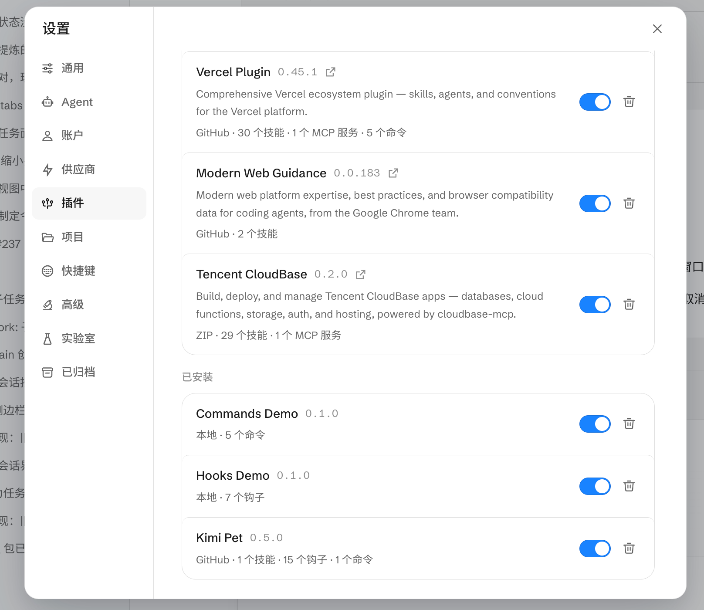

import IDESelector from '../components/IDESelector';
import RelatedResources from '../components/RelatedResources';

# Kimi Work 配置指南

[Kimi Work](https://kimi.com/) 是月之暗面（Moonshot AI）推出的桌面端 AI 助手，面向知识工作者，支持插件系统与 MCP。本页说明如何在 Kimi Work 中启用 CloudBase 插件。

配置后，你可以在 Kimi Work 的对话中直接调用 CloudBase 的数据库、云函数、存储、认证等能力。

**例如：**

- "帮我创建一个 CloudBase PostgreSQL 表" - AI 引导建模并执行 DDL
- "部署一个 CloudBase 云函数" - AI 编写代码并完成部署
- "查询今天的新增用户数" - AI 构造查询并返回结果

## 前置条件

<details>
<summary><strong>已准备好 Node.js 环境和云开发环境</strong></summary>

**Kimi Work 版本：** 请使用已支持「设置 → 插件」面板的版本。

**Node.js 环境：** 确保已安装 Node.js v18.15.0 或更高版本：

```bash
node --version
```

**云开发环境：** 请参考文档 [开通云开发环境](../../quick-start/create-env)。新用户可以免费开通体验。

</details>

---

<IDESelector defaultIDE="kimi-work" showInstallButton={false} />

## 通过插件面板安装（推荐）

Kimi Work 内置插件管理界面，支持一键安装：

1. 打开 Kimi Work，点击左侧 **设置**（齿轮图标）
2. 进入 **插件** 面板
3. 在列表中找到 **Tencent CloudBase**，点击右侧开关启用
4. 安装成功后显示版本号与能力摘要（如 `v0.2.0 · 29 个技能 · 1 个 MCP 服务`）



安装完成后即可在对话中使用 CloudBase 全部能力。

## ZIP 本地安装（备选）

如果插件市场暂未上线，可通过本地 ZIP 安装：

1. 从 [CloudBase-MCP Releases](https://github.com/TencentCloudBase/CloudBase-MCP/releases) 下载最新的 `cloudbase-kimi-plugin.zip`
2. 在 Kimi Work **设置 → 插件** 页面，选择 **从本地安装**（或拖拽 ZIP 到窗口）
3. 确认安装后启用插件

## 验证连接

在 Kimi Work 对话中输入：

```
检查 CloudBase 工具是否可用
```

或直接发起一个具体请求：

```
列出当前环境的 CloudBase 资源
```

## 常见问题

**Q: 设置里找不到「插件」入口？**
A: 请确认 Kimi Work 版本已更新至最新。插件功能可能在较新版本中才开放。

**Q: 插件开关打开后没有反应？**
A: 尝试重启 Kimi Work 应用；首次安装可能需要下载依赖，请等待几秒后刷新。

**Q: 显示的技能数量和实际不一致？**
A: 插件面板显示的是已注册的技能数量。如显示 0，可能是 MCP 连接未建立，请检查网络和 Node.js 环境。

**Q: 工具数量显示为 0？**
A: 请参考[常见问题](../faq#mcp-显示工具数量为-0-怎么办)。

更多问题请查看：[完整 FAQ](../faq)

<RelatedResources ideName="Kimi Work" ideDocUrl="https://kimi.com/" />
