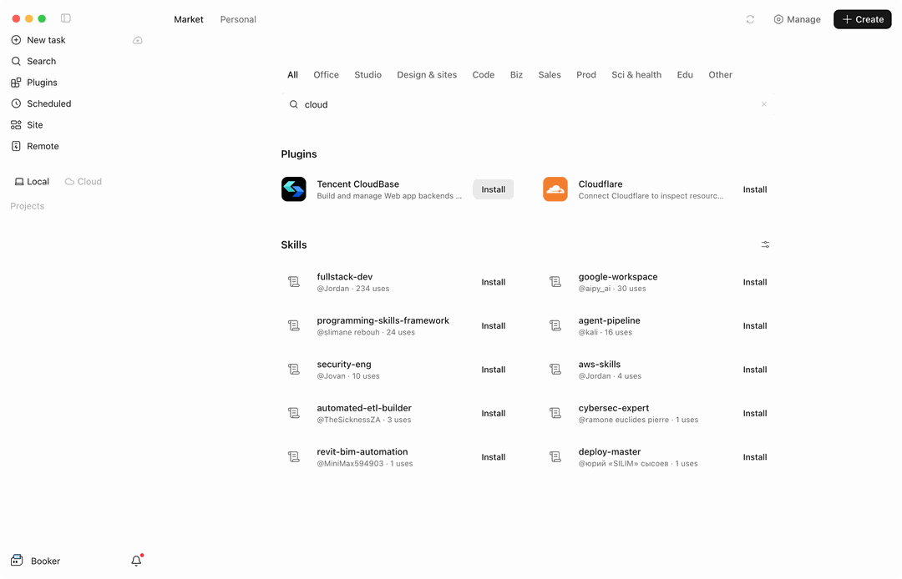

import IDESelector from '../components/IDESelector';
import RelatedResources from '../components/RelatedResources';

# MiniMax Code 配置指南

[MiniMax Code](https://agent.minimax.io/) 是 MiniMax 推出的 AI 编程产品，**桌面端与终端 CLI** 都通过插件市场安装 CloudBase。

两款形态共用同一个插件（id: `cloudbase`），只是安装入口不同：

| 形态 | 插件入口 | 安装方式 |
| --- | --- | --- |
| MiniMax Code 桌面端 | **Plugins** → **Market** | 在市场里点 **Install** |
| MiniMax Code 终端 CLI | `mcode plugin` | 一条命令 |

配置后，你可以在 MiniMax Code 的对话中直接操作 CloudBase 服务。

**例如：**

- "用云开发做一个微信小程序点餐系统" - AI 搭页面、建云数据库、写云函数并引导预览
- "做一个预约管理系统，支持用户下单和后台改状态" - AI 用 CloudBase PostgreSQL 建模、配权限并接好前后端
- "给 Web 应用加上手机号登录" - AI 启用认证方式并接入 CloudBase SDK

无需切换到云控制台，所有操作都可以在 MiniMax Code 中用自然语言完成。

## 前置条件

在开始配置之前，请确保满足以下条件：

<details>
<summary><strong>已准备好云开发环境</strong></summary>

**MiniMax Code：** 桌面端请使用已支持插件市场的版本（左侧 **Plugins** → **Market**）；终端 CLI 请使用带 `mcode plugin` 命令的版本。

**Node.js 环境：** 插件里的 MCP 服务由本机 `npx` 拉起，确保已安装 Node.js v18.15.0 或更高版本：

```bash
node --version
```

如果未安装，请从 [Node.js 官网](https://nodejs.org/en/download) 下载安装。

**云开发环境：** 请参考文档 [开通云开发环境](../../../quick-start/create-env)。新用户可以免费开通体验。

</details>

---

<IDESelector defaultIDE="minimax-code" />

## MiniMax Code 桌面端

1. 打开 MiniMax Code 桌面端，在左侧导航点击 **Plugins**
2. 顶部切换到 **Market** 标签
3. 在搜索框中输入 `cloud`，或直接在列表中浏览，找到 **Tencent CloudBase** 卡片
4. 点击卡片右侧的 **Install**



Market 页面分为 **Plugins** 与 **Skills** 两段，CloudBase 在 **Plugins** 段。点开卡片可以看到插件包含的内容：**1 个 MCP 服务**（`cloudbase-mcp`）与 **31 个技能**。

这里装的是 CloudBase 官方插件，与其他客户端上架的是同一套插件包。插件自带 MCP 服务定义 —— `cloudbase-mcp`，由本机 `npx @cloudbase/cloudbase-mcp@latest` 拉起 —— 与技能一起注册。**不需要你手工编写 MCP 配置**，装完就能用。

> Market 界面目前是英文，分类标签包括 All、Office、Studio、Design & sites、Code、Biz、Sales、Prod、Sci & health、Edu、Other。

安装完成后，在对话中即可使用 CloudBase 的各项能力。

## MiniMax Code 终端 CLI

CLI 用的是同一个插件市场，可以用命令查看和安装。

**安装 CLI**

```bash
curl -fsSL https://filecdn.minimax.chat/public/install.sh | bash
```

安装器自带私有 Node 运行时，不需要预装 Node.js，也不使用 `sudo`。装好后 `mcode` 位于 `~/.minimax-code/bin`，安装器会把这个目录加进 shell PATH（重开终端生效）。

**查看市场里的可用插件**

```bash
mcode plugin list -m official --available
```

**安装 CloudBase**

```bash
mcode plugin add cloudbase@official
```

装完后用 `mcode plugin list` 查看已安装的插件；`mcode plugin disable cloudbase` 与 `mcode plugin enable cloudbase` 可以临时停用或重新启用。

> CLI 与桌面端共用 `~/.minimax/` 下的配置。插件来源有两个：`official`（官方注册表）和 `local`（本机目录 `~/.minimax/plugins`）。

## 验证连接

安装完成后，在对话中输入：

```
检查 CloudBase 工具是否可用
```

或直接提一个具体需求：

```
帮我查一下当前 CloudBase 环境的状态
```

## 常见问题

**Q: Market 里找不到 Tencent CloudBase？**
A: 在搜索框中输入 `cloud` 过滤；仍找不到时请升级 MiniMax Code 到支持 Market 的最新版本。

**Q: 命令行里找不到 `mcode`？**
A: 安装器把 `~/.minimax-code/bin` 写进了 shell 配置文件，重开一个终端即可；当前终端可以先执行 `source ~/.zshrc`。

**Q: 插件装好了但工具数量是 0？**
A: 检查本机 Node.js 是否可用，确认网络连接正常，然后重启 MiniMax Code 重试。

**Q: 工具数量显示为 0？**
A: 请参考[常见问题](../faq#mcp-显示工具数量为-0-怎么办)。

更多问题请查看：[完整 FAQ](../faq)

<RelatedResources ideName="MiniMax Code" ideDocUrl="https://agent.minimax.io/" />
