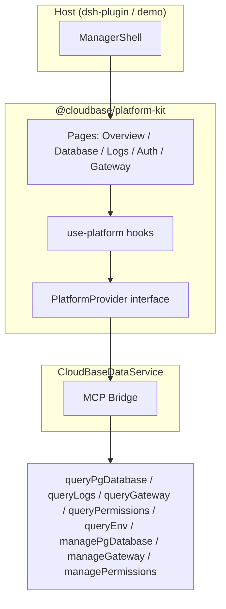

# platform-kit v3 功能深化 Spec

> **状态**：可执行 spec（调研完成，待实现）  
> **基线**：`@cloudbase/platform-kit` v2.8 — ManagerShell 10 项菜单 + OverviewPage + LogsPage（极简）+ UrlCombobox  
> **目标**：对标 dev-platform v1.25.1 与 Supabase platform-kit-nextjs，补齐数据库深度管理、日志、认证用户、网关、概览指标  
> **实现包**：`platform-kit/`（组件 + hooks + i18n）；CloudBase 参考 Provider：`dsh-plugin/src/server/data-service.ts`

---

## 1. 调研结论

### 1.1 dev-platform 可复用项

| 模块 | 源码路径 | 复用方式 |
|------|----------|----------|
| PG 元数据 SQL | `apps/dev-platform/src/pages/db/postgres/sql.ts` | **复制 SQL 生成函数**到 `platform-kit/src/pg/sql.ts`（已移植 @supabase/pg-meta 语义） |
| RLS 策略页 | `db/postgres/policies/index.tsx` | UI 布局与交互参考；数据走 MCP + 上述 SQL |
| 索引/函数/扩展/角色 | `db/postgres/{indexes,functions,extensions,roles}/` | 列表列定义、Drawer 形态参考 |
| 迁移记录 | `db/postgres/migrations/index.tsx` | 版本格式化、`sqlListMigrations` 逻辑 |
| 日志查询 | `env/devops/logManage/LogManage.tsx` | 服务筛选、时间 RangePicker、Table expandable、导出 |
| 网关路由 | `env/domain/tcb-env-access/domain-associated-resource/` | 按域名 Collapse + 路由表 + CreateOrEditGatewayModal 字段 |
| 认证用户 | `identity/user-management/` | 列表 + 搜索 + 详情侧栏（kit 先做列表级） |
| 菜单/特性门控 | `framework/menu/menu.tsx` + `EFeatureId` | kit 已有 `useMenu` + `EFeatureId`，对齐 PG/NoSQL 分支 |

**不可直接依赖**：`@tencent/tea-component`、`capi-service`、`tcbService.executePGSql` — kit 保持轻量 React + CSS variables。

### 1.2 Supabase platform-kit 可借鉴项

| 模块 | 路径 | 借鉴点 |
|------|------|--------|
| LogsManager | `platform-kit-nextjs/.../logs.tsx` | 日志类型 Combobox + 结果 Table + HoverCard 详情 |
| DatabaseManager | `.../database.tsx` | Sheet 导航：表列表 → 行编辑 / SQL Editor |
| UsersManager | `.../users.tsx` | 增长图 + 时间范围 Select + 用户表 |
| AuthManager | `.../auth.tsx` | Provider 卡片 + DynamicForm |
| pg-meta | `lib/pg-meta/sql.ts` | 列/表/关系 SQL（dev-platform 已同步） |
| hooks 模式 | `use-logs.ts`, `use-tables.ts` | React Query 式 `{ data, isLoading, error, refetch }` → kit 用 `useAsyncResource` 统一 |

### 1.3 CloudBase 特有差异

| 能力 | Supabase | CloudBase |
|------|----------|-----------|
| 日志 | Management API `logs.all` + SQL | **CLS** `queryLogs(searchLogs)` + 云函数 `queryFunctions(listFunctionLogs)` |
| 认证用户 | `auth.users` 表 SQL | **`queryPermissions(listUsers)`** + **`managePermissions(updateUser)`**（非 PG 表） |
| RLS | Dashboard Policy Editor | PG **`pg_policies`** + `managePgDatabase(execute)`；NoSQL 用 **安全规则**（另一套，v3 P1） |
| 网关 | Edge Functions URL | **HTTP 网关** `queryGateway` / `manageGateway`（SCF/CBR/STATIC_STORE/LH） |
| 指标 | 内置 Analytics | **`queryEnv(metrics)`** + **`queryEnv(usage)`**（DescribeCurveData / CreditsUsage） |
| 环境类型 | 仅 PG | **PostgreSQL / NoSQL / MySQL** — 深度 DB 功能 **PG-only**；NoSQL 保持 v2 DatabaseTab 能力 |

### 1.4 v2.8 差距（Booker 反馈对应）

- **日志**：无服务选择、无时间范围、query 未 wired、无行展开/导出 → 几乎不可用  
- **数据库**：ManagerShell `database` route 为 placeholder；无 RLS/索引/函数/扩展/角色/迁移  
- **认证/网关**：menu 存在但 `renderRoute` 默认占位  
- **概览**：metrics/usage 有数据但无 sparkline、无 QPS 卡、指标维度少  

---

## 2. 范围与优先级

### P0（MVP — v3.0 必须交付）

1. **LogsExplorerPage** — 完整日志查询器（CLS + 基础筛选 + 表格 + 展开 + 导出）  
2. **DatabasePage** — 表列表 + **表详情侧栏**（列/索引/外键/RLS 状态）+ **RLS 策略列表与创建/编辑**（PG）  
3. **AuthUsersPage** — 用户列表 + 搜索 + 禁用/启用 + 增长图  
4. **GatewayPage** — 路由列表 + 创建/编辑绑定（path → 上游资源）  
5. **OverviewPage 增强** — 指标卡 + SparkChart + 用量条（对齐现有 provider）  
6. **PlatformProvider 扩展** + **CloudBase data-service 实现**  
7. **ManagerShell 接线** — 上述 route 默认渲染，替换 placeholder  

### P1（扩展 — v3.1+）

- PG：**函数列表**、**扩展列表**、**角色列表**、**迁移记录**、索引创建/删除、RLS 模板面板  
- 日志：云函数 `listFunctionLogs` 快捷 Tab、实时 tail（轮询）  
- 认证：**Provider 配置只读卡片**（`queryAppAuth`）  
- NoSQL：**集合安全规则**只读/简易编辑（`readSecurityRule` / `writeSecurityRule`）  
- 概览：告警摘要、CloudRun QPS  

### 明确不做（v3）

- dev-platform 级 SQL Editor 多 Tab / AI Assist / Schema Visual  
- 备份/副本/Setting 子页（13 子页完整 parity）  
- Supabase Auth Provider 动态表单全量（P1 只读）  

---

## 3. 架构



### 3.1 目录结构（实现时创建）

```
platform-kit/src/
  pg/
    sql.ts              # 从 dev-platform 精简复制（RLS/index/role/function SQL builders）
    types.ts            # PgPolicyRow, PgIndexRow, ...
  components/
    database/
      DatabasePage.tsx
      TableListPanel.tsx
      TableDetailSheet.tsx
      RlsPolicyEditor.tsx
      PolicyList.tsx
    logs/
      LogsExplorerPage.tsx      # 替换 LogsPage 或 re-export
      LogFiltersBar.tsx
      LogResultsTable.tsx
    auth/
      AuthUsersPage.tsx
      UsersTable.tsx
    gateway/
      GatewayPage.tsx
      RouteTable.tsx
      RouteFormDrawer.tsx
    charts/
      SparkChart.tsx              # 从 dsh-plugin 迁入或 duplicate
  hooks/
    use-database.ts
    use-logs-search.ts
    use-auth-users.ts
    use-gateway-routes.ts
```

### 3.2 PlatformProvider 扩展（v3）

在 `core/provider.ts` 新增：

```typescript
// --- Logs ---
searchLogs(opts: {
  queryString: string;
  service?: "tcb" | "tcbr";
  startTime?: string;  // YYYY-MM-DD HH:mm:ss
  endTime?: string;
  limit?: number;
  sort?: "asc" | "desc";
  context?: string;    // pagination
}): Promise<{ entries: LogEntry[]; context?: string }>;

// --- Database (PG) ---
getTableSchema(schemaTable: string): Promise<TableSchemaDetail>;
listSchemaPolicies(schema?: string): Promise<PolicySummary[]>;
runPgDDL(sql: string, confirm: boolean): Promise<{ ok: boolean; message: string }>;

// --- Auth users ---
searchAppUsers(opts: {
  keyword?: string;
  pageNo?: number;
  pageSize?: number;
}): Promise<{ users: AppUser[]; total?: number }>;
setAppUserStatus(uid: string, enabled: boolean): Promise<void>;

// --- Gateway ---
listGatewayRoutes(): Promise<GatewayRoute[]>;
upsertGatewayRoute(input: GatewayRouteInput): Promise<void>;
deleteGatewayRoute(routeId: string, confirm: boolean): Promise<void>;
getGatewayPrivilege(): Promise<{ enableService?: boolean; enableAuth?: boolean }>;

// --- Metrics (optional granular) ---
fetchMetricSeries(metricName: string, opts?: MetricQueryOpts): Promise<MetricSeries>;
```

新增类型见 §4 各模块 `types`。

---

## 4. 功能规格

### 4.1 概览指标增强（OverviewPage）

**优先级**：P0  

#### UI 形态（参考 dev-platform `#/overview` + Supabase Dashboard Home）

```
┌─────────────────────────────────────────────────────────────┐
│ 环境概览                                                     │
├─────────────────────────────────────────────────────────────┤
│ [EnvId] [Region] [Runtime] [Functions: N] [Hosting: N]      │  ← 现有 envInfo 卡
├─────────────────────────────────────────────────────────────┤
│ 指标 (24h)                                                   │
│ ┌──────────┐ ┌──────────┐ ┌──────────┐ ┌──────────┐        │
│ │ 函数调用  │ │ DB 读    │ │ DB 写    │ │ 错误      │        │
│ │ 12.4k    │ │ 3.1k     │ │ 890      │ │ 0.2%  ▲   │        │
│ │ ▁▂▃▅▇   │ │ spark    │ │ spark    │ │ red spark│        │
│ └──────────┘ └──────────┘ └──────────┘ └──────────┘        │
├─────────────────────────────────────────────────────────────┤
│ 用量 (本计费周期)                                            │
│ FLEXDB ████████░░  820 资源点                               │
│ SCF    ████░░░░░░  210 资源点                               │
├─────────────────────────────────────────────────────────────┤
│ 访问入口 / 部署时间轴  (v2.8 不变)                            │
└─────────────────────────────────────────────────────────────┘
```

- 指标卡宽 `minmax(140px, 1fr)`，sparkline 高 36px，使用 `SparkChart`（与 dsh `UsersGrowthChart` 同组件）  
- `FunctionError` 卡：`danger` 边框 + 最新点 / 总量比展示  

#### 数据源

| 数据 | MCP 调用 |
|------|----------|
| 指标序列 | `queryEnv({ action: "metrics", envId, metricName, startTime?, endTime?, period? })` |
| 用量 | `queryEnv({ action: "usage", envId, type? })` |
| 环境信息 | 现有 `provider.envInfo()` |

**P0 metricName 集合**：`FunctionInvocation`, `DbRead`, `DbWrite`, `FunctionError`  
**P1 追加**：`GatewayTraceEnvQPS`, `TkeQPSService`, `MysqlCpuUsageRate`（按 runtimeMode 显示）

#### 组件设计

| 组件 | 职责 |
|------|------|
| `MetricCardsGrid` | props: `series: MetricSeries[]`, `loading`, `onRefresh` |
| `UsageBarsList` | props: `items: UsageItem[]` — 可选进度条（有 quota 时） |
| `SparkChart` | props: `{ points: number[]; width?; height?; variant?: "default" \| "danger" }` |

#### Hooks

```typescript
function useMetricCards(provider?: PlatformProvider, names?: string[]): AsyncResource<MetricSeries[]>;
// 内部 parallel fetchMetricSeries
```

#### i18n keys

| Key | zh | en |
|-----|----|----|
| `overview.metrics.24h` | 指标 (24h) | Metrics (24h) |
| `overview.metrics.refresh` | 刷新指标 | Refresh metrics |
| `overview.usage.cycle` | 本计费周期 | Current billing cycle |
| `metric.FunctionInvocation` | 函数调用 | Function invocations |
| `metric.DbRead` | 数据库读 | DB reads |
| `metric.DbWrite` | 数据库写 | DB writes |
| `metric.FunctionError` | 函数错误 | Function errors |

#### 验收标准

1. When 用户打开概览且 provider 已绑定 envId，the OverviewPage shall 展示至少 4 张指标卡，每张含数值标签与 sparkline。  
2. When `queryEnv(usage)` 返回模块列表，the OverviewPage shall 展示用量条目（≥1 条）或空态文案。  
3. When 某 metric 请求失败，the 对应卡片 shall 显示 `—` 且不影响其他卡片。  

---

### 4.2 日志查询器（LogsExplorerPage）

**优先级**：P0（替换现有 `LogsPage` 行为）

#### UI 形态（参考 dev-platform `#/devops/log` + Supabase LogsManager）

```
┌─────────────────────────────────────────────────────────────┐
│ 日志查询                                    [导出 CSV] [刷新] │
├─────────────────────────────────────────────────────────────┤
│ 服务 [全部 ▼]  级别 [全部 ▼]  时间 [近4小时 ▼] [自定义范围]   │
│ 查询语句 [ (src:app OR src:system) AND log:ERROR        ] 🔍 │
├─────────────────────────────────────────────────────────────┤
│ ⚠ CLS 未开通 → 引导 checkLogService（P0 仅 Banner）         │
├─────────────────────────────────────────────────────────────┤
│ 时间          │ 服务      │ 级别   │ 消息                    │
│ 08-19 20:01   │ scf       │ ERROR  │ START RequestId: ...    │
│               │           │        │ ▼ 展开 JSON 全文         │
└─────────────────────────────────────────────────────────────┘
```

**服务预设**（映射 CLS queryString 片段，对齐 dev-platform LogManage）：

| UI 标签 | queryString 片段 | MCP `service` |
|---------|------------------|---------------|
| 全部 | *(空)* | — |
| 云函数 | `(src:app OR src:system)` | `tcb` |
| 云托管 | `service:cloudrun` 或 tcbr | `tcbr` |
| 静态托管 | `module:hosting` | `tcb` |
| 数据库 | `module:database OR module:rdb` | `tcb` |
| 网关访问 | `logType:accesslog` | `tcb` |

**级别过滤**（客户端过滤 + 默认 query 注入）：

- 全部 / ERROR / WARN / INFO — 选中时在 queryString 追加 `AND log:ERROR` 等  

**时间范围**：

| 预设 | startTime / endTime |
|------|---------------------|
| 近 4 小时 | now-4h → now |
| 近 24 小时 | now-24h → now |
| 近 3 天 | now-72h → now |
| 自定义 | RangePicker → `YYYY-MM-DD HH:mm:ss` |

#### 数据源

| 操作 | MCP |
|------|-----|
| 检查 CLS | `queryLogs({ action: "checkLogService" })` |
| 搜索 | `queryLogs({ action: "searchLogs", queryString, service, startTime, endTime, limit: 50, sort: "desc", context? })` |
| P1 单函数 | `queryFunctions({ action: "listFunctionLogs", functionName, startTime, endTime })` |

**LogEntry 扩展类型**：

```typescript
interface LogEntry {
  id?: string;
  time?: string;
  level: "error" | "warn" | "info" | "debug";
  service?: string;
  message: string;
  raw?: Record<string, unknown>;  // 展开用
}
```

#### 组件设计

| 组件 | Props |
|------|-------|
| `LogsExplorerPage` | `{ provider?: PlatformProvider }` |
| `LogFiltersBar` | `{ service, level, timeRange, queryString, onChange, onSearch }` |
| `LogResultsTable` | `{ entries, loading, expandedId, onToggle, onExport }` |

#### Hooks

```typescript
function useLogsSearch(
  provider: PlatformProvider | undefined,
  filters: LogSearchFilters,
): { data; error; loading; reload; loadMore; hasMore };
// loadMore: 传 context 翻页
```

#### i18n keys

| Key | zh | en |
|-----|----|----|
| `logs.service.all` | 全部服务 | All services |
| `logs.service.scf` | 云函数 | Cloud functions |
| `logs.service.cloudrun` | 云托管 | CloudRun |
| `logs.service.hosting` | 静态托管 | Static hosting |
| `logs.service.database` | 数据库 | Database |
| `logs.service.gateway` | 网关 | Gateway |
| `logs.level.all` | 全部级别 | All levels |
| `logs.time.4h` | 近 4 小时 | Last 4 hours |
| `logs.time.24h` | 近 24 小时 | Last 24 hours |
| `logs.time.3d` | 近 3 天 | Last 3 days |
| `logs.time.custom` | 自定义 | Custom range |
| `logs.expand` | 展开详情 | Expand details |
| `logs.export` | 导出 CSV | Export CSV |
| `logs.cls.disabled` | 日志服务未开通 | Log service not enabled |
| `logs.empty` | 暂无日志 | No logs found |

#### 验收标准

1. When 用户选择「云函数 + ERROR + 近 4 小时」并点击查询，the LogsExplorerPage shall 调用 `searchLogs` 且表格展示 ≥0 行（含时间/服务/级别/消息列）。  
2. When 用户点击某行，the 行 shall 展开显示 `raw` 或完整 message（monospace，max-height 240px scroll）。  
3. When 用户点击导出，the 浏览器 shall 下载 CSV（UTF-8 BOM），列：time, service, level, message。  
4. When `checkLogService` 表明未开通，the 页顶 shall 显示警告 Banner（不阻塞查询尝试）。  
5. When 用户修改 query 输入并搜索，the hook shall 使用最新 queryString（修复 v2.8 未绑定 bug）。  

---

### 4.3 数据库深度管理（DatabasePage）

**优先级**：P0 表详情 + RLS；P1 函数/扩展/角色/迁移/索引 CRUD

#### UI 形态

**主布局**（Supabase Database + dev-platform PG 侧栏）

```
┌──────────────┬──────────────────────────────────────────────┐
│ 表/视图       │  public.users                    [RLS: ON]   │
│ ─────────    │  Tabs: [数据] [结构] [RLS] [索引] [外键]       │
│ ▶ users      │  ─────────────────────────────────────────── │
│   orders     │  结构: 列名 | 类型 | 可空 | 默认 | PK         │
│   posts      │  RLS:  [+ 创建策略]                          │
│              │  ┌ policy_select_own ─ SELECT ─ roles: ... ─┐ │
│ [SQL 编辑器]  │  │ USING (auth.uid() = user_id)            │ │
│  (P1 链接)   │  └─────────────────────────────────────────┘ │
└──────────────┴──────────────────────────────────────────────┘
```

- 左栏宽 220px：`useTables()` 分组 table/view  
- 右栏：**TableDetailSheet** 内 Tabs（P0：结构、RLS、索引只读、外键只读；P1：数据网格复用 dsh DatabaseTab）  
- PG 环境外：`FeatureGuard` + 文案「仅 PostgreSQL 环境支持深度管理」+ 降级 NoSQL 集合列表  

#### 数据源

| 能力 | MCP / SQL |
|------|-----------|
| 表列表 | `queryPgDatabase({ action: "metadata", limit: 200 })` |
| 表结构 | `queryPgDatabase({ action: "schema", objectName: "public.users" })` → 返回 columns, indexes, foreignKeys, security |
| 全 schema 策略 | `queryPgDatabase({ action: "sql", sql: sqlListSchemaPolicies("public") })` |
| RLS 开关 | `managePgDatabase({ action: "execute", sql: sqlToggleRLS(...), confirm: true })` |
| 创建策略 | `managePgDatabase({ action: "execute", sql: CREATE POLICY ..., confirm: true })` |
| 修改/删除策略 | `sqlAlterPolicy` / `sqlDropPolicy` → execute |
| P1 函数 | `sqlListFunctions(schema)` via sql action |
| P1 扩展 | dev-platform `extensions/useExtensions.ts` 对应 SQL |
| P1 角色 | `SELECT ... FROM pg_roles` |
| P1 迁移 | `managePgDatabase({ action: "listMigrations" })` |

**从 dev-platform 复制到 `platform-kit/src/pg/sql.ts` 的函数（P0/P1）**：

- P0: `sqlListSchemaPolicies`, `sqlToggleRLS`, `sqlDropPolicy`, `sqlAlterPolicy`, `parseRows` 等价物（provider 内解析 MCP 返回）  
- P1: `sqlListFunctions`, `sqlListIndexes`, `sqlCreateIndex`, `sqlDropIndex`, `sqlListMigrations`  

#### 组件设计

| 组件 | 说明 |
|------|------|
| `DatabasePage` | 主页面；`featureCtx.isPostgresEnv` 门控 |
| `TableListPanel` | `tables: TableSummary[]`, `selected`, `onSelect` |
| `TableDetailSheet` | `schema: TableSchemaDetail`, `activeTab` |
| `ColumnsTable` | 列定义表格 |
| `IndexesTable` | indexname + definition |
| `ForeignKeysTable` | FK 关系 |
| `RlsPolicyList` | 按表分组策略；badge RLS on/off |
| `RlsPolicyEditor` | Drawer/Modal：name, command(SELECT/INSERT/...), roles[], using, with_check, permissive |
| `RlsToggleConfirm` | 二次确认 ALTER TABLE ... ENABLE/DISABLE RLS |

#### Hooks

```typescript
function useTables(provider?: PlatformProvider): AsyncResource<TableSummary[]>;
function useTableSchema(provider: PlatformProvider | undefined, schemaTable: string | undefined): AsyncResource<TableSchemaDetail>;
function useSchemaPolicies(provider: PlatformProvider | undefined, schema: string): AsyncResource<PolicySummary[]>;
function usePgMutation(provider: PlatformProvider | undefined): {
  execute: (sql: string) => Promise<void>;
  pending: boolean;
};
```

**TableSchemaDetail**（对齐 MCP schema action）：

```typescript
interface TableSchemaDetail {
  schemaTable: string;
  kind: string;
  rowCount?: number | null;
  columns: ColumnSummary[];
  primaryKey: string[];
  indexes: { name: string; definition: string }[];
  foreignKeys: { constraintName; columnName; references; referencedColumn }[];
  security: {
    rowLevelSecurityEnabled: boolean;
    forceRowLevelSecurity: boolean;
    policies: PolicySummary[];
  };
}
```

#### i18n keys（节选）

| Key | zh |
|-----|-----|
| `db.title` | 数据库 |
| `db.pgOnly` | 深度管理仅支持 PostgreSQL 环境 |
| `db.tab.structure` | 结构 |
| `db.tab.rls` | RLS 策略 |
| `db.tab.indexes` | 索引 |
| `db.tab.fks` | 外键 |
| `db.rls.enable` | 启用 RLS |
| `db.rls.disable` | 禁用 RLS |
| `db.policy.create` | 创建策略 |
| `db.policy.edit` | 编辑策略 |
| `db.policy.delete` | 删除策略 |
| `db.policy.command` | 命令 |
| `db.policy.roles` | 角色 |
| `db.policy.using` | USING 表达式 |
| `db.policy.withCheck` | WITH CHECK 表达式 |

#### 验收标准

1. When PG 环境且选中表 `public.todos`，the DatabasePage shall 展示列清单与 RLS 开关状态（与 `schema.security` 一致）。  
2. When 表启用了 RLS 但 policies 为空，the UI shall 显示警告条（与 MCP schema 警告一致）。  
3. When 用户创建策略并提交，the provider shall 调用 `managePgDatabase(execute)` 且成功后刷新策略列表。  
4. When 用户编辑 USING 表达式，the 提交 SQL shall 使用 `sqlAlterPolicy` 生成（仅变更字段）。  
5. When 非 PG 环境，the DatabasePage shall 显示 FeatureGuard 且不发起 `queryPgDatabase schema`。  
6. P1: When 打开迁移 Tab，the 页 shall 列出 `listMigrations` 记录并可查看 SQL 只读。  

---

### 4.4 认证用户（AuthUsersPage）

**优先级**：P0

#### UI 形态（Supabase UsersManager + dev-platform user-management）

```
┌─────────────────────────────────────────────────────────────┐
│ 认证用户                        时间范围 [近 14 天 ▼]        │
├─────────────────────────────────────────────────────────────┤
│ 用户增长  ▁▂▄▆█  (SparkChart)                              │
├─────────────────────────────────────────────────────────────┤
│ 🔍 搜索用户名/邮箱/uid                    [刷新]            │
├─────────────────────────────────────────────────────────────┤
│ 用户 ID      │ 用户名   │ 邮箱        │ 状态   │ 操作        │
│ uid_abc      │ demo     │ a@b.com     │ 正常   │ [禁用]      │
│ uid_def      │ test     │ —           │ 已禁用 │ [启用]      │
└─────────────────────────────────────────────────────────────┘
```

- **注意**：列表为 **CloudBase 应用用户**（`queryPermissions`），不是 MCP 管理端登录身份  
- 顶栏可选链接「登录方式配置」→ P1 跳转 Provider 只读（`queryAppAuth getLoginConfig`）

#### 数据源

| 操作 | MCP |
|------|-----|
| 列表 | `queryPermissions({ action: "listUsers", pageNo, pageSize })` |
| 搜索 | 客户端 filter；P1 server-side keyword 若 API 支持 |
| 禁用/启用 | `managePermissions({ action: "updateUser", uid, userStatus: "DISABLE" \| "NORMAL" })` |
| 增长图 | 对 `listAppUsers` 结果按 `createdAt` 做 `bucketUserGrowth`（已有 `dsh-plugin/shared/kit-insights.ts`） |

#### 组件设计

| 组件 | Props |
|------|-------|
| `AuthUsersPage` | `{ provider }` |
| `UsersGrowthChart` | `{ users, days }` — **迁入 platform-kit** 从 dsh |
| `UsersTable` | `{ users, onToggleStatus, pendingUid? }` |

**AppUser 扩展**：

```typescript
interface AppUser {
  uid: string;
  name?: string;
  email?: string;
  phone?: string;
  createdAt?: string;
  lastLoginAt?: string;
  status?: "normal" | "disabled";
}
```

#### Hooks

```typescript
function useAuthUsers(provider?: PlatformProvider, opts?: { pageSize?: number }): AsyncResource<AppUser[]>;
function useSetUserStatus(provider?: PlatformProvider): { mutate(uid, enabled): Promise<void>; pending: boolean };
```

#### i18n keys

| Key | zh |
|-----|-----|
| `auth.users.title` | 认证用户 |
| `auth.users.search` | 搜索用户 |
| `auth.users.status.normal` | 正常 |
| `auth.users.status.disabled` | 已禁用 |
| `auth.users.disable` | 禁用 |
| `auth.users.enable` | 启用 |
| `auth.users.growth` | 用户增长 |
| `auth.users.empty` | 暂无用户 |

#### 验收标准

1. When 页面加载，the AuthUsersPage shall 展示用户表格与增长图（基于 createdAt 分桶）。  
2. When 用户点击禁用，the UI shall 二次确认后调用 `updateUser` 且刷新行状态。  
3. When 搜索框输入 keyword，the 表格 shall 过滤 uid/name/email（客户端）。  
4. When `listUsers` 失败，the 页 shall 展示错误态与重试按钮。  

---

### 4.5 网关路由（GatewayPage）

**优先级**：P0

#### UI 形态（dev-platform `#/env` HTTP 访问 / 域名关联资源）

```
┌─────────────────────────────────────────────────────────────┐
│ 网关路由                    总开关: [ON]  鉴权: [OFF]  [刷新] │
├─────────────────────────────────────────────────────────────┤
│ ▼ https://xxx.service.tcloudbase.com (默认域名)              │
│   路径          │ 上游类型    │ 上游资源        │ 鉴权 │ 操作  │
│   /api/*        │ 云函数      │ hello           │ 否   │ 编辑  │
│   /             │ 静态托管    │ index.html      │ 否   │ 删除  │
├─────────────────────────────────────────────────────────────┤
│ [+ 添加路由]                                                 │
└─────────────────────────────────────────────────────────────┘
```

**CreateOrEdit Route Drawer 字段**（对齐 `manageGateway`）：

- Domain（下拉 `listCustomDomains` + 默认域）  
- Path（`/foo`, 支持 `*`）  
- UpstreamResourceType: `SCF` | `WEB_SCF` | `CBR` | `STATIC_STORE` | `LH`  
- UpstreamResourceName（函数名 / 服务名 / 托管路径）  
- EnableAuth (boolean)  
- EnablePathTransmission (boolean)  
- Enable (route enabled)  

#### 数据源

| 操作 | MCP |
|------|-----|
| 列表 | `queryGateway({ action: "listRoutes" })` |
| 特权 | `queryGateway({ action: "getPrivilege" })` |
| 创建 | `manageGateway({ action: "createRoute", route: {...} })` |
| 更新 | `manageGateway({ action: "updateRoute", routeId, route: {...} })` |
| 删除 | `manageGateway({ action: "deleteRoute", routeId, confirm: true })` |
| 开关 | `manageGateway({ action: "enableService" \| "authSwitch", enable })` |

**GatewayRoute 类型**：

```typescript
interface GatewayRoute {
  routeId?: string;
  domain: string;
  path: string;
  upstreamResourceType: string;
  upstreamResourceName: string;
  enableAuth?: boolean;
  enable?: boolean;
  domainType?: string;
}
```

#### 组件设计

| 组件 | 说明 |
|------|------|
| `GatewayPage` | PG 环境显示（与 v2 menu 一致 `hideWhen: NON_POSTGRES` 可 reconsider — 网关传统环境也有；**v3 改为所有环境可见**） |
| `GatewayDomainGroup` | Collapse 按 domain |
| `RouteTable` | 路由行 |
| `RouteFormDrawer` | 创建/编辑表单 |
| `GatewayPrivilegeBar` | 总开关 + 鉴权开关 |

#### Hooks

```typescript
function useGatewayRoutes(provider?: PlatformProvider): AsyncResource<GatewayRoute[]>;
function useGatewayPrivilege(provider?: PlatformProvider): AsyncResource<GatewayPrivilege>;
function useGatewayMutations(provider?: PlatformProvider): { create; update; remove; toggleService; toggleAuth };
```

#### i18n keys

| Key | zh |
|-----|-----|
| `gateway.title` | 网关路由 |
| `gateway.addRoute` | 添加路由 |
| `gateway.path` | 路径 |
| `gateway.upstream` | 上游资源 |
| `gateway.upstreamType` | 上游类型 |
| `gateway.auth` | 路由鉴权 |
| `gateway.serviceEnabled` | 网关服务 |
| `gateway.deleteConfirm` | 确认删除该路由？ |

#### 验收标准

1. When 页面加载，the GatewayPage shall 按域名分组展示 `listRoutes` 结果。  
2. When 用户添加路由并保存，the provider shall 调用 `createRoute` 且列表刷新。  
3. When 用户切换网关总开关，the 调用 `enableService` 且 UI 反映 `getPrivilege`。  
4. When 上游类型为 SCF，the 资源名下拉 shall 填充 `queryFunctions listFunctions`（provider 内聚合）。  

**Menu 变更**：`use-menu.ts` 移除 gateway 的 `hideWhen: NON_POSTGRES_ENV`（网关非 PG 独有）。

---

## 5. ManagerShell 集成

### 5.1 默认 route 映射（P0）

```typescript
// ManagerShell.tsx defaultBody
case "database": return <DatabasePage provider={props.provider} />;
case "auth": return <AuthUsersPage provider={props.provider} />;
case "gateway": return <GatewayPage provider={props.provider} />;
case "logs": return <LogsExplorerPage provider={props.provider} />;
// overview 已存在；storage/functions/cloudrun/hosting/settings 仍 renderRoute 扩展
```

### 5.2 dsh-plugin 集成步骤

1. `dsh-plugin` 依赖 bump `@cloudbase/platform-kit`  
2. `data-service.ts` 实现 §3.2 新 Provider 方法  
3. DetailsPanel 可保留 DatabaseTab 作快捷入口，或改为嵌入 `ManagerShell` route=`database`  
4. 截图对比：`dsh-plugin/docs/screenshots/v28-preview.png` → v3 追加 `v3-database.png`, `v3-logs.png`（实现后补）

---

## 6. CloudBase Provider 实现要点（data-service）

| Provider 方法 | 实现摘要 |
|---------------|----------|
| `searchLogs` | `queryLogs searchLogs`；映射 `Results` → `LogEntry[]`；保留 `context` |
| `getTableSchema` | `queryPgDatabase schema` |
| `listSchemaPolicies` | `queryPgDatabase sql` + `sqlListSchemaPolicies` |
| `runPgDDL` | `managePgDatabase execute` + confirm:true |
| `searchAppUsers` | `queryPermissions listUsers`；map `userStatus` |
| `setAppUserStatus` | `managePermissions updateUser` |
| `listGatewayRoutes` | flatten `queryGateway listRoutes` |
| `fetchMetricSeries` | 复用现有 metrics 循环逻辑，单 metric |

---

## 7. 测试策略

| 层级 | 内容 |
|------|------|
| 单元 | `pg/sql.ts` SQL 生成快照测试；`bucketUserGrowth` |
| 组件 | Vitest + React Testing Library：LogFiltersBar 组合 query；RlsPolicyEditor 校验 |
| Provider | mock MCP bridge，断言 tool 名与参数 |
| 手工 | PG 环境走 ManagerShell 五页；CLS 开通环境测日志；创建/删除测试路由 |

---

## 8. 实施任务拆分（执行 agent）

### Phase 1 — Provider + 类型（P0 基础）

- [ ] 扩展 `core/types.ts`, `core/provider.ts`  
- [ ] 实现 `dsh-plugin/src/server/data-service.ts` 新方法  
- [ ] 添加 `platform-kit/src/pg/sql.ts`（P0 策略 SQL）  
- [ ] i18n zh/en 键补齐  

### Phase 2 — 页面（P0）

- [ ] `LogsExplorerPage` + 替换 ManagerShell logs route  
- [ ] `DatabasePage` + RLS 编辑器  
- [ ] `AuthUsersPage` + 迁入 `SparkChart` / `UsersGrowthChart`  
- [ ] `GatewayPage`  
- [ ] `OverviewPage` MetricCardsGrid 增强  

### Phase 3 — P1

- [ ] Database 子 Tab：函数/扩展/角色/迁移  
- [ ] 索引创建 Drawer  
- [ ] Auth Provider 只读  
- [ ] NoSQL 安全规则简易视图  

### Phase 4 — 文档 & 截图

- [ ] 更新 `platform-kit/README-ZH.md`  
- [ ] 追加 `docs/screenshots/platform-kit-v3-*.png`  

---

## 9. 参考截图 / UI 描述索引

| 参考 | 位置 |
|------|------|
| v2.8 现状 | `dsh-plugin/docs/screenshots/v28-preview.png` |
| dev-platform 日志页 | 控制台 `#/devops/log` — 顶栏筛选 + 表格 expandable |
| dev-platform RLS | `#/db/postgres/policies` — 表折叠 + 策略 Drawer |
| dev-platform 网关 | `#/env` HTTP 访问 — 域名 Collapse + 路由表 |
| Supabase Logs | `LogsManager` — 右侧 log type Combobox + 全宽 Table |
| Supabase Users | 增长图 + 隐藏 SQL 的用户表 |

---

## 10. 风险与缓解

| 风险 | 缓解 |
|------|------|
| CLS 未开通 | Banner + checkLogService；文档链接 |
| RLS DDL 误操作 | 所有 execute 必须 confirm；编辑器展示 SQL 预览 |
| 网关 API 复杂 | P0 仅默认域名 + 常用 upstream；自定义域 P1 |
| 并行 session 改 platform-kit | 按本 spec Phase 顺序 PR，先 provider 后 UI |

---

**文档版本**：v3-spec-1.0  
**任务 ID**：e031efd5-fe44-4ce8-bd35-68bd0daa55d7  
**下一步**：执行 agent 按 §8 Phase 1 开始实现，无需重复调研。
