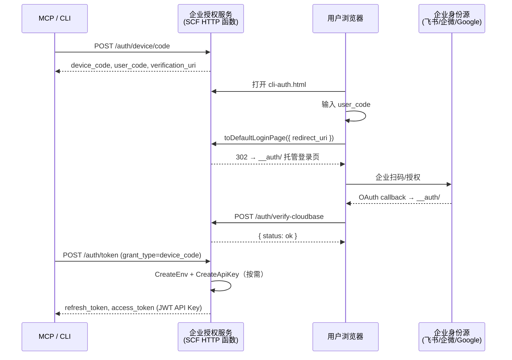

# cloudbase-auth-endpoint-with-feishu

企业自有品牌授权服务——用户在你的授权页面输入设备码 → 跳转飞书/企微 SSO → 自动创建 CloudBase 环境并签发 API Key。

## 架构



## 从零开始完整操作路径

### 前置准备

| 资源 | 说明 | 获取方式 |
|------|------|----------|
| CloudBase 环境 | 管理中心环境，作为"1+N"中的"1" | [控制台创建](https://console.cloud.tencent.com/tcb) |
| 腾讯云 API 密钥 | `SecretId` + `SecretKey` | [CAM 访问管理](https://console.cloud.tencent.com/cam/capi) |
| Publishable Key | 前端 SDK 初始化用 | 控制台 → 身份认证 → API Key 管理 |
| 飞书自建应用 | 用于企业 SSO 登录 | [飞书开放平台](https://open.feishu.cn/app) |

### Step 1: 部署授权服务到 CloudBase

```bash
# 克隆代码
cd examples/cloudbase-auth-endpoint-with-feishu

# 配置环境变量
cp .env.example .env
# 编辑 .env 填入：
#   CLOUDBASE_ENV_ID=xxx
#   CLOUDBASE_PUBLISHABLE_KEY=xxx
#   TENCENTCLOUD_SECRET_ID=xxx
#   TENCENTCLOUD_SECRET_KEY=xxx

# 本地验证
npm install --include=dev
npm run build
npm run start
curl -X POST http://localhost:9000/auth/device/code -H 'Content-Type: application/json' -d '{}'
```

部署到 CloudBase（通过 MCP `manageFunctions` 完成）：

```json
{
  "tool": "manageFunctions",
  "params": {
    "action": "createFunction",
    "func": {
      "name": "auth-service",
      "type": "HTTP",
      "runtime": "Nodejs18.15",
      "timeout": 120,
      "envVariables": {
        "BASE_URL": "https://your-domain.com",
        "CLOUDBASE_ENV_ID": "your-env-id",
        "CLOUDBASE_PUBLISHABLE_KEY": "your-publishable-key",
        "CLOUDBASE_REGION": "ap-shanghai",
        "CB_SECRET_ID": "your-secret-id",
        "CB_SECRET_KEY": "your-secret-key"
      }
    },
    "functionRootPath": "/absolute/path/to/examples/cloudbase-auth-endpoint-with-feishu"
  }
}
```

> `functionRootPath` 指向项目目录，`manageFunctions` 会自动上传 `package.json`、`scf_bootstrap`、`dist/`、`public/` 等文件并安装依赖。首次创建函数使用 `createFunction`，后续更新代码用 `updateFunctionCode`。

### Step 2: 配置 HTTP 访问服务路由

通过 MCP `manageGateway` 为云函数创建网关入口：

```json
{
  "tool": "manageGateway",
  "params": {
    "action": "createAccess",
    "targetType": "function",
    "targetName": "auth-service",
    "path": "/",
    "type": "HTTP",
    "auth": false
  }
}
```

这会创建一个默认域名的网关入口。之后你的服务访问地址为：
```
https://{envId}-{appId}.ap-shanghai.app.tcloudbase.com/cli-auth.html
```

**⚠️ 不要使用 `domain: "*"` 的通配路由**，会拦截 CloudBase 内置的 `__auth/` 托管登录页。

### Step 3: 通过 MCP 配置飞书身份源

部署成功后，通过 MCP 配置飞书 OAuth 身份源。以下演示通过 `manageAppAuth` 和 `callCloudApi` 完成：

#### 2.1 先查当前身份源配置

```json
{
  "tool": "queryAppAuth",
  "params": { "action": "listProviders" }
}
```

#### 2.2 添加/更新飞书身份源

```json
{
  "tool": "manageAppAuth",
  "params": {
    "action": "addProvider",
    "providerId": "feishu",
    "providerType": "OAUTH",
    "displayName": "飞书登录",
    "config": {
      "ClientId": "cli_xxxxx",
      "ClientSecret": "xxxxx",
      "Scope": "auth:user_access_token:read",
      "AuthorizationEndpoint": "https://open.feishu.cn/open-apis/authen/v1/authorize",
      "TokenEndpoint": "https://open.feishu.cn/open-apis/authen/v1/access_token",
      "UserinfoEndpoint": "https://open.feishu.cn/open-apis/authen/v1/user_info",
      "TokenEndpointAuthMethod": "CLIENT_SECRET_POST",
      "RequestParametersMap": {
        "AuthPosition": "Body",
        "ClientId": "app_id",
        "ClientSecret": "app_secret",
        "GrantType": "grant_type",
        "FieldToken": "data"
      },
      "ResponseParametersMap": {
        "Sub": "data.open_id",
        "Name": "data.name",
        "Picture": "data.avatar_url"
      }
    }
  }
}
```

**关于这些配置的说明：**

| 配置 | 为什么这么设 |
|------|-------------|
| `TokenEndpointAuthMethod: CLIENT_SECRET_POST` | 飞书不支持 HTTP Basic Auth，必须在请求 Body 中传 `app_id` + `app_secret` |
| `RequestParametersMap.ClientId: "app_id"` | 飞书的参数名叫 `app_id`，不是标准 OAuth 的 `client_id` |
| `RequestParametersMap.AuthPosition: "Body"` | 凭证参数放在请求 Body 中 |
| `RequestParametersMap.GrantType: "grant_type"` | 显式声明 `grant_type` 参数名 |
| `RequestParametersMap.FieldToken: "data"` | 飞书 API 的响应包在 `{"code":0,"data":{...},"msg":"success"}` 的 `data` 字段里 |
| `ResponseParametersMap.Sub: "data.open_id"` | 飞书返回的用户 ID 是 `data.open_id`，不是标准 OIDC 的 `sub` |

#### 2.3 开启自动创建用户

```json
{
  "tool": "callCloudApi",
  "params": {
    "service": "tcb",
    "action": "ModifyProvider",
    "params": {
      "EnvId": "your-env-id",
      "Id": "feishu",
      "AutoSignUpWithProviderUser": "TRUE"
    }
  }
}
```

#### 2.4 在飞书开放平台配置应用

**重定向 URL**：
```
https://{envId}-{appId}.tcloudbaseapp.com/__auth/
```

**权限**：添加 `auth:user_access_token:read` → **发布版本**

#### 2.5 其他 OAuth 身份源通用配置

不同 OAuth 身份源的参数映射不同，配置前需参考对应平台 API 文档确认：

| 身份源 | 认证方式 | 常见特化配置 |
|--------|---------|-------------|
| **飞书** | `CLIENT_SECRET_POST` + Body 传参 + `data` 解包 | 见上文飞书完整示例 |
| **Google** | `CLIENT_SECRET_BASIC`（默认），无需参数映射 | 标准 OIDC，`Scope: "email openid profile"` |
| **企业微信** | 通常需 `AuthPosition: Body` + 字段映射 | `ClientId → corpid`，`ClientSecret → corpsecret` |
| **微信开放平台** | 通过 CloudBase 控制台配置 `WX_OPEN` 类型 | 走控制台流程更简洁 |
| **自定义 OAuth** | 标准 OAuth 2.0，按需调整映射 | 对照第三方 API 文档配置 |

通用排查步骤：

1. **查文档**：确定第三方平台的 OAuth 端点地址（authorize / token / userinfo）
2. **测试请求**：用 curl 调 token 端点，看参数名（是 `client_id` 还是 `app_id`？）
3. **配 `RequestParametersMap`**：字段名不同时设置 `ClientId`/`ClientSecret` 映射
4. **配 `AuthPosition`**：凭证需在 Body 而非 Header 中传递时，设 `"AuthPosition": "Body"`
5. **配 `ResponseParametersMap`**：响应包装在嵌套字段中时（如飞书的 `data.open_id`），用点号路径映射
6. **测试回调**：CloudBase 控制台 → 身份认证 → 托管登录页 立即测试

更详细的配置指南可通过 MCP 查询：

```json
{
  "tool": "searchKnowledgeBase",
  "params": { "mode": "skill", "skillName": "auth-tool" }
}
```

### Step 3: 配置 HTTP 访问服务路由

部署后，添加云函数的路由：

```bash
# 添加通配路由（指向你的云函数）
tcb routes add -e your-env-id --data '{
  "domain": "your-env-id-{appId}.ap-shanghai.app.tcloudbase.com",
  "routes": [{
    "path": "/",
    "upstreamResourceType": "WEB_SCF",
    "upstreamResourceName": "auth-service",
    "enablePathTransmission": true
  }]
}'
```

**⚠️ 注意**：不要使用 `*` 通配域名的通配路由（`path: "/"` on `domain: "*"`），这会拦截 CloudBase 内置的托管登录页服务，导致 `__auth/` 路径无法访问。

### Step 4: MCP 绑定环境并验证

配置 MCP 环境变量：

```json
{
  "tool": "auth",
  "params": { "action": "set_env", "envId": "your-env-id" }
}
```

验证清单：

- [ ] 浏览器打开 `https://{your-domain}/cli-auth.html` 可访问
- [ ] 输入设备码后跳转托管登录页
- [ ] 托管登录页展示飞书/企微等身份源按钮
- [ ] 扫码完成 → 回调页显示授权成功
- [ ] CLI 轮询拿到 API Key

## 关键实现细节

### SCF HTTP 函数注意事项

| 要点 | 原因 |
|------|------|
| `app.listen(PORT, '127.0.0.1')` | **必须绑定 127.0.0.1**，否则 SCF 网关连不上你的服务 |
| 默认端口改为 9000 | SCF 环境变量 `PORT` 会被设为 9000，但本地开发也需要默认 9000 |
| 添加 `cors` 中间件 | JSSDK 的 auth API 调用是跨域的 |
| 安装 `express-rate-limit` | 防止设备码/验证接口被刷 |
| 静态文件和 API 用同一端口 | `express.static()` + API 路由，不需要额外部署静态托管 |
| 首次冷启动约 6-15 秒 | 之后请求毫秒级响应 |
| 关闭云端依赖安装 (`installDependency: false`) | 预装依赖后上传，避免冷启动时 npm install |
| timeout 设 120 秒 | 给首次冷启动留够缓冲 |

### 前端 SDK CDN 地址

```html
<!-- 旧（已失效）-->
<script src="https://imgcache.qq.com/qcloud/tcb/js-sdk/2.x.x/cloudbase.js"></script>

<!-- 新（v3 全量）-->
<script src="https://static.cloudbase.net/cloudbase-js-sdk/3.4.8/cloudbase.full.js"></script>
```

## 安全注意事项

- `CreateEnv` 是**付费操作**，每次用户首次登录自动下单扣费
- 生产环境**必须**使用子账号密钥，并限定 `tcb:CreateEnv` 资源范围
- 建议配合 STS 临时密钥或白名单机制，防止滥刷导致资损
- 敏感配置（SecretId/SecretKey）通过 `.env` 管理，不要提交到代码仓库
- 生产部署后将配置转移到 CloudBase 控制台环境变量

## 关键文件

| 文件 | 说明 |
|------|------|
| `src/server.ts` | Express 入口：5 个核心端点 + 限流 + token 校验 + CORS |
| `src/utils/auth.ts` | CloudBase HTTP API access_token 归属校验 |
| `src/utils/tcb.ts` | CreateEnv + CreateApiKey 封装 |
| `public/cli-auth.html` | 授权页：输入设备码 → 跳转托管登录页 |
| `public/cli-auth-callback.html` | 回调页：处理 OAuth 回调 → 完成设备码授权 |
| `cloudbaserc.json` | 部署配置：HTTP 函数类型、120s 超时、环境变量 |
| `scf_bootstrap` | HTTP 函数启动脚本 |
| `docs/protocol.md` | OAuth 2.0 设备码授权协议文档 |
