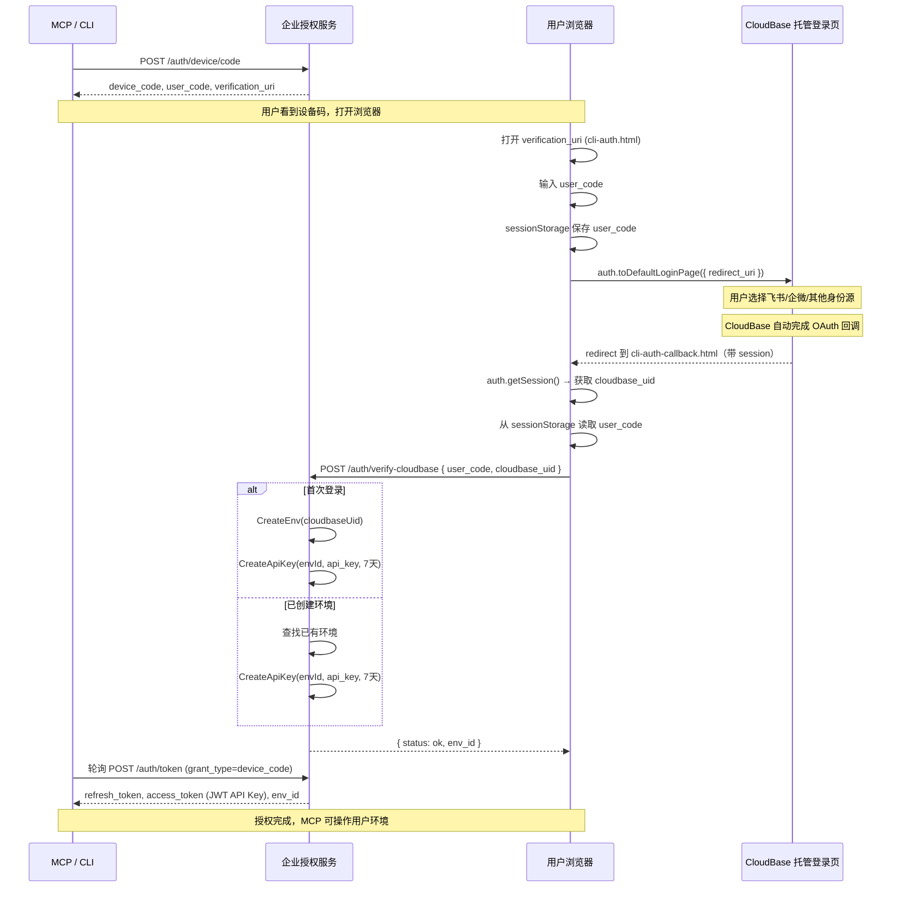

# 企业自有品牌授权服务协议

本协议基于 RFC 8628（OAuth 2.0 Device Authorization Grant）扩展，结合 CloudBase 托管登录页 + 自定义 OAuth 2.0 身份源，实现企业自有品牌下的免腾讯云账号授权流程。

## 协议端点

| 方法 | 路径 | 用途 |
|------|------|------|
| `GET` | `/auth/config` | 获取 CloudBase SDK 初始化配置 |
| `POST` | `/auth/device/code` | 申请设备授权码 |
| `POST` | `/auth/verify-cloudbase` | CloudBase 托管登录页认证后回调 |
| `POST` | `/auth/device/verify` | 简单确认授权（兼容） |
| `POST` | `/auth/token` | 轮询/续期/退出 |

## 完整流程

## 环境变量

参见 `.env.example`。

## Token 说明

| 凭证 | 生成时机 | 用途 | 生命周期 |
|------|----------|------|----------|
| `device_code` | POST /device/code | 客户端轮询标识 | EXPIRES_IN 秒 |
| `user_code` | POST /device/code | 用户浏览器确认 | EXPIRES_IN 秒 |
| `refresh_token` | POST /token (grant=device) | 客户端续期凭证 | 7 天（可配） |
| `access_token` | POST /token (grant=device) | 本次返回 API Key 值 | 7 天（与 refresh 对齐） |

## 响应字段补充说明

| 字段 | 来源 | 说明 |
|------|------|------|
| `provider_id` | CloudBase UserInfo API | 用户使用的身份源 ID（如 `custom_oauth_feishu`、`email`），可通过此字段判断用户的登录方式 |
| `provider_user_id` | CloudBase UserInfo API | 用户在身份源侧的原始 ID（如飞书 `open_id`），可用于关联企业身份系统 |

> 注：`provider_id` 和 `provider_user_id` 在 `POST /auth/token` 响应中返回。当前 CloudBase 暂不返回身份源扩展属性（如飞书 `tenant_key`、部门等），如需获取可在回调页直接调身份源 API。
