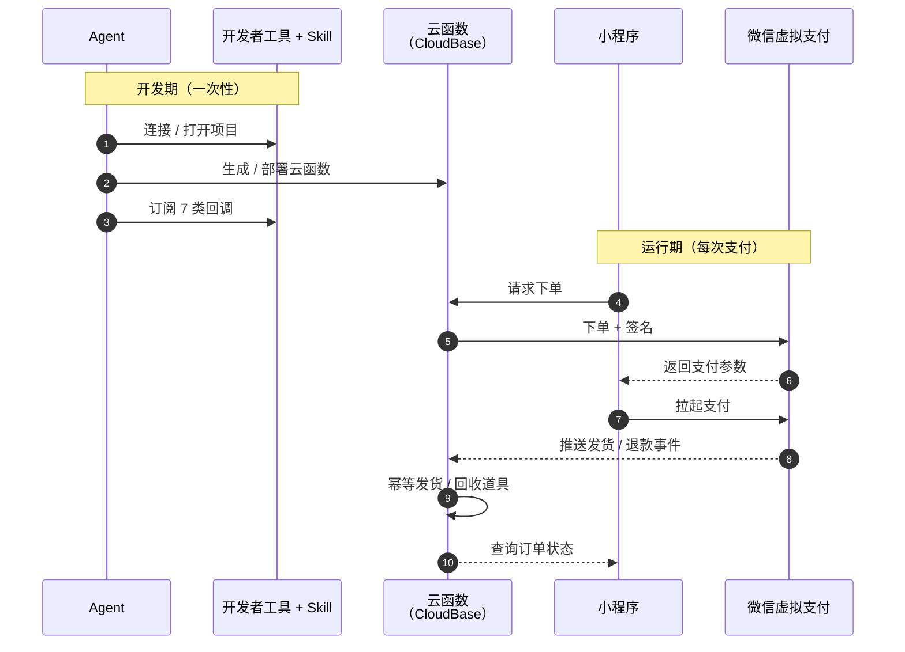

# 云开发 + Agent 快速接入个人小程序虚拟支付

> 基于微信云开发的个人主体小程序虚拟支付接入，覆盖开通、签名、回调、发货、退款等全链路，配合 Agent 可零基础落地。

## 一、概述

微信小程序虚拟支付是微信针对**虚拟商品交易**为个人开发者开放的支付能力。个人主体小程序在「工具」类目、已认证备案的前提下，可开通虚拟支付，月支付限额 10 万元。

微信云开发（CloudBase）配合官方调试工具 Skill，将虚拟支付的全链路能力**整合到云函数与云数据库**中：服务端签名、消息推送订阅、订单入库、幂等发货、查单兜底，都由云函数承担，无需自建服务器、无需管理证书。

Agent（如 CodeBuddy、WorkBuddy 等）可在调试、签名、代码生成、云函数部署、回调订阅、文档撰写等环节**直接接管整套流程**——开发者从零开始接入一个完整的虚拟支付 Demo 通常只需要 10 分钟左右。

## 二、前提条件

| 条件 | 说明 |
|------|------|
| 个人主体 | 小程序主体为个人，开发者持有中国大陆居民身份证 |
| 服务类目 | 小程序服务类目包含「工具」 |
| 认证与备案 | 已完成小程序认证、备案 |
| 云开发环境 | 已开通 CloudBase 并获得环境 ID |

## 三、开通虚拟支付

### 3.1 MP 后台开通流程

详见微信官方文档：[个人主体虚拟支付接入指引](https://developers.weixin.qq.com/miniprogram/dev/platform-capabilities/business-capabilities/virtual-payment/person)。

### 3.2 开通后获取 3 个关键参数

| 信息 | 是什么 | 在哪找 |
|------|--------|--------|
| **AppID** | 小程序的「身份证号」 | MP 后台 → 设置 |
| **OfferID** | 虚拟支付商户号 | 虚拟支付 → 基本配置 |
| **现网 AppKey** | 支付密钥 | 虚拟支付 → 基本配置 |
| **沙箱 AppKey**（按需获取） | 沙箱环境密钥，调试时使用 | 虚拟支付 → 基本配置 |

**沙箱环境限制**（按小程序版本）：

| 模式 | 适用版本 | 限制 |
| ---- | -------- | ---- |
| 沙箱 | 开发版 / 体验版 | 真机预览下会被 `PAYMENT_ILLEGAL_IN_SANDBOX` 拦截 |
| 现网 | 全版本 | iOS 真机需开通 IAP |

> ⚠️ 真实联调请使用**现网**模式（沙箱仅适合开发版/体验版的开发者工具内调试）。沙箱密钥不要在生产环境代码中使用。

### 3.3 创建道具

**虚拟支付 → 道具管理** 创建道具，记录道具 ID 和价格 → 完成发布。

> ⚠️ 道具必须先发布，且**发布后需等待几分钟到半小时**用于全平台同步，期间下单会被 `COIN_OR_PRODUCT_ID_CREATED_IN_RECENTLY` 拒绝。

### 3.4 iOS 支付额外条件

如需 iOS 端支付：

1. **虚拟支付 → 基础配置** 配置**小程序简称**（Apple 展示名）
2. **虚拟支付 → 基本配置** 开通**苹果 IAP 支付**
3. iOS 端用户需微信客户端 **8.0.68 及以上**，代码里先校验版本再拉起支付

## 四、整体架构

Agent 贯穿开发期每个环节，串联起小程序、云函数、虚拟支付后台、开发者工具。



**核心能力构成：**

| 组件 | 在虚拟支付场景中的角色 |
|------|----------------------|
| **微信云开发 CloudBase** | 提供 Serverless 后端服务，云函数承担下单签名 / 回调处理 / 查单兜底，云数据库存储订单与道具数据 |
| **虚拟支付 Skill** | 提供签名算法、回调格式、合规清单等接入指引 |
| **微信云开发 Skill** | 提供 CloudBase 平台知识、最佳实践、相关子 skill 索引（鉴权、数据库、云函数等） |
| **wechatide Skill** | 通过微信开发者工具的 CLI 自动完成云函数部署、消息推送订阅 |
| **微信开发者工具 MCP** | 在 AI 工具与开发者工具之间提供工具调用通道，使 Agent 能直接执行云函数部署、消息推送订阅等操作 |
| **Agent** | 让 AI 实现整个虚拟支付流程 |

## 五、Skill 与开发者工具准备

整套接入依赖三项准备：Nightly 版微信开发者工具、CloudBase 云环境、三个官方 Skill（虚拟支付 / 云开发 / wechatide）。

### 5.1 下载 Nightly 版微信开发者工具

虚拟支付调试需 Nightly 版开发者工具，内置虚拟支付相关的 Skill 与 MCP 能力，支持 `wechatide` CLI。

- 下载页：https://developers.weixin.qq.com/miniprogram/dev/devtools/log.html
- Nightly 版本要求 ≥ 2.02.2608312

### 5.2 安装 Skill

| Skill | 地址 | 说明 |
| ------ | ---- | ---- |
| `miniprogram-virtualpay-person` | https://skillhub.cn/skills/tencent-adm/miniprogram-virtualpay-person | 个人主体虚拟支付接入指引（开通激活、道具直购、发货推送、查单、退款、结算与费率） |
| `miniprogram-development` | https://skillhub.cn/skills/tencent-adm/miniprogram-development | 小程序项目开发、微信云开发集成、调试预览 |
| `wechatide-skill` | https://skillhub.cn/skills/tencent-adm/wechatide-skill | 微信开发者工具 CLI 操作（编译、预览、上传、云函数部署、消息推送订阅） |

> 提示：Nightly 版微信开发者工具菜单里提供 **「复制 Skill 安装提示词」** 一键复制上述 skill 的安装指令。

#### 让 AI 一键安装三个 Skill

直接告诉 AI：

> 请根据 https://skillhub.cn/install/skillhub.md，安装 @tencent-adm/miniprogram-virtualpay-person、@tencent-adm/miniprogram-development、@tencent-adm/wechatide-skill。

AI 会自动完成 SkillHub CLI 安装、三个 Skill 下载与加载。

## 六、AI 辅助接入流程

整套接入可以完全由 AI 驱动，开发者只需提供业务参数。

### 6.1 让 AI 帮你跑全流程

把已经开通虚拟支付 + 配置好道具的需求告诉 AI，让 AI 帮你生成完整 Demo：

```text
> 我有一个个人小程序，已经开通虚拟支付，并完成相关虚拟道具配置。
> 请使用安装好的 Skill，帮我生成一个能完成整支付的 Demo。
```

### 6.2 关键步骤

#### 第一步：环境与授权

AI 会自动完成服务端口检查、CLI 授权握手、轮询结果。授权过程中开发者工具会弹出「CodeBuddy 请求连接 CLI」和「MCP 客户端授权」两个确认框，点「允许」即可。

> ⚠️ 已运行的开发者工具因单例锁会导致授权超时；建议**先完全退出开发者工具**，再让 AI 执行授权。

#### 第二步：部署云函数

AI 会通过 MCP 自动部署承担支付后端能力的云函数（下单签名、回调处理、查单兜底、用户身份识别）。

#### 第三步：订阅消息推送

AI 会自动把虚拟支付推送事件（发货、代币、退款、投诉等）订阅到云函数。

## 七、关键模块作用

虚拟支付链路在 CloudBase 上由以下模块协作完成：

| 模块 | 承担的能力 |
|------|-----------|
| **下单云函数** | 接收前端下单请求，生成业务单号、构造支付参数、计算双签名，返回给前端用于拉起支付 |
| **回调云函数** | 接收虚拟支付平台推送的发货 / 退款等事件，幂等校验后发放或回收道具 |
| **查单云函数** | 推送丢失时主动查单补发货，同时提供我的订单 / 我的道具列表查询 |
| **小程序前端** | 调用云函数下单、调用 `wx.requestVirtualPayment` 拉起支付、查询并展示订单状态 |

> 上述模块的具体函数名 / 文件结构因实现而异，AI 会按业务需求自动规划。具体的接入步骤、签名算法、回调处理等代码实现可参考接入教程 `docs/个人小程序虚拟支付接入教程.md`。

## 八、7 类回调事件清单

| Event | 说明 | 处理方式 |
|-------|------|---------|
| `xpay_goods_deliver_notify` | 道具发货通知 | 「核心事件」：幂等发货并发放道具 |
| `xpay_coin_pay_notify` | 代币支付通知 | 更新代币余额 |
| `xpay_refund_notify` | 退款通知 | 更新订单状态、回收道具 |
| `xpay_complaint_notify` | 用户投诉通知 | 记录投诉，建议人工跟进 |
| `xpay_subscribe_signing_result_notify` | 订阅签约结果 | 更新订阅状态 |
| `xpay_subscribe_pay_fail_notify` | 订阅支付失败 | 提示用户、检查订阅状态 |
| `xpay_subscribe_ios_refund_query_notify` | iOS 订阅退款问询 | 「3 秒内」响应特殊格式，决定是否拒绝退款 |

> iOS 退款问询必须在 3 秒内返回 `IosRefundQueryResponse.result_code`（0=建议退款，1=拒绝退款），否则 Apple 会连续问询 3 次后将结果标为「不确定」。

## 九、测试说明

Demo 跑通后，可按以下步骤验证全链路：

### 9.1 拉起支付成功

在小程序首页点击「购买」，应能正常拉起虚拟支付界面，说明下单签名与支付参数正确。

### 9.2 道具购买成功

完成支付后，订单状态与道具数量应同步更新，也可以在小程序后台-虚拟支付，查看订单交易记录。

### 9.3 回调成功

支付成功后，微信平台应推送 `xpay_goods_deliver_notify` 到回调云函数。

- 查看云函数日志，确认收到 `xpay_goods_deliver_notify` 事件
- 回调函数返回 `{ ErrCode: 0, ErrMsg: 'success' }`，平台不再重试
- 若推送丢失，可通过查单云函数主动调官方查单接口兜底补发货

## 十、关键注意事项

### 10.1 版本控制

| 模式 | 适用版本 | 限制 |
|------|---------|------|
| 沙箱 | 开发版 / 体验版 | 真机预览下会被 `PAYMENT_ILLEGAL_IN_SANDBOX` 拦截 |
| 现网 | 全版本 | iOS 真机需要开通 IAP |

### 10.2 常见错误速查

| 错误 | 原因 | 解法 |
|------|------|------|
| `COIN_OR_PRODUCT_ID_CREATED_IN_RECENTLY` | 道具刚发布，平台同步延迟 | 等几分钟到半小时再试 |
| `PAYMENT_ILLEGAL_IN_SANDBOX` | 沙箱模式在真机预览下被拒 | 切现网（`sandbox: false`） |
| `当前商户尚未开启 iOS 支付` | iOS 端 IAP 未开通 | MP 后台配置小程序简称 + 开通 IAP |

## 十一、退款、结算与费率

iOS 端虚拟支付走的是 **Apple IAP（苹果内购）**链路，资金和订单由 Apple 掌控，与 Android 端的退款行为有本质差异。

| 终端 | 谁能退款 | 方式 |
|------|---------|------|
| Android 等 | 开发者主动退款 | 调用官方服务端退款接口发起 |
| iOS | ❌ 开发者无法主动退款 | 用户到 App Store → 订阅/购买记录申请，Apple 审批通过后推送退款事件 |

### 11.1 结算周期与费率

| 终端 | 结算周期 | 费率 |
|------|---------|------|
| Android 等 | T+3 | 1%（腾讯技术服务费） |
| iOS | 约 45-60 天 | 12%（Apple 佣金） |

- 支付时间 **180 天以内**的退款，平台退还手续费；超过 180 天不退还
- 资金到账后可在 MP 后台【虚拟支付】查看账户余额、每日账单并发起提现
- 发票可在**次月 5 号后**申请开具上个月的腾讯技术服务费发票

### 11.2 iOS 退款要点

- iOS 订单的退款必须由**用户**在 **App Store → 购买记录**主动发起，开发者无法通过接口主动退款
- Apple 审批通过后，平台会推送 `xpay_refund_notify` 事件；服务端的回调处理逻辑与 Android 一致（回收道具 + 更新订单状态）
- 开发者无法对 iOS 订单调用退款接口；在「我的」页等前端场景，建议对 iOS 订单**隐藏退款按钮**，改为提示文案，引导用户去 App Store 申请

## 十二、相关资源

- 个人主体接入指引： https://developers.weixin.qq.com/miniprogram/dev/platform-capabilities/business-capabilities/virtual-payment/person
- 客户端 API：https://developers.weixin.qq.com/miniprogram/dev/api/payment/wx.requestVirtualPayment.html
- 虚拟支付回调（小游戏）：https://developers.weixin.qq.com/minigame/dev/wxcloud/guide/wechatpay/virtual-payment-callback.html
- 微信云开发文档：https://docs.cloudbase.net/
- 微信开发者工具 Nightly：https://developers.weixin.qq.com/miniprogram/dev/devtools/nightly_backup.html

---

> 本方案为个人开发者提供从开通到上线的完整接入路径，配合官方 Skill 与 AI 调试工具可在极短时间内完成全流程。
