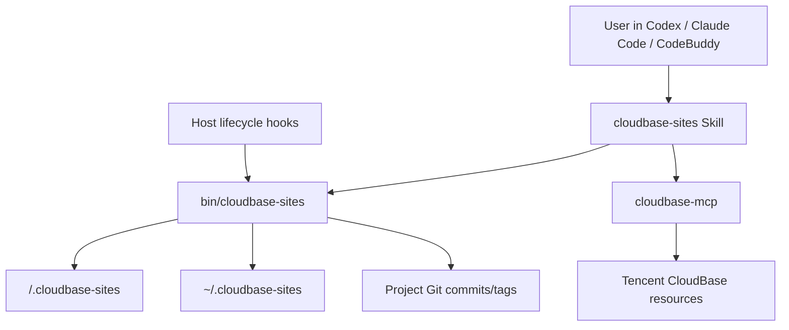

# 技术方案

## 概述

CloudBase Sites 将在现有 `plugin/cloudbase-sites` 目录中补充 Codex 插件形态，并将运行时命名统一为 Sites。实现目标是让同一套核心 CLI 和 runtime 同时服务 Claude Code / CodeBuddy / Codex，宿主差异只保留在 manifest、hook 包装和文档说明中。

本方案不兼容旧的 `.cloudbase-agent/` 状态目录。实现后所有项目级状态写入 `<cwd>/.cloudbase-sites/`，所有机器级 supervisor 状态写入 `~/.cloudbase-sites/`。

## 架构



### 分层职责

- Plugin manifests
  - `.claude-plugin/plugin.json` 保留 Claude Code / CodeBuddy 元数据。
  - `.codex-plugin/plugin.json` 新增 Codex 插件元数据，引用 `./skills/` 和 `./.mcp.json`。
  - Codex manifest 不写 `hooks` 字段；Codex 通过默认 `hooks/hooks.json` 发现插件 hooks。
- Shared runtime
  - `bin/cloudbase-sites` 是唯一用户入口。
  - `lib/verbs/*` 继续承载 `init`、`preview`、`save`、`deploy`、`rollback`、`versions`、`supervisor`。
  - `lib/*` 中所有状态路径统一从 `.cloudbase-agent` 改为 `.cloudbase-sites`。
- Host hooks
  - `hooks/hooks.json` 保留生命周期声明，但 hook command 需要避免硬编码 Claude-only 变量。
  - `on-session-start.sh` 和 `on-file-change.sh` 继续作为 hook 实现。
  - 如果 Codex 未信任或禁用 hooks，skill 中的显式 CLI 流程仍可工作。
- Cloud effects
  - 只有 `cloudbase-mcp` 负责 CloudBase 资源副作用，例如 `manageApps`、`envQuery`、数据库和认证配置。

## Codex 插件 Manifest

新增 `plugin/cloudbase-sites/.codex-plugin/plugin.json`，字段遵循本地 `plugin-creator` 校验器：

- `name`: `cloudbase-sites`
- `version`: 与 Claude manifest 初始保持一致，例如 `0.1.0`
- `description`: 明确为 CloudBase 托管的 Sites-like workflow
- `author`: Tencent CloudBase
- `homepage` / `repository` / `license` / `keywords`
- `skills`: `./skills/`
- `mcpServers`: `./.mcp.json`
- `interface`
  - `displayName`: `CloudBase Sites`
  - `shortDescription`: 建站、预览、保存版本、部署到 CloudBase
  - `longDescription`: 说明 CloudBase hosting/database/storage/auth/backend 能力
  - `developerName`: `Tencent CloudBase`
  - `category`: `Developer Tools`
  - `capabilities`: 至少包含 `Write`、`Interactive`
  - `defaultPrompt`: 3 条以内，覆盖创建站点、部署、加数据库

先不添加 logo/screenshots，避免引入资源验证问题。后续如需要插件卡片视觉，再放入 `assets/` 并更新 manifest。

## Hooks 设计

Codex 支持插件 bundled hooks，但非托管 hooks 需要用户信任。实现上遵守以下原则：

- `hooks/hooks.json` 使用 Codex/Claude 都能理解的事件名和 matcher：`SessionStart`、`PostToolUse`、`Edit|Write|MultiEdit`。
- hook command 不依赖 `${CLAUDE_PLUGIN_ROOT}` 作为唯一路径来源。
- hook 脚本应通过如下顺序解析插件根目录：
  1. host 提供的插件根环境变量；
  2. 脚本自身路径 `dirname "$0"/..`；
  3. `command -v cloudbase-sites`。
- hook 失败不阻塞用户操作，错误写入 `.cloudbase-sites/logs/`。
- `SessionStart` 输出的 Claude additionalContext 对 Codex 不作为强依赖；Codex 主要依赖 bundled skill 和 hook 副作用。

## 状态与日志

### 项目级状态

所有项目级状态写入：

```text
<cwd>/.cloudbase-sites/
  preview.json
  app.json
  restart.lock
  template.zip
  logs/
    preview-<ts>.log
    hook-session-start.log
    hook-restart.log
```

`app.json` 继续使用 V2 schema：

```json
{
  "siteName": "project-abcdef",
  "cwd": "/path/to/project",
  "firstSeenAt": "ISO timestamp",
  "versions": [
    {
      "n": 1,
      "commitSha": "abc1234",
      "label": "initial version",
      "savedAt": "ISO timestamp",
      "status": "saved"
    }
  ],
  "deployments": [
    {
      "version": 1,
      "deployedAt": "ISO timestamp",
      "accessUrl": "https://...",
      "buildId": "optional",
      "versionName": "optional",
      "buildStatus": "SUCCESS",
      "finalUrl": "https://...?v=..."
    }
  ],
  "currentVersion": 1,
  "currentDeploy": 1
}
```

### 机器级状态

所有跨项目 supervisor 状态写入：

```text
~/.cloudbase-sites/
  registry.json
  supervisor.json
  supervisor.lock
  registry.lock
  supervisor.log
```

### Git ignore

`cloudbase-sites init` 和任何会创建状态目录的命令应确保用户项目 `.gitignore` 包含：

```gitignore
.cloudbase-sites/
```

仓库自身 `.gitignore` 也应加入 `**/.cloudbase-sites/`，防止测试或本地运行产生状态文件被提交。

## Save / Deploy / Rollback 语义

### Save

`cloudbase-sites save -m "<label>"` 保持 Git checkpoint 模型：

1. 确认当前目录是 Git repo。
2. 确保 `.cloudbase-sites/` 已被 Git 忽略。
3. `git add -A`
4. `git commit --allow-empty -m "version <n>: <label>"`
5. `git tag -f version/<n>`
6. 写入 `app.json.versions[]`

该命令只创建本地 commit/tag，不 push。

### Deploy

为避免“指定版本”和“当前工作区”语义不一致，部署指定版本时采用清晰策略：

- `cloudbase-sites deploy --version <n>` 应部署版本 `n` 对应的 Git commit。
- 如果当前 HEAD 不是目标版本 commit，命令应先 stash 当前未提交修改，再 checkout/reset 到目标 commit 进行 build。
- build 完成并输出 `nextAction` 后，不自动恢复工作树；恢复或继续编辑由用户通过 rollback/save 流程显式完成。

Phase 1 输出 `nextAction`：

```json
{
  "tool": "manageApps",
  "args": {
    "action": "deployApp",
    "serviceName": "<siteName>",
    "filePath": "<cwd>",
    "buildPath": "dist",
    "framework": "static",
    "installCmd": "",
    "buildCmd": ""
  }
}
```

Phase 2 由 agent 在 `manageApps` 成功后调用：

```bash
cloudbase-sites deploy --post --version <n> --access-url <url> --build-id <optional>
```

记录 `deployments[]`、更新 `currentDeploy`，并打 `deploy/<n>-<ts>` tag。

Phase 2 应尽量记录 CloudBase 构建元数据：

- `buildId`: `manageApps` 返回的 `BuildId`，用于后续 `queryApps(action="getAppVersion")` 和 `queryApps(action="getBuildLog")`。
- `versionName`: `manageApps` 返回的 `VersionName`，如果存在则记录。
- `buildStatus`: 当前已知构建状态，成功部署时默认可记录为 `SUCCESS`。

如果 `manageApps` 返回了 `BuildId`，agent 必须通过 `--build-id` 传给 `cloudbase-sites deploy --post`。如果 Phase 2 未收到 buildId，CLI 应在 JSON 输出中给出 warning，提示该部署无法直接追踪 CloudBase 构建日志。

### Rollback

`cloudbase-sites rollback --to-version <n>`：

1. stash 未提交修改；
2. `git reset --hard <version.commitSha>`；
3. 标记目标版本之后的版本为 `rolled-back`；
4. 异步 `preview --restart`。

Rollback 不自动部署，用户需要显式 deploy。

## 已知 runtime 修正

本次实现应包含以下修正：

- `cloudbase-sites status` 改为 `preview --status` 的真实别名。
- `on-session-start.sh` 读取 V2 `app.json` 的 `versions/deployments/currentVersion/currentDeploy`。
- 所有 `[cloudbase-agent]` stderr 前缀改为 `[cloudbase-sites]`。
- `cloudbase-agent-runtime` skill 目录或 skill name 改为 Sites 命名，例如 `skills/cloudbase-sites-runtime/SKILL.md`。
- `init` 的 empty-enough 允许列表从 `.cloudbase-agent` 改为 `.cloudbase-sites`。

## 安全性

- 不提交 secret、日志、PID、端口、模板压缩包或运行态 JSON。
- `save` 和 rollback 都只做本地 Git 操作，不 push。
- Codex hook 信任由 Codex 自身 hook review 机制处理。
- CloudBase 云端资源变更继续走 `cloudbase-mcp`，受 MCP tool approval 和 CloudBase auth 约束。

## 测试策略

### 静态验证

- 运行 Codex plugin validator：

```bash
python3 /Users/bookerzhao/.codex/skills/.system/plugin-creator/scripts/validate_plugin.py plugin/cloudbase-sites
```

- grep 验证插件 runtime 不再出现 `.cloudbase-agent` 和 `[cloudbase-agent]`。

### CLI 验证

在临时 Vite fixture 或测试项目中验证：

- `cloudbase-sites --help`
- `cloudbase-sites status`
- `cloudbase-sites preview --status` 在无 preview 时返回可解析 JSON
- `cloudbase-sites save -m "test"` 不会提交 `.cloudbase-sites/`
- `cloudbase-sites versions`
- `cloudbase-sites deploy --skip-build` 在已有 saved version 和 dist 时输出 `nextAction`

### 文档/生成物控制

- 本任务不需要更新 `doc/mcp-tools.md` 或 `scripts/tools.json`。
- 提交前检查 `git diff --stat`，排除无关生成产物漂移。
