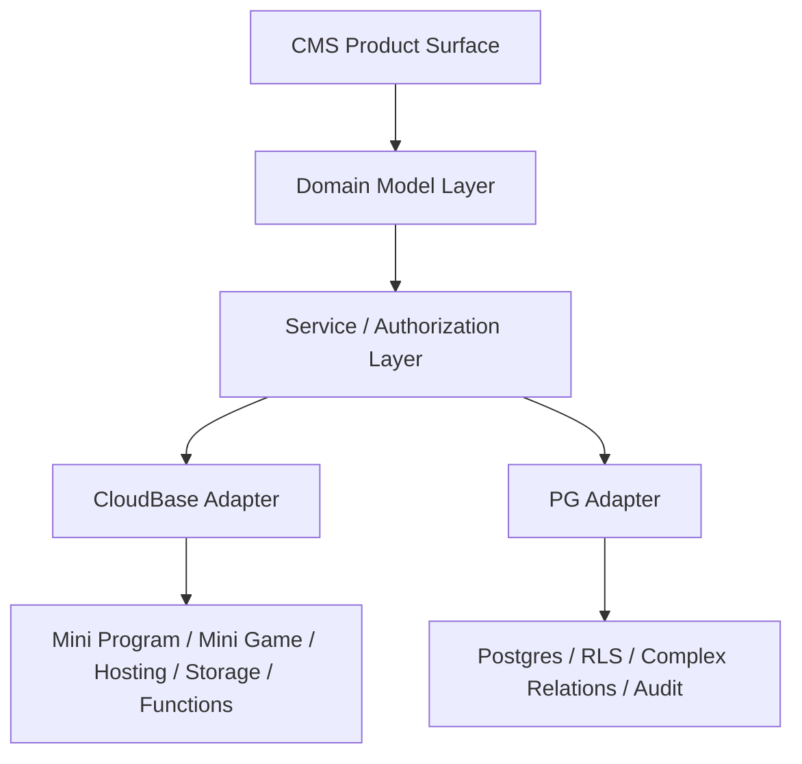

# 技术方案设计

## 概述

本方案为 CloudBase CMS 路线提供一套 `CloudBase-first / PG-ready` 的分层设计，用于支撑两类目标：

- 允许团队在当前 CloudBase 能力边界内先发布一个真实可用的 CMS v1
- 从第一天起为 PG / Supabase 类能力预留演进路径，避免未来因为底层实现切换而推翻产品概念、API 和 skill 路由

方案重点不在于立即实现完整 CMS，而在于先稳定以下内容：

- v1 与 v2 的产品边界
- 核心领域模型与命名
- CloudBase、PG 与服务层的分工
- 后续 `cms` skill、参考资料与实现任务可复用的决策矩阵

## 目标

- 定义可首发的 `CloudBase CMS v1`
- 定义后续 `PG-enhanced CMS v2`
- 建立存储无关的领域模型
- 建立 `CloudBase-native`、`PG-based`、`Hybrid` 三种推荐路线
- 让后续 `cms` skill 不再默认“从零造一个 CMS”，而是先做路线选择和范式推荐

## 非目标

- 不在本阶段实现新的 CMS 产品代码
- 不在本阶段选定唯一的 PG 产品方案
- 不要求立即完成 CloudBase 到 PG 的迁移实现
- 不将 CloudBase 现有数据模型定义为未来 CMS 的唯一真相源

## 已知约束

### CloudBase 侧约束

- 文档型数据库安全规则更适合轻量文档/行级控制，不适合作为复杂 CMS 授权系统的唯一基础
- 云函数与服务端逻辑可以绕过数据库侧限制，因此复杂 RBAC、工作流和业务授权仍需在服务层实现
- CloudBase 更擅长承接微信小程序、小游戏、静态托管、文件存储、云函数编排和腾讯生态交付

### PG 侧约束

- PG / RLS 更适合复杂关系建模、多租户/多项目隔离、复杂查询、审计和工作流状态建模
- RLS 不能替代 CMS 业务层 RBAC、状态流转权限和领域服务授权
- PG 是否由 CloudBase 原生提供类似 Supabase 的统一 API 仍非当前可依赖前提，因此本方案不能把 PG 作为 v1 前置

## 产品路线

### v1 - CloudBase CMS

定位：

- CloudBase-first
- 面向内容管理、活动运营、小程序/小游戏配置和轻量项目后台
- 可基于 CloudBase 现有能力发布

适合承诺的能力：

- 内容类型定义与基础内容录入
- 项目级内容与资源管理
- 基础角色控制
- 基础 API 暴露
- 基础 webhook / hook
- 小程序、小游戏、活动页和轻量内容门户接入

不在 v1 强承诺的能力：

- 复杂企业级 RBAC
- 多租户 SaaS 级隔离
- 复杂审批与版本工作流
- 字段级细粒度权限
- 高复杂分析查询和报表引擎

### v2 - PG-enhanced CMS

定位：

- PG-ready 路线的增强版本
- 用于承接复杂权限、复杂工作流、复杂关系和多项目/多客户隔离

适合增强的能力：

- 多租户/多客户数据隔离
- 复杂 RBAC / policy
- 工作流、版本、审计
- 复杂查询、统计与数据门户
- 更强的 API 策略和外部系统集成

## 核心架构



说明：

- `CMS Product Surface`
  - 指产品功能、控制台、API、skill 路由和对外能力描述
- `Domain Model Layer`
  - 存储无关的领域模型，定义核心概念
- `Service / Authorization Layer`
  - 负责 CMS 业务授权、工作流、hook、批量操作和编排
- `CloudBase Adapter`
  - 负责 CloudBase 上的内容、存储、函数和腾讯生态交付
- `PG Adapter`
  - 负责关系数据、复杂权限隔离、审计和复杂查询

## 领域模型设计

为避免 CloudBase collection 或 PG table 直接泄漏为产品概念，先定义稳定的领域模型：

- `workspace` / `project`
- `contentType` / `schema`
- `entry`
- `mediaAsset`
- `role`
- `policy`
- `workflow`
- `webhook`
- `apiToken`
- `auditLog`

这些概念必须满足两条要求：

1. 能先映射到 CloudBase v1
2. 后续可以迁移或并行映射到 PG

### v1 中的 CloudBase 映射

- `workspace/project` → CloudBase 中的项目配置集合
- `contentType/schema` → schema 配置集合或受控数据模型定义
- `entry` → collection 文档
- `mediaAsset` → Cloud Storage 文件对象 + 元数据文档
- `role/policy` → 角色文档 + 服务层授权逻辑
- `workflow` → 云函数或服务层状态机逻辑
- `webhook` → webhook 配置集合 + 云函数 / HTTP 触发
- `apiToken` → API token 配置与服务层校验

### v2 中的 PG 映射

- `workspace/project` → projects / tenants / memberships
- `contentType/schema` → typed metadata tables
- `entry` → normalized relational content tables
- `role/policy` → membership / role / policy tables + RLS + service authz
- `workflow` → workflow / task / transition tables
- `auditLog` → append-only audit tables

## 分层职责

### 1. 产品层

负责：

- CMS 控制台与配置体验
- 路线选择文案与能力边界
- 后续 `cms` skill 的触发与推荐结果

原则：

- 不暴露底层实现细节作为产品主概念
- 不把 “collection” 或 “table” 当作对用户的唯一产品语言

### 2. 领域与服务层

负责：

- 领域对象定义
- RBAC / policy 判断
- 状态流转权限
- 批量操作与内容发布逻辑
- webhook / hook 触发策略
- 报告、AI 问答和异步任务编排

原则：

- 所有复杂授权都在这一层收口
- CloudBase ACL / 安全规则与 PG RLS 只作为下层能力，不替代这一层

### 3. CloudBase Adapter

负责：

- 小程序与小游戏前端接入
- 文件存储与静态资源托管
- 云函数执行与轻量 hook
- CloudBase 原生内容和运营配置能力

适用：

- v1 首发
- 内容、活动、配置类后台
- 腾讯生态交付

### 4. PG Adapter

负责：

- 复杂关系建模
- 多租户 / 多客户隔离
- 审计、版本、复杂工作流状态
- 复杂查询和聚合

适用：

- v2 增强
- 更复杂的门户、报表、工作流和授权

## 路线决策矩阵

后续 `cms` skill 和产品规划统一使用三种路线：

### CloudBase-native

适用于：

- 轻量内容管理
- 活动运营
- 小程序/小游戏配置
- 基础 API 暴露
- 轻量后台

推荐原因：

- 快速
- 交付链条短
- 腾讯生态接入顺畅

### PG-based

适用于：

- 复杂 RBAC
- 多项目/多客户隔离
- 工作流、审计、版本
- 复杂查询与统计

推荐原因：

- 关系模型更强
- 权限和查询能力更适合长期系统

### Hybrid

适用于：

- 小程序/小游戏前端和交付仍依赖 CloudBase
- 核心数据与权限逐步转向 PG
- 需要平衡现有 CloudBase 资产与未来能力升级

推荐原因：

- 支持渐进演进
- 避免一次性重构

## 对 `cms` skill 的影响

后续 `cms` skill 不再默认输出“从零造一个 CMS”，而改为：

1. 先判断需求复杂度与场景
2. 选择 `CloudBase-native`、`PG-based` 或 `Hybrid`
3. 套用固定 CMS archetype
4. 再输出 CloudBase / PG 映射建议

建议 `cms` skill 参考资料结构：

```text
config/source/skills/cms/
├── SKILL.md
├── references/
│   ├── archetypes.md
│   ├── snippets.md
│   ├── cloudbase-mapping.md
│   └── decision-matrix.md
└── assets/
    ├── collection-cms-template.md
    ├── campaign-cms-template.md
    └── hybrid-architecture-template.md
```

其中：

- `decision-matrix.md` 复用本方案中的路线决策逻辑
- `cloudbase-mapping.md` 复用本方案中的 CloudBase / PG 分层职责

## 测试与验证策略

本阶段不做产品代码测试，改为做方案级验证：

1. 场景验证
   - 轻量内容管理需求应落到 `CloudBase-native`
   - 复杂 RBAC / 多客户门户需求应落到 `PG-based` 或 `Hybrid`

2. 概念验证
   - 领域模型命名不依赖 collection / table
   - v1/v2 边界可被清楚解释

3. skill 复用验证
   - 后续 `cms` skill 能根据本矩阵给出一致的架构推荐

## 推荐实施优先级

基于当前样板结果，建议执行顺序如下：

1. `CloudBase CMS v1` 策略资料与 `cms` skill 样板
   - 先稳定路线矩阵、CMS archetype、snippet、CloudBase/PG mapping
   - 用于统一产品规划、skill 触发和方案输出

2. `CloudBase-native` 首发场景验证
   - 重点覆盖官网 CMS、活动运营后台、小程序/小游戏配置后台
   - 验证这些场景是否足以支撑一个真实可发的 v1

3. 高复杂场景样例回放
   - 使用“台账 + 可视化 + 多用户 + 小程序 + 对话式数据访问”等样例复查边界
   - 将这类需求明确归入 `PG-based` 或 `Hybrid`

4. PG-enhanced 路线预研
   - 在不阻塞 v1 的前提下，规划 PG 侧的内容、权限、工作流和审计模型
   - 明确后续是否采用自建服务层、Directus 类平台，或其他 PG-based CMS 组合

结论：

- 先做 `CloudBase-first` 的 v1 资料与样板是合理的
- 不应为了等待 PG 完整方案而阻塞 CMS 首发方向
- 但所有高复杂场景必须从第一天起被显式标记为 `PG-ready` 或 `Hybrid-ready`

## 风险与缓解

风险 1：v1 边界定义过宽，导致团队误以为 CloudBase-only 可以承接复杂 CMS

- 缓解：在需求与 skill 决策矩阵中明确列出 v1 不强承诺的能力

风险 2：团队过早绑定某一种 PG 产品实现，反而把产品概念做窄

- 缓解：设计阶段先稳定领域模型与路线矩阵，不将某个产品实现上升为产品主概念

风险 3：未来 `cms` skill 再次退化成“大而全说明文档”

- 缓解：要求 skill 主文档聚焦行为规则与路由，将路线矩阵、范式和映射拆到 references
