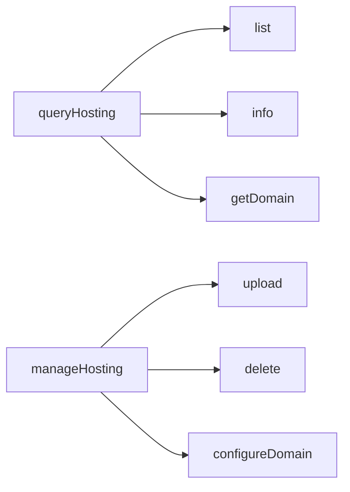
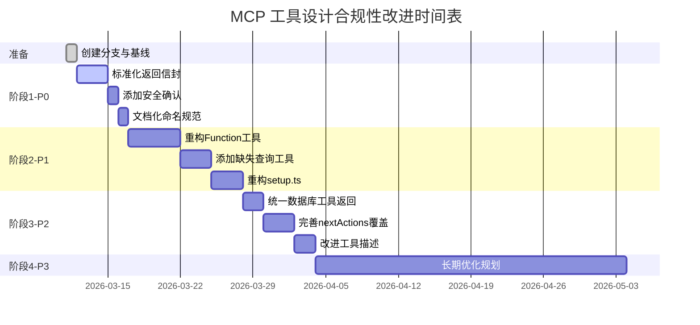

# 技术方案设计 - MCP 工具设计合规性改进

## 1. 架构概述

本方案旨在通过标准化、模块化和自动化手段，提升 CloudBase MCP 工具包的设计合规性，从当前的 65/100 提升至 90/100 以上。

### 1.1 核心原则

1. **向后兼容**：所有改动保持向后兼容，使用 deprecation 策略逐步迁移
2. **渐进式改进**：分阶段实施，优先处理关键问题
3. **测试驱动**：每个改动都有对应的测试验证
4. **文档同步**：代码改动与文档更新同步进行

### 1.2 技术栈

- **语言**：TypeScript 5.x
- **测试框架**：Vitest
- **构建工具**：tsup
- **代码质量**：ESLint, Prettier
- **版本控制**：Git (feature branch workflow)

---

## 2. 标准化返回格式设计

### 2.1 返回信封类型定义

```typescript
// mcp/src/utils/response-builder.ts

export interface NextAction {
  tool: string;                    // 工具名称
  params?: Record<string, any>;    // 核心参数（AI 可直接使用或填充占位符）
  reason: string;                  // 建议原因
  priority?: 'high' | 'medium' | 'low';  // 优先级（可选）
}

export interface ToolResult<T = any> {
  success: boolean;       // 操作是否成功
  data: T;                // 返回数据
  message: string;        // 人类可读的消息
  nextActions?: NextAction[];  // 下一步建议（如无必要，不要推荐）
}

export function buildToolResult<T>(
  success: boolean,
  data: T,
  message: string,
  nextActions?: NextAction[]
): ToolResult<T> {
  return {
    success,
    data,
    message,
    nextActions: nextActions || []
  };
}

// 便捷函数
export function successResult<T>(
  data: T,
  message: string,
  nextActions?: NextAction[]
): ToolResult<T> {
  return buildToolResult(true, data, message, nextActions);
}

export function errorResult<T = null>(
  message: string,
  data: T = null as T,
  nextActions?: NextAction[]
): ToolResult<T> {
  return buildToolResult(false, data, message, nextActions);
}

// 辅助函数：构建 nextAction
export function buildNextAction(
  tool: string,
  params: Record<string, any> | undefined,
  reason: string,
  priority?: 'high' | 'medium' | 'low'
): NextAction {
  return { tool, params, reason, priority };
}
```

### 2.2 nextActions 策略

**核心原则**：**如无必要，不要推荐**

只在以下情况提供 `nextActions`：
1. **错误需要修复** - 提供诊断或修复步骤
2. **操作需要验证** - 异步操作、复杂配置等需要确认结果
3. **工作流不完整** - 操作是多步骤流程的一部分
4. **发现可用资源** - 如搜索到 skills，推荐具体的 skill actions 和核心参数

**❌ 不推荐的场景**：
- 简单的查询操作（如 list、get）
- 完整的独立操作（如 upload 成功）
- 显而易见的下一步（AI 可以自行推断）

**✅ 推荐的场景示例**：

**错误需要修复**：
```typescript
// 函数调用失败
nextActions: [
  {
    tool: 'queryFunctions',
    params: { action: 'get', functionName: 'my-func' },
    reason: 'Check if function exists and is active'
  },
  {
    tool: 'auth',
    params: { action: 'status' },
    reason: 'Verify authentication status'
  }
]
```

**异步操作需要验证**：
```typescript
// 部署 CloudRun 后（异步操作）
nextActions: [
  {
    tool: 'queryCloudRun',
    params: { action: 'get', serviceName: 'my-service' },
    reason: 'Check deployment status (async operation)'
  }
]
```

**其他工具推荐 searchKnowledgeBase**（而不是 searchKnowledgeBase 推荐其他工具）：
```typescript
// 场景 1: 用户尝试创建函数但缺少参数
manageFunctions({ action: 'create' })

// 返回错误 + 推荐查阅文档
{
  success: false,
  data: null,
  message: 'Missing required parameters: functionName, runtime, handler',
  nextActions: [
    {
      tool: 'searchKnowledgeBase',
      params: {
        mode: 'skills',  // 改名后（原 mode='doc'）
        skillName: 'cloud-functions'
      },
      reason: 'Read cloud functions development guide to understand required parameters, runtime options, and best practices'
    }
  ]
}

// 场景 2: 用户尝试执行危险 SQL 操作
executeWriteSQL({ sql: 'DELETE FROM users WHERE id > 100' })

// 返回错误 + 推荐查阅文档和正确操作
{
  success: false,
  data: null,
  message: 'Destructive SQL operation detected. Please set confirm=true to proceed.',
  nextActions: [
    {
      tool: 'searchKnowledgeBase',
      params: {
        mode: 'skills',
        skillName: 'relational-database-tool'
      },
      reason: 'Read the REQUIRED documentation to understand safe SQL execution, security rules, and why confirm=true is needed'
    },
    {
      tool: 'executeWriteSQL',
      params: {
        sql: 'DELETE FROM users WHERE id > 100',
        confirm: true
      },
      reason: 'Execute with confirm=true after understanding the implications from the documentation'
    }
  ]
}

// 场景 3: 用户想使用 AI 功能但不知道用哪个 SDK
// (假设有个 queryAICapabilities 工具)
{
  success: true,
  data: {
    availableSDKs: ['ai-model-nodejs', 'ai-model-web', 'ai-model-wechat']
  },
  message: 'CloudBase supports AI capabilities in 3 environments',
  nextActions: [
    {
      tool: 'searchKnowledgeBase',
      params: {
        mode: 'skills',
        skillName: 'ai-model-nodejs'
      },
      reason: 'Read Node.js AI SDK guide if developing backend services or cloud functions (supports text + image generation)'
    },
    {
      tool: 'searchKnowledgeBase',
      params: {
        mode: 'skills',
        skillName: 'ai-model-web'
      },
      reason: 'Read Web AI SDK guide if developing browser/Web applications (text generation only)'
    },
    {
      tool: 'searchKnowledgeBase',
      params: {
        mode: 'skills',
        skillName: 'ai-model-wechat'
      },
      reason: 'Read WeChat Mini Program AI SDK guide if developing mini programs (text generation only)'
    }
  ]
}

// 注意：searchKnowledgeBase 本身返回文档后，不推荐 nextActions
// AI 阅读文档后自行决定下一步操作
{
  success: true,
  data: {
    skillName: 'cloud-functions',
    description: 'Complete guide for CloudBase cloud functions development...',
    content: '...' // 完整的文档内容
  },
  message: 'Found documentation: cloud-functions',
  nextActions: []  // ✅ 不推荐，让 AI 自己阅读理解
}
```

**工作流不完整**：
```typescript
// 创建函数但未配置触发器
nextActions: [
  {
    tool: 'manageFunctionTriggers',
    params: {
      action: 'create',
      functionName: 'my-func',
      triggerType: 'timer' // 建议的触发器类型
    },
    reason: 'Function created but has no triggers configured'
  }
]
```

---

## 3. 命名规范设计

### 3.1 资源分类

| 资源类型 | 定义 | 命名模式 | 示例 |
|---------|------|---------|------|
| 生命周期资源 | 需要创建、更新、删除的云资源 | `query{Domain}` / `manage{Domain}` | `queryFunctions` / `manageFunctions` |
| 声明式资源 | 通过读写配置管理的资源 | `read{Domain}` / `write{Domain}` | `readSecurityRule` / `writeSecurityRule` |
| 执行动作 | 一次性执行的操作 | `execute{Action}` 或折叠到 `manage` | `executeSQL` 或 `manage(action="invoke")` |

### 3.2 迁移策略

**阶段 1**：文档化规范，新工具遵循规范  
**阶段 2**：标记不符合规范的工具为 deprecated  
**阶段 3**：创建符合规范的新工具，保持向后兼容  
**阶段 4**：在主版本升级时移除 deprecated 工具

### 3.3 工具映射表

| 当前工具 | 分类 | 推荐命名 | 迁移策略 |
|---------|------|---------|---------|
| `getFunctionList` | 生命周期 | `queryFunctions(action="list")` | 长期迁移 |
| `createFunction` | 生命周期 | `manageFunctions(action="create")` | 长期迁移 |
| `uploadFiles` | 生命周期 | `manageHosting(action="upload")` | 阶段 2 迁移 |
| `readSecurityRule` | 声明式 | ✅ 已符合 | 无需迁移 |
| `executeReadOnlySQL` | 执行动作 | ✅ 已符合 | 无需迁移 |

---

## 4. 安全确认机制设计

### 4.1 确认参数设计

```typescript
interface DestructiveOperationParams {
  confirm?: boolean;      // 明确确认标志
  force?: boolean;        // 强制执行标志（用于已存在的模式）
  dryRun?: boolean;       // 预览模式（可选）
}
```

### 4.2 SQL 安全检查

```typescript
// mcp/src/tools/databaseSQL.ts

function detectDestructiveSQL(sql: string): boolean {
  const destructivePatterns = [
    /\bDROP\s+(TABLE|DATABASE|INDEX|VIEW)\b/i,
    /\bDELETE\s+FROM\b/i,
    /\bTRUNCATE\s+TABLE\b/i,
    /\bALTER\s+TABLE\s+\w+\s+DROP\b/i
  ];
  
  return destructivePatterns.some(pattern => pattern.test(sql));
}

async function executeWriteSQL(params: {
  sql: string;
  confirm?: boolean;
  // ... other params
}) {
  if (detectDestructiveSQL(params.sql) && !params.confirm) {
    return errorResult(
      'Destructive SQL operation detected. Please set confirm=true to proceed.',
      null,
      [{ tool: 'executeWriteSQL', reason: 'Add confirm=true parameter', priority: 'high' }]
    );
  }
  
  // ... execute SQL
}
```

### 4.3 破坏性操作清单

| 工具 | 操作 | 确认参数 | 状态 |
|-----|------|---------|------|
| `manageStorage` | delete | `force` | ✅ 已实现 |
| `manageCloudRun` | delete | `confirm` | ✅ 已实现 |
| `executeWriteSQL` | DROP/DELETE/TRUNCATE | `confirm` | ❌ 待实现 |
| `manageFunctions` | delete | `confirm` | ❌ 待验证 |
| `writeNoSqlDatabaseStructure` | deleteCollection | `confirm` | ❌ 待实现 |
| `manageHosting` | delete | `force` | ❌ 待实现 |

---

## 5. Function 工具优化设计

### 5.1 视图控制设计

```typescript
// getFunctionList 参数扩展
interface GetFunctionListParams {
  view?: 'summary' | 'detail';  // 默认 summary
  include?: Array<'layers' | 'triggers' | 'envVariables' | 'vpc'>;
  // ... existing params
}

// Summary 视图返回字段
interface FunctionSummary {
  functionName: string;
  runtime: string;
  status: string;
  updateTime: string;
}

// Detail 视图返回完整信息
interface FunctionDetail extends FunctionSummary {
  description: string;
  handler: string;
  memorySize: number;
  timeout: number;
  environment?: Record<string, string>;
  layers?: LayerInfo[];
  triggers?: TriggerInfo[];
  vpc?: VpcConfig;
}
```

### 5.2 批量操作设计

```typescript
// manageFunctionTriggers 批量删除
interface ManageFunctionTriggersParams {
  action: 'create' | 'delete';
  triggerName?: string;        // 单个删除
  triggerNames?: string[];     // 批量删除
  // ... other params
}

interface BatchOperationResult {
  total: number;
  succeeded: number;
  failed: number;
  results: Array<{
    item: string;
    success: boolean;
    message: string;
  }>;
}
```

---

## 6. 缺失工具设计

### 6.1 Hosting 工具设计



**queryHosting 工具**：
```typescript
{
  name: 'queryHosting',
  description: 'Query static hosting files and configuration',
  inputSchema: {
    action: 'list' | 'info' | 'getDomain',
    path?: string,  // for 'info' action
    // ...
  }
}
```

**manageHosting 工具**：
```typescript
{
  name: 'manageHosting',
  description: 'Manage static hosting files and configuration',
  inputSchema: {
    action: 'upload' | 'delete' | 'configureDomain',
    localPath?: string,  // for 'upload'
    remotePath?: string,
    force?: boolean,     // for 'delete'
    // ...
  }
}
```

### 6.2 Data Model 工具设计

**queryDataModel 工具**：
```typescript
{
  name: 'queryDataModel',
  description: 'Query data models and schemas',
  inputSchema: {
    action: 'list' | 'get' | 'getSchema',
    modelName?: string,  // for 'get' and 'getSchema'
    // ...
  }
}
```

**manageDataModel 工具整合**：
```typescript
{
  name: 'manageDataModel',
  description: 'Manage data models (create, update, delete, import)',
  inputSchema: {
    action: 'create' | 'update' | 'delete' | 'import' | 'export',
    // ... existing params
  }
}
```

---

## 7. setup.ts 重构设计

### 7.1 模块化结构

```
mcp/src/tools/setup/
├── index.ts              # 主入口，协调各模块
├── download.ts           # 下载逻辑
├── extract.ts            # 解压逻辑
├── filter.ts             # IDE 文件过滤逻辑
├── copy.ts               # 文件复制逻辑
├── types.ts              # 类型定义
├── constants.ts          # 常量定义
└── __tests__/
    ├── download.test.ts
    ├── extract.test.ts
    ├── filter.test.ts
    └── copy.test.ts
```

### 7.2 模块职责

**download.ts**：
```typescript
export async function downloadTemplateArchive(
  url: string,
  destPath: string
): Promise<{ success: boolean; filePath: string; message: string }> {
  // 下载逻辑
}
```

**extract.ts**：
```typescript
export async function extractArchive(
  archivePath: string,
  destDir: string
): Promise<{ success: boolean; extractedPath: string; message: string }> {
  // 解压逻辑
}
```

**filter.ts**：
```typescript
export function filterFilesByIDE(
  files: string[],
  ideType: string
): string[] {
  // 过滤逻辑
}
```

**copy.ts**：
```typescript
export async function copyFiles(
  sourceDir: string,
  destDir: string,
  files: string[]
): Promise<{ success: boolean; copiedCount: number; message: string }> {
  // 复制逻辑
}
```

**index.ts**（主函数 < 100 行）：
```typescript
export async function downloadTemplate(params: DownloadTemplateParams) {
  // 1. 验证参数
  // 2. 调用 downloadTemplateArchive
  // 3. 调用 extractArchive
  // 4. 调用 filterFilesByIDE
  // 5. 调用 copyFiles
  // 6. 清理临时文件
  // 7. 返回结果
}
```

---

## 8. 测试策略

### 8.1 单元测试

**覆盖范围**：
- 所有新增的工具函数
- 所有重构的模块
- 所有边界条件和错误处理

**测试框架**：Vitest

**示例**：
```typescript
// mcp/src/utils/__tests__/response-builder.test.ts
describe('response-builder', () => {
  it('should build success result', () => {
    const result = successResult({ id: 1 }, 'Success');
    expect(result.success).toBe(true);
    expect(result.data).toEqual({ id: 1 });
    expect(result.message).toBe('Success');
  });

  it('should build error result', () => {
    const result = errorResult('Error occurred');
    expect(result.success).toBe(false);
    expect(result.message).toBe('Error occurred');
  });

  it('should include nextActions', () => {
    const result = successResult(
      { id: 1 },
      'Created',
      [{ tool: 'query', reason: 'Verify' }]
    );
    expect(result.nextActions).toHaveLength(1);
  });
});
```

### 8.2 集成测试

**覆盖范围**：
- 工具的端到端流程
- 多工具协作场景
- 向后兼容性验证

**示例**：
```typescript
// tests/integration/function-tools.test.ts
describe('Function Tools Integration', () => {
  it('should create, query, and delete function', async () => {
    // 1. Create function
    const createResult = await manageFunctions({
      action: 'create',
      functionName: 'test-func',
      // ...
    });
    expect(createResult.success).toBe(true);
    expect(createResult.nextActions).toContainEqual(
      expect.objectContaining({ tool: 'queryFunctions' })
    );

    // 2. Query function
    const queryResult = await queryFunctions({
      action: 'get',
      functionName: 'test-func'
    });
    expect(queryResult.success).toBe(true);

    // 3. Delete function
    const deleteResult = await manageFunctions({
      action: 'delete',
      functionName: 'test-func',
      confirm: true
    });
    expect(deleteResult.success).toBe(true);
  });
});
```

### 8.3 回归测试

**目标**：确保所有改动不破坏现有功能

**策略**：
- 运行完整测试套件
- 验证所有现有测试通过
- 添加新测试覆盖新功能

---

## 9. 数据库设计

本项目不涉及数据库设计，所有数据通过 CloudBase SDK 与云端交互。

---

## 10. 接口设计

### 10.1 MCP Tool Schema 标准

所有工具遵循 MCP 协议的 Tool Schema 规范：

```typescript
interface MCPTool {
  name: string;
  description: string;
  inputSchema: {
    type: 'object';
    properties: Record<string, JSONSchema>;
    required?: string[];
  };
  annotations?: {
    readOnlyHint?: boolean;
    destructiveHint?: boolean;
    category?: string;
  };
}
```

### 10.2 返回格式标准

所有工具返回 `ToolResult<T>` 格式（见第 2 节）。

---

## 11. 安全性设计

### 11.1 破坏性操作保护

- 所有 DELETE、DROP、TRUNCATE 操作需要明确确认
- 使用 `confirm` 或 `force` 参数
- 默认值为 `false`，拒绝执行

### 11.2 参数验证

- 所有输入参数进行类型验证
- 必填参数检查
- 参数依赖关系验证

### 11.3 错误处理

- 所有错误返回清晰的错误信息
- 提供 `nextActions` 建议修复步骤
- 不暴露敏感信息（如密钥、内部路径）

---

## 12. 性能优化

### 12.1 响应大小优化

- 默认使用 `summary` 视图，减少返回数据量
- 支持 `include` 参数，按需加载额外信息
- 避免返回原始 SDK JSON 字符串

### 12.2 批量操作支持

- 支持批量删除触发器
- 返回逐项结果，便于错误定位

### 12.3 缓存策略

- 暂不实现缓存（未来可考虑）
- 依赖 CloudBase SDK 的缓存机制

---

## 13. 部署策略

### 13.1 版本管理

- 使用语义化版本（Semantic Versioning）
- 主版本升级时移除 deprecated 功能
- 次版本升级时添加新功能（向后兼容）
- 补丁版本升级时修复 bug

### 13.2 发布流程

1. 在 `refactor/mcp-design-compliance` 分支开发
2. 完成一个阶段后合并到 `main`
3. 运行完整测试套件
4. 更新 CHANGELOG.md
5. 发布新版本到 npm

### 13.3 向后兼容策略

- 保留所有现有工具
- 新工具与旧工具并存
- 使用 `@deprecated` 标记旧工具
- 在文档中引导用户使用新工具

---

## 14. 监控与度量

### 14.1 质量指标

| 指标 | 当前值 | 目标值 | 测量方法 |
|-----|--------|--------|---------|
| 设计合规性评分 | 65/100 | 90/100 | 人工审查 |
| 命名一致性 | ~60% | 95% | 自动化脚本统计 |
| 返回格式一致性 | ~40% | 100% | 自动化脚本统计 |
| nextActions 质量 | 低（过度推荐） | 高（准确相关） | 人工审查 + AI 反馈 |
| 安全确认覆盖率 | ~50% | 100% | 人工审查 |
| 测试覆盖率 | ~70% | 80% | Vitest coverage |
| 代码行数（setup.ts） | 500+ | <100 | 代码统计 |

### 14.2 自动化检查

创建 `scripts/check-compliance.ts` 脚本：
```typescript
// 检查命名一致性
// 检查返回格式一致性
// 检查 nextActions 覆盖率
// 生成合规性报告
```

---

## 15. 风险评估

### 15.1 技术风险

| 风险 | 影响 | 概率 | 缓解措施 |
|-----|------|------|---------|
| 破坏现有功能 | 高 | 中 | 完整的回归测试 + 向后兼容 |
| 性能下降 | 中 | 低 | 性能测试 + 优化 |
| 迁移成本高 | 中 | 中 | 渐进式迁移 + 保持兼容 |

### 15.2 项目风险

| 风险 | 影响 | 概率 | 缓解措施 |
|-----|------|------|---------|
| 时间超期 | 中 | 中 | 分阶段实施，优先关键功能 |
| 资源不足 | 中 | 低 | 合理分配任务，使用自动化 |
| 需求变更 | 低 | 低 | 需求已明确，变更可能性小 |

---

## 16. 实施时间表



**总计**：约 3-4 个月（包含测试和文档）

---

## 17. 成功标准

### 17.1 技术指标

- ✅ 所有工具使用标准返回格式（100%）
- ✅ nextActions 质量高（准确、相关、无过度推荐）
- ✅ 安全确认覆盖率 = 100%
- ✅ 命名一致性 > 95%
- ✅ 测试覆盖率 > 80%
- ✅ setup.ts 主函数 < 100 行
- ✅ searchKnowledgeBase 支持 skills 模式

### 17.2 质量指标

- ✅ 设计合规性评分 > 90/100
- ✅ 所有测试通过
- ✅ 无破坏性变更（向后兼容）
- ✅ 文档完整且准确

### 17.3 用户体验指标

- ✅ AI 工具名称预测准确率 > 90%
- ✅ AI 响应解析成功率 = 100%
- ✅ nextActions 推荐被采纳率 > 70%（高质量推荐）
- ✅ AI 错误自恢复率 > 80%
- ✅ skills 发现和使用效率提升 50%


