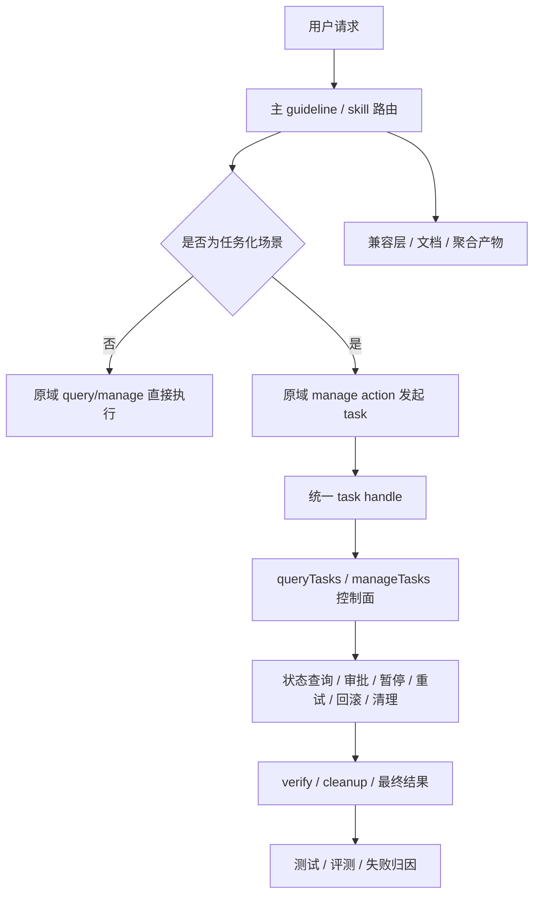

# 技术方案设计

## 设计目标

本方案目标不是再增加一批新的 tool 名字，而是在当前仓库约束下，建立一套可持续扩展的 `task/job-first` 范式：

1. **保留域入口收敛**：继续沿用现有 `queryXxx` / `manageXxx` 主入口思路，不把新范式误解为别名工具膨胀。
2. **让任务成为第一等对象**：为多阶段、高风险、可暂停、可重试、可回滚的操作提供统一生命周期。
3. **让 skill 成为 workflow contract**：从知识说明升级为路由、前置约束、verify、rollback 与 guardrail 合同。
4. **让投影与评测共享同一语义源**：源码、skill、文档、兼容产物与测试都围绕同一套任务化合同运转。
5. **渐进式落地**：先以少量高价值域试点，验证形态后再扩展。

## 非目标

1. 不在本轮把所有现有工具全部迁移到任务模式。
2. 不为每个任务化动作新增独立 tool 名称或 alias tool。
3. 不在首期试点中引入复杂分布式调度系统或重型外部工作流引擎。
4. 不把 skill 改造成新的执行器；真实副作用仍由 MCP 工具承担。
5. 不把所有同步动作强制改造成异步任务。

## 当前问题分析

### 1. 工具层仍偏同步 RPC 心智

当前工具设计已经开始强调主入口收敛，但很多高风险能力仍停留在“调用一个 action，等一个结果”的心智下。对于需要计划、审批、执行、验证和收尾的操作，这种模型天然不够。

### 2. Skill 更像知识说明，不像可执行 workflow contract

现有 skill 已能较好说明场景、工具和文档，但尚未系统化表达：

- 哪些场景必须进入计划阶段；
- 哪些动作需要 `verify`；
- 哪些失败后需要 `rollback` / `cleanup`；
- 哪些场景不应继续走直接同步调用。

### 3. 缺少跨域统一的任务控制面

即使某些域底层已经有异步任务或长流程，也缺少统一的任务句柄、状态查询和控制语义，导致 Agent 只能依赖各域私有实现和零散文档。

### 4. 缺少任务化语义的统一投影

当前仓库已有较成熟的语义源与兼容层体系，但对 `task/job-first` 范式还没有明确的单一合同，未来很容易在主 guideline、子 skill、docs、manifest、all-in-one 和测试里逐渐漂移。

## 总体架构



该架构分为四层。

## 一、域工具层：继续作为能力发起入口

### 设计原则

1. **域入口不变**：高风险能力仍从原域 `manageXxx` 发起，例如 `manageSqlDatabase`、`manageFunctions`。
2. **同步 / 任务双模式共存**：低风险动作保持同步；高风险动作返回任务句柄。
3. **action 保持 canonical**：避免因为任务化而新增大量并列 tool 名字。

### 发起模式

建议域工具在发起任务化动作时统一返回如下 envelope：

```ts
type TaskHandle = {
  executionMode: "task";
  taskId: string;
  domain: string;
  action: string;
  status: TaskStatus;
  nextStep?: string;
  approvalRequired?: boolean;
};
```

同步动作则继续返回原有结果 envelope：

```ts
type DirectHandle = {
  executionMode: "direct";
  data: unknown;
};
```

### 域内 action 形态

推荐沿用“在统一入口下新增 action”的方式，而不是拆 tool。例如数据库域可以演进为：

```ts
type ManageSqlDatabaseAction =
  | "runStatement"
  | "initializeSchema"
  | "planSchemaChange"
  | "runSchemaChange"
  | "verifySchemaChange";
```

其中：

- `runStatement` 仍用于低风险直接操作；
- `planSchemaChange` / `runSchemaChange` 用于高风险任务流；
- `runSchemaChange` 返回 `TaskHandle`；
- 任务控制与回滚不在 SQL 域内继续分裂，而由统一任务控制面承担。

## 二、任务控制面：新增独立 `tasks` 资源域

### 为什么这里允许新增新域

仓库规则要求“新增 tool 必须先回答为什么不能并入现有入口”。

这里新增 `tasks` 资源域是合理的，因为任务对象具备独立资源边界：

- 它跨越多个业务域（数据库、函数、部署、存储等）；
- 它承载统一生命周期与控制语义；
- 它不是某个具体业务动作的别名，而是独立的运行态对象。

因此建议新增两个主入口：

- `queryTasks`
- `manageTasks`

这符合“一域一 query / 一域一 manage”的现有设计哲学。

### `queryTasks`

建议覆盖以下动作：

```ts
type QueryTasksAction =
  | "getTaskDetail"
  | "listTasks"
  | "listTaskEvents"
  | "getTaskResult";
```

用途：

- 查询单任务状态
- 按域、状态、资源过滤任务
- 查看关键阶段事件
- 查看最终结果、验证结论和收尾建议

### `manageTasks`

建议覆盖以下动作：

```ts
type ManageTasksAction =
  | "approveTask"
  | "pauseTask"
  | "resumeTask"
  | "cancelTask"
  | "retryTask"
  | "rollbackTask"
  | "cleanupTask";
```

说明：

- 具体任务支持哪些控制动作，由任务元数据声明；
- 不支持的动作应返回明确错误，而不是静默忽略；
- 危险动作继续要求 `confirm=true`。

### 任务状态模型

建议统一状态枚举：

```ts
type TaskStatus =
  | "planned"
  | "awaitingApproval"
  | "queued"
  | "running"
  | "verifying"
  | "succeeded"
  | "failed"
  | "rolledBack"
  | "cancelled"
  | "cleanupPending"
  | "cleaned";
```

### 任务记录结构

建议统一记录：

- `taskId`
- `domain`
- `action`
- `resourceRef`
- `status`
- `supports`（pause/resume/retry/rollback/cleanup）
- `approvalRequired`
- `summary`
- `events[]`
- `verification`
- `result`
- `cleanupRecommendation`

## 三、Skill 层：从知识说明升级为 workflow contract

### 主 guideline 职责

建议在 `config/source/guideline/cloudbase/SKILL.md` 中新增或强化以下结构：

1. **什么时候必须进入任务流**
2. **哪些域支持任务化动作**
3. **进入任务流前的最小检查**
4. **哪些场景不要直接走同步动作**
5. **何时需要 verify / rollback / cleanup**

### 子 skill 顶部合同模板

对支持任务化动作的高价值 skill，统一增加以下区块：

- `Use this first when...`
- `Before action...`
- `Prefer direct mode for...`
- `Prefer task mode for...`
- `Verify after...`
- `Rollback / cleanup if...`
- `Do NOT use for...`

这样 skill 承担的是：

- 路由
- 前置检查
- 风险分级
- 收尾规范

而不是把具体副作用逻辑写进 skill。

### 结构化语义源

为保持语义源可测试，建议新增一份结构化合同文件，例如：

- `config/source/guideline/cloudbase/task-flows.yaml`

建议字段包括：

- `scenarioId`
- `signals`
- `primarySkill`
- `thenRead`
- `initiatingTool`
- `initiatingAction`
- `mode` (`direct` / `task` / `conditional`)
- `beforeAction`
- `verifyAfter`
- `rollbackIf`
- `doNotUse`
- `priority`

这份文件用于驱动：

- 主 guideline 路由表
- 兼容层投影
- 测试 fixture
- 后续评测合同

## 四、兼容层、文档与测试投影

### 语义源

首要语义源建议为：

- `mcp/src/tools/**/*.ts`：能力定义与 canonical action
- `config/source/guideline/cloudbase/SKILL.md`：主路由合同
- `config/source/guideline/cloudbase/task-flows.yaml`：结构化任务流映射
- `config/source/skills/*/SKILL.md`：子 skill 的 workflow contract

### 投影面

需同步检查的面包括：

- `doc/mcp-tools.md`
- `doc/connection-modes.mdx`
- `config/source/editor-config/` 兼容规则
- `config/.claude/skills/` 兼容镜像（由脚本自动生成）
- `.generated/compat-config/`
- 对外 skills 仓库模板与 all-in-one 产物

### 测试策略

建议新增或扩展三类测试：

#### 1. 任务控制面测试

覆盖：

- 任务创建返回 `TaskHandle`
- 状态迁移合法性
- 控制动作权限与 `confirm=true`
- 结果查询与收尾建议

#### 2. Skill / 路由合同测试

覆盖：

- 哪些场景应该进入任务流
- 哪些场景仍应使用直接模式
- 高风险场景是否定义 `beforeAction`、`verifyAfter`、`doNotUse`
- skill 与结构化语义源是否一致

#### 3. 投影一致性测试

覆盖：

- 主 guideline、子 skill、兼容规则、文档和生成产物中的 canonical 名称一致
- 关键任务语义在 all-in-one 与兼容层中不丢失

## 首期试点建议

为了控制范围，建议首期只覆盖最值得任务化的三个方向：

1. **SQL schema change**
   - 最适合体现 `plan -> run -> verify -> rollback`
2. **NoSQL backfill / collection migration**
   - 适合体现长流程与幂等任务
3. **函数或部署发布流程**
   - 适合体现审批、发布、验证和清理

这些场景有共同特征：

- 高风险
- 多阶段
- 需要 verify
- 容易误用同步心智

## 风险与取舍

1. **任务控制面会引入新域**：这是新增复杂度，但其资源边界独立，能避免每个域重复造轮子。
2. **同步与任务双模式并存**：短期会增加文档与路由复杂度，但这是渐进式演进的必要代价。
3. **skill 需要更强合同化**：会增加维护要求，但能显著提升 Agent 的稳定性与可评测性。
4. **结构化语义源需要维护**：新增 `task-flows.yaml` 会带来同步成本，因此必须配套测试避免漂移。

## 成功标准

如果本方案成功，仓库应呈现以下变化：

1. 维护者不再倾向于为每个复杂动作新增单独 tool，而是优先考虑是否进入任务流。
2. Agent 在高风险场景下能先命中正确 skill，再走 `plan / run / verify / rollback` 路径。
3. 文档、兼容层和测试都能明确区分直接动作与任务化动作。
4. 首期试点域能以统一的任务句柄、状态模型和收尾语义对外提供能力。