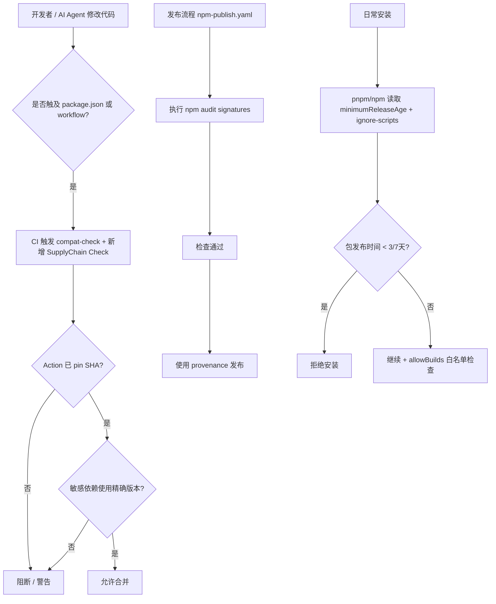

# 技术方案设计

## 1. 背景与目标

本项目因其 MCP Server + 大规模 AI IDE 技能分发特性，成为 npm 供应链攻击的高价值目标。Supabase 2026 年文章明确指出的三类主要攻击（Maintainer 攻破、Typosquatting、Build Pipeline 投毒）在本仓库中均存在现实攻击面。

**设计总目标**：建立分层防御体系，将本项目被成功供应链攻击的概率和影响显著降低。具体包括：

- 阻断恶意包在发布后短时间内进入 CI（时间窗口防御）
- 防止 CI 流程本身被投毒（Actions + Cache + Token 防护）
- 限制已进入 node_modules 的恶意代码执行能力（生命周期脚本 + 精确版本）
- 为人类开发者与 AI Agent 提供可执行的防护指引

## 2. 核心设计决策

### 2.1 包管理器策略：采用 pnpm 11 作为推荐方案

**推荐方案**：将项目逐步迁移到 **pnpm 11+** 作为主要包管理器。

**理由**（直接对齐 Supabase 文章）：
- pnpm 11 默认开启 `minimumReleaseAge`（版本时效隔离）
- 提供成熟的 `allowBuilds` 模型（生命周期脚本白名单）
- 原生支持 `blockExoticSubdeps`
- 在多 package 场景（根 + mcp）下 workspace 管理更清晰
- 已被 Supabase 等重视供应链安全的团队验证有效

**备选方案（如果坚持最小变更）**：
- 继续使用 npm，但通过 `.npmrc` + `packageManager` 字段 + CI 严格参数实现近似能力（`min-release-age`、`ignore-scripts`）。
- 评估结果：防护能力弱于 pnpm 11，且长期维护成本更高。**不推荐作为最终状态**。

**实施原则**：
- 初期允许根目录与 `mcp/` 逐步迁移（先 mcp 核心发布包）。
- 保留 `npm ci` 兼容能力一段时间（通过 corepack + 文档说明）。
- 所有 CI 必须通过 `corepack enable` + `packageManager` 字段强制使用指定版本。

### 2.2 GitHub Actions Pinning 策略

**一次性基线 Pinning + 自动化维护** 组合方案：

1. **初始阶段**：使用脚本或人工批量将所有 `uses:` 替换为当前最新稳定版本的 commit SHA（带注释）。
2. **长期维护**：引入 Renovate（或 Dependabot），配置为：
   - Actions 更新 → 自动 PR + 必须人工 review 后合并
   - 仅在 PR 描述中说明“Action SHA 更新”
3. **验证机制**：在 `compat-check.yml` 或新增 `security-check.yml` 中增加 Action pinning 合规检查（可选，使用已有工具如 `zizmor` 或简单 grep 脚本）。

此方案兼顾安全与可维护性。

### 2.3 生命周期脚本与 Quarantine 的实现方式

- 根目录新增 `.npmrc`（npm 过渡期使用）和 `pnpm-workspace.yaml`（pnpm 启用后）。
- 关键配置：
  - `ignore-scripts=true`（npm）
  - `minimumReleaseAge: 4320`（3天）→ 逐步提升至 10080（7天）
  - pnpm 下使用显式 `allowBuilds` 列表
- CI 中所有 `npm ci` / `pnpm install` 必须显式携带相应参数，防止本地配置被绕过。

### 2.4 敏感依赖精确 Pinning 范围

必须精确版本的依赖（初始列表，后续可扩展）：
- `@cloudbase/manager-node`
- `@cloudbase/mcp`
- `@cloudbase/*` 其他直接依赖
- `@modelcontextprotocol/sdk`
- `express`、`ws`、`zod`（MCP 运行时关键）
- 所有直接处理凭证、文件系统、子进程的 runtime 依赖

构建工具类依赖（webpack、rollup、vitest 等）可保留合理 `^` 范围。

## 3. 变更影响范围分析

### 3.1 必须修改的文件类型

| 类型 | 数量估算 | 变更复杂度 | 备注 |
|------|----------|------------|------|
| `.github/workflows/*.yml` | 15+ | 中 | 全部 Action pinning + 安装命令调整 |
| `package.json`（根 + mcp） | 2 | 低 | 增加 `packageManager`、精确 pinning 敏感依赖 |
| 新增配置文件 | 2-3 | 低 | `.npmrc`、`pnpm-workspace.yaml`、`renovate.json`（可选） |
| 文档 | 3+ | 低 | `doc/npm-security.md`、更新 AGENTS.md、README 安全章节 |
| 脚本 | 1-2 | 中 | 可能新增 Action pinning 辅助脚本或检查脚本 |
| CI 密钥使用审查 | 多处 | 中 | 主要是策略收紧，非代码大改 |

### 3.2 对开发者体验的影响

- **正面**：更强的安全保障；未来可信任的依赖更新流程。
- **潜在负面**：
  - 切换 pnpm 后，部分开发者需要安装 pnpm（corepack 可缓解）。
  - 严格的版本 pinning 会增加手动更新敏感依赖的频率。
  - 3-7 天 quarantine 可能在紧急安全补丁场景下需要手动 override（需文档说明流程）。

**缓解措施**：提供一键本地环境准备脚本 + 清晰的应急 override 文档。

## 4. 实施路线图（分阶段）

**Phase 1: 基础硬化（低风险、高收益）**
- 所有 GitHub Actions 完成 SHA pinning
- 新增根 `.npmrc` 实现 `ignore-scripts=true`
- 在 `npm-publish.yaml` 增加 `npm audit signatures`
- 修复 `ai-dev.yaml` 中的 `@beta` Action
- 创建 `doc/npm-security.md` + Agent 审计 prompt

**Phase 2: 包管理器与版本控制**
- 在根与 mcp 引入 `packageManager` 字段 + corepack
- 完成安全敏感依赖的精确版本 pinning
- 引入 pnpm 11（推荐）或强化 npm 配置
- 配置 Renovate/Dependabot（带 review 策略）

**Phase 3: 流程与文化固化**
- 更新所有开发规范（AGENTS.md、CONTRIBUTING.md）
- 在 CI 中增加供应链安全检查门禁
- 组织一次全员/核心维护者安全培训（可选）
- 建立定期（每季度）供应链卫生自检流程

## 5. 关键技术选型与约束

- **Actions Pinning 工具**：初期手动 + Renovate 为主，不引入过多新工具链。
- **Quarantine 实现**：优先依赖包管理器原生能力（pnpm 11 `minimumReleaseAge`），避免自研复杂逻辑。
- **文档位置**：`doc/npm-security.md`（对外可见），同时在 `AGENTS.md` 中引用。
- **向后兼容**：发布流程必须保持 `provenance: true` 不变；外部消费方（AI IDE、ClawHub）感知不到内部包管理器变更。
- **测试策略**：
  - 所有 workflow 变更必须通过现有 CI
  - 新增一个非阻塞的“供应链卫生检查” job（可先不阻断）
  - 人工 review 重点关注 lockfile 大变更和 Action 更新

## 6. 风险与缓解

| 风险 | 影响 | 缓解措施 |
|------|------|----------|
| pnpm 迁移导致本地开发环境问题 | 中 | 提供 `corepack` 方案 + 详细迁移指南；初期支持 npm fallback |
| 紧急安全补丁被 quarantine 挡住 | 中 | 文档明确 override 流程（临时调低 minimumReleaseAge 或使用 `--ignore-minimum-release-age`） |
| 大量 Action SHA 更新 PR 增加维护负担 | 低 | 分批 PR + Renovate 自动分组 |
| 开发者抵触严格 pinning | 低 | 用事实（Supabase 案例 + 本项目价值）教育；提供自动化检查工具 |
| CI 在迁移过程中短暂不稳定 | 中 | 所有变更走 feature branch + 充分 review；关键发布流程最后改 |

## 7. 验证与成功标准

- 所有公开 workflow 的第三方 Action 均为 40 字符 SHA
- `package.json` 中安全敏感依赖无 `^` / `~`
- 本地与 CI 执行 `pnpm install` / `npm ci` 时，7 天内发布的包无法被拉取
- 新增 `doc/npm-security.md` 且内容可被 AI Agent 直接引用
- `npm-publish.yaml` 包含签名审计步骤且执行通过
- 无新增高风险模式（floating tag、pull_request_target + checkout、未锁定全局安装等）

## 8. Mermaid 流程图（关键变更）

---

本设计方案在安全强度与实施可行性之间取得平衡。Phase 1 的内容即可带来显著风险下降，且对日常开发影响最小，可作为首批落地目标。

下一阶段将基于本设计拆分具体可执行任务。