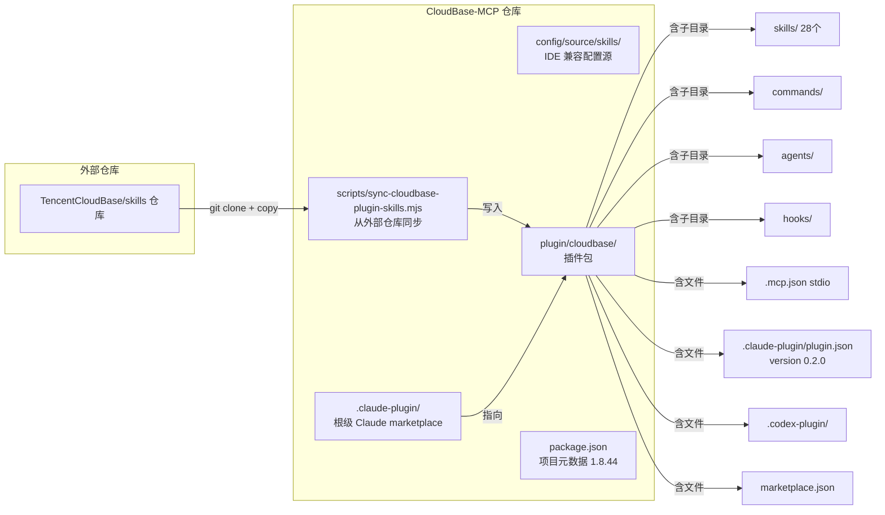

# 技术方案设计

## 介绍

将 `plugin/cloudbase/` 补齐为 Open Plugin Specification v1.0.0 合规插件包，并通过构建脚本自动生成合规产物，更新文档主推 `npx plugins add` 路径。

## 现状架构



### 现有插件包与 Open Plugin Spec 的差距

| 维度 | 现状 | Spec 要求 | 差距 |
|---|---|---|---|
| manifest 路径 | `.claude-plugin/plugin.json`（厂商特定） | `.plugin/plugin.json`（厂商中立，推荐） | 缺 `.plugin/plugin.json` |
| manifest `$schema` | 无 | `https://open-plugins.com/schemas/1.0.0/plugin.schema.json`（必填） | 需补 |
| manifest `name` | `cloudbase` | lowercase + hyphens，1-64 字符 | ✓ 已符合 |
| manifest `version` | `0.2.0`（与 `package.json` 1.8.44 不同步） | 语义化版本 | 需从 `package.json` 同步 |
| `mcp.json` 路径 | `.mcp.json`（带点前缀） | `mcp.json`（无点前缀） | 缺 `mcp.json` |
| `mcp.json` 传输 | stdio | stdio（必须支持） | ✓ 已符合 |
| `skills/` 结构 | 子目录 + `SKILL.md` | 完全一致 | ✓ 已符合 |
| `commands/`/`agents/`/`hooks/` | 存在 | spec v1 不支持，host 必须忽略 | 无害，保留 |

## 技术方案

### 1. 新增 `.plugin/plugin.json`（厂商中立 manifest）

**策略**：新建 `scripts/build-open-plugin-spec.mjs`，从 `package.json` 读取元数据生成 `.plugin/plugin.json`，避免 version 不同步。

**生成路径**：`plugin/cloudbase/.plugin/plugin.json`

**生成内容**：
```json
{
  "$schema": "https://open-plugins.com/schemas/1.0.0/plugin.schema.json",
  "name": "cloudbase",
  "version": "<从 package.json 读取>",
  "description": "<从 package.json 读取>",
  "author": {
    "name": "TencentCloudBase",
    "url": "https://github.com/TencentCloudBase"
  },
  "homepage": "<从 package.json 读取>",
  "repository": "<从 package.json 读取>",
  "license": "MIT",
  "keywords": ["cloudbase", "tencent-cloud", "mcp", "ai-toolkit", ...]
}
```

**关键决策**：
- **不包含** `commands`/`agents`/`hooks` 字段 —— spec v1 schema 是闭合的，只允许 `$schema`/`name`/`version`/`description`/`author`/`homepage`/`repository`/`license`/`keywords`/`extensions`
- 现有 `.claude-plugin/plugin.json` 保留 `commands`/`agents` 作为 Claude Code 厂商超集（spec §11.3 要求 host 忽略不支持字段，但厂商特定 manifest 不受 spec schema 约束）
- `name` 用 `cloudbase`（与现有一致，符合 spec 命名约束）

### 2. 新增 `mcp.json`（spec 标准路径）

**策略**：构建脚本从 `.mcp.json` 复制到 `mcp.json`，保持单一真源。

**源文件**：`plugin/cloudbase/.mcp.json`（现有，stdio 传输）
**生成文件**：`plugin/cloudbase/mcp.json`（spec 标准路径，内容一致）

```json
{
  "mcpServers": {
    "cloudbase-mcp": {
      "command": "npx",
      "args": ["-y", "@cloudbase/cloudbase-mcp@latest"],
      "env": {}
    }
  }
}
```

**关键决策**：
- 用复制而非符号链接 —— Windows 符号链接需要管理员权限，复制更安全
- CI 加校验：比较 `.mcp.json` 和 `mcp.json` 内容一致

### 3. 构建脚本 `scripts/build-open-plugin-spec.mjs`

**职责**：
1. 从 `package.json` 读取 `version`/`description`/`author`/`homepage`/`repository`/`license`/`keywords`
2. 生成 `plugin/cloudbase/.plugin/plugin.json`
3. 复制 `plugin/cloudbase/.mcp.json` → `plugin/cloudbase/mcp.json`
4. 运行 `npx plugins discover plugin/cloudbase --remote` 验证
5. 失败则退出码 1

**接口设计**：
```bash
# 生成产物
node scripts/build-open-plugin-spec.mjs

# 仅校验不生成（CI 用）
node scripts/build-open-plugin-spec.mjs --check
```

**与现有脚本的关系**：
- 不修改 `sync-cloudbase-plugin-skills.mjs`（职责：从外部仓库同步 skills）
- 不修改 `build-compat-config.mjs`（职责：生成 IDE 兼容配置）
- 新脚本只负责 Open Plugin Spec 合规产物

### 4. 同步更新 `.claude-plugin/plugin.json` 的 version

**问题**：现有 `plugin/cloudbase/.claude-plugin/plugin.json` 的 `version: "0.2.0"` 落后于 `package.json` 的 `1.8.44`。

**策略**：构建脚本同时更新 `.claude-plugin/plugin.json` 的 version 字段，保持三处一致：
- `package.json` → 权威源
- `plugin/cloudbase/.plugin/plugin.json` → 生成产物
- `plugin/cloudbase/.claude-plugin/plugin.json` → 同步 version 字段

### 5. 文档更新

#### 5.1 `doc/ai-agent-plugins.mdx` 重构

```
# CloudBase AI 插件

## 快速安装（推荐）
[npx plugins add 命令 + 支持的 7 个 IDE 列表]

## 什么是插件？
[Open Plugin Spec 5 种组件定义 + 我们的插件包含什么]

## 其他 IDE 接入
[Tab 切换：Codex App / Codex CLI / Claude Code / WorkBuddy / 其他 IDE]
[说明：CodeBuddy/WorkBuddy 不在 plugins CLI 白名单，走各自集成]

## 包含内容
[现有 MCP Server + Skills 表格]

## 工作原理
[mermaid 图：plugins CLI 如何发现和安装]

## 调试与报告问题
```

#### 5.2 `doc/connection-modes.mdx` P0 修复

- 补全 25 个 canonical 插件名（含 `pg_database`/`pg_storage`/`mysql_database`/`database-nosql`/`database-sql`/`data-model`）
- 补全 10 个别名（含 `mysql`/`mysql-database`/`sql-database`）
- 修 `doc/plugins/miniprogram.md:62` broken link

#### 5.3 `README.md` / `mcp/README.md` 同步

- 插件列表与 `mcp/src/server.ts` 真源一致

### 6. CI 集成

在 `sync-cloudbase-plugin-skills.yml` 或新建 `open-plugin-spec-check.yml` 中加入：

```yaml
- name: Build Open Plugin Spec artifacts
  run: node scripts/build-open-plugin-spec.mjs

- name: Verify plugins CLI can discover
  run: npx plugins discover plugin/cloudbase --remote
```

## 目录结构（改造后）

```
plugin/cloudbase/
├── .plugin/                    # [新增] Open Plugin Spec 厂商中立目录
│   └── plugin.json             # [新增] spec 合规 manifest（构建生成）
├── .claude-plugin/             # [保留] Claude Code 厂商配置
│   ├── marketplace.json
│   └── plugin.json             # [修改] version 同步
├── .codex-plugin/              # [保留] Codex 厂商配置
├── .mcp.json                   # [保留] MCP 配置（单一真源）
├── mcp.json                    # [新增] spec 标准路径（从 .mcp.json 复制）
├── skills/                     # [保留] 符合 spec
├── commands/                   # [保留] 厂商超集，spec host 会忽略
├── agents/                     # [保留] 厂商超集
├── hooks/                      # [保留] 厂商超集
├── marketplace.json            # [保留]
├── README.md                   # [保留]
└── ...
```

## 测试策略

| 测试项 | 方式 | 验收标准 |
|---|---|---|
| spec 合规性 | `npx plugins discover plugin/cloudbase --remote` | 成功识别 `cloudbase` 插件 |
| 实际安装（Cursor） | `npx plugins add TencentCloudBase/CloudBase-MCP --target cursor --yes` | 安装成功，Cursor 能发现 MCP + Skills |
| 实际安装（Claude Code） | `npx plugins add TencentCloudBase/CloudBase-MCP --target claude-code --yes` | 安装成功，不破坏现有 marketplace |
| 实际安装（Codex） | `npx plugins add TencentCloudBase/CloudBase-MCP --target codex --yes` | 安装成功 |
| 向后兼容 | 现有 `claude plugin install cloudbase@tencent-cloudbase` 仍可用 | 不破坏现有 Claude Code marketplace 安装路径 |
| version 同步 | 构建脚本运行后三处 version 一致 | `package.json` = `.plugin/plugin.json` = `.claude-plugin/plugin.json` |
| mcp.json 一致 | 构建脚本校验 `.mcp.json` == `mcp.json` | 内容完全一致 |
| 文档 P0 修复 | `doc/connection-modes.mdx` 插件表与 `mcp/src/server.ts` 对比 | 25 个 canonical + 10 个别名完全一致 |
| broken link 修复 | `doc/plugins/miniprogram.md` 链接检查 | 无指向 `../plugins.md` 的 broken link |

## 安全性

- **供应链安全**：`plugins` 包如果作为 devDependency，使用精确版本（遵循 `<supply_chain_security>`）
- **不泄漏内部信息**：文档中不泄漏内部评测文件名（遵循 `<attribution_evaluation_guardrails>`）
- **manifest 闭合 schema**：`.plugin/plugin.json` 严格遵循 spec 闭合 schema，不引入未定义字段

## 风险与缓解

| 风险 | 影响 | 缓解 |
|---|---|---|
| `npx plugins add` 实际安装行为未验证 | 中 | 设计阶段做 POC：在临时目录测试 `--target cursor --scope local` |
| `.plugin/` 与 `.claude-plugin/` 优先级冲突 | 低 | spec 明确多 manifest 可共存，厂商前缀优先于 `.plugin/` |
| version 字段三方同步可能漂移 | 中 | CI 加校验：三处 version 必须一致 |
| `mcp.json` 与 `.mcp.json` 内容漂移 | 中 | CI 加校验：两文件内容必须一致 |
| 现有 Claude Code marketplace 安装路径被破坏 | 高 | 不修改 `.claude-plugin/marketplace.json`，只同步 version 字段 |

## 不做的事

- 不推 CodeBuddy/WorkBuddy 实现 Open Plugin Spec（产品决策，不在本 spec 范围）
- 不给 `vercel-labs/plugins` 提 PR 加 target（等仓库公开后再评估）
- 不修改 `mcp/src/server.ts` 的插件定义（只改文档同步）
- 不修改 `config/source/skills/` 的 skills 源（只改 `plugin/cloudbase/` 的产物）
- 不修改现有 `sync-cloudbase-plugin-skills.mjs`（职责分离）
