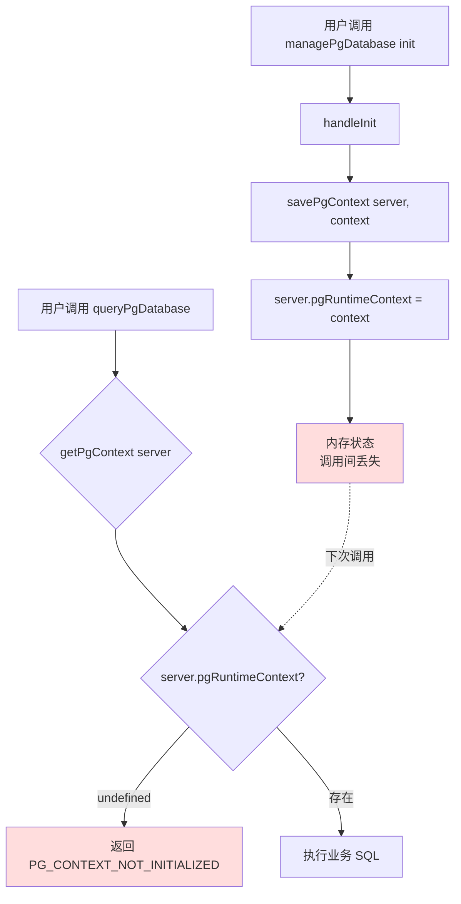
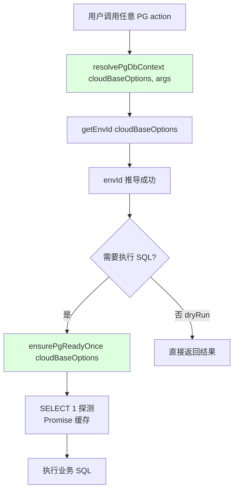
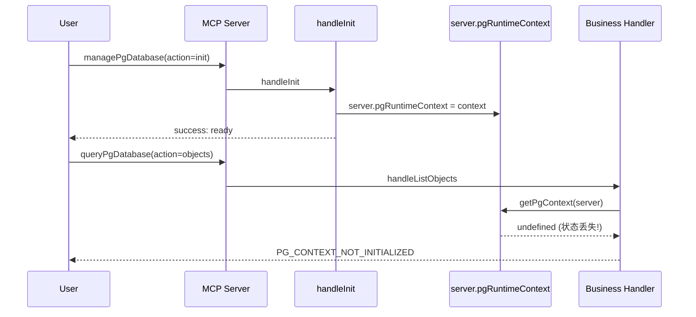
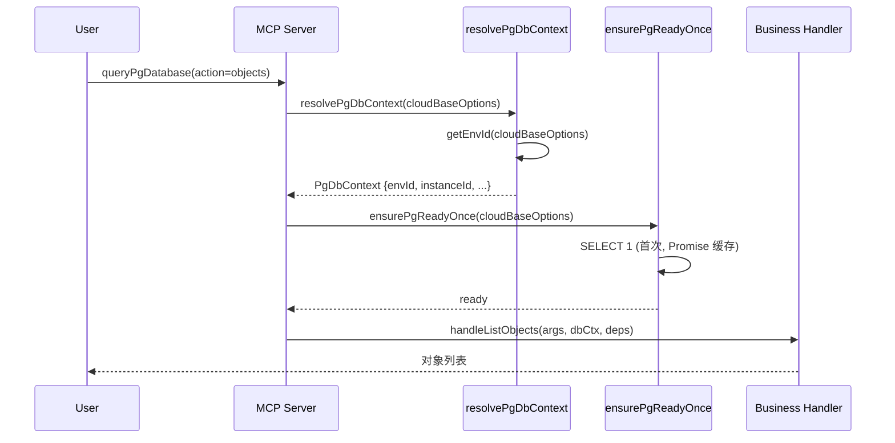
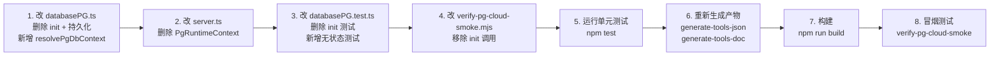

# 技术方案设计：PG MCP 工具无状态化重构

## 1. 设计目标

将 PG 工具从「init 绑定可变上下文」模式重构为「函数式推导 + lazy 探测」无状态模式，与 NoSQL/MySQL 工具完全一致，修复服务端/HTTP transport 下上下文丢失的 bug。

## 2. 协议与惯例合规性分析

### 2.1 MCP 协议合规性

| 协议要求 | 当前 init 模式 | 重构后 | 合规 |
|---------|--------------|--------|------|
| 工具调用应无状态（stateless） | ❌ 依赖 `server.pgRuntimeContext` 可变状态 | ✅ 每次调用自行推导 | ✅ |
| 工具 schema 应自描述 | ❌ init 隐式绑定后续调用 | ✅ 所有参数显式在 schema | ✅ |
| 错误应可自愈（nextActions） | ❌ 引导循环 init | ✅ 直接执行或返回 `PG_NOT_READY` | ✅ |

**结论**：init 模式违反 MCP 工具无状态惯例，重构后合规。

### 2.2 CloudBase API 协议合规性

Manager SDK 的 `executePGSql` 调用契约**不变**，仅改变参数来源：

```ts
// 当前（依赖 context）
manager.database.executePGSql({ Sql, Role: context.role, EnvId: context.envId })

// 重构后（推导）
manager.database.executePGSql({ Sql, Role: role ?? "cloudbase_admin", EnvId: await getEnvId(cloudBaseOptions) })
```

**符合 `cloud_api_backend_rules`**：优先使用 Manager SDK，不直接调用腾讯云 API。

### 2.3 项目内部惯例合规性

| 惯例规则 | 合规说明 |
|---------|---------|
| `mcp_tool_schema_rules` | `MANAGE_ACTIONS` 是固定枚举，修改后用 `z.enum(MANAGE_ACTIONS)`，同步更新 `tools.json`、`mcp-tools.md`、schema 测试 |
| 与 NoSQL/MySQL 一致性 | envId 解析走统一的 `getEnvId(cloudBaseOptions)`，manager 创建走 `getCloudBaseManager({ cloudBaseOptions })` 闭包模式 |
| `doc_freshness_rules` | `mcp/src/server.ts` 的 `AVAILABLE_PLUGINS` 等不变；`managePgDatabase` 的 action 枚举描述同步更新 |
| `attribution_evaluation_guardrails` | 不为评测加特殊分支，不泄漏内部 artifact |
| `skills_and_rules_maintenance` | SKILL.md 检查后无需改（已确认无 init 引用） |

## 3. 架构设计

### 3.1 当前架构（坏的）



**根因**：`server.pgRuntimeContext` 是可变内存状态，在 HTTP transport / 服务端模式下，工具调用间不共享，导致 init 写入的状态丢失。

### 3.2 重构后架构（无状态）



**关键改进**：
- 无可变状态，每次调用从 `cloudBaseOptions`（不可变配置）推导
- 就绪探测用 Promise 缓存，同一 server 生命周期内只执行一次
- 与 NoSQL/MySQL 完全一致的模式

## 4. 核心接口设计

### 4.1 新增：`resolvePgDbContext` 函数

替代 `getPgContext`，纯函数式推导，无副作用：

```ts
/**
 * 从 cloudBaseOptions + args 推导 PG 执行上下文（无状态）
 * 照搬 MySQL 的 resolveSqlDbContext 模式
 */
async function resolvePgDbContext(
  cloudBaseOptions?: ExtendedMcpServer["cloudBaseOptions"],
  args?: { envId?: string; instanceId?: string; defaultSchema?: string; role?: string },
): Promise<PgDbContext> {
  const envId = args?.envId
    ?? cloudBaseOptions?.envId
    ?? await getEnvId(cloudBaseOptions);
  
  return {
    envId,
    instanceId: args?.instanceId ?? "cloudbase-pg",
    defaultSchema: args?.defaultSchema ?? "public",
    role: args?.role ?? "cloudbase_admin",
  };
}

interface PgDbContext {
  envId: string;
  instanceId: string;
  defaultSchema: string;
  role: string;
}
```

**与 MySQL 的 `resolveSqlDbContext` 对齐**（`databaseSQL.ts:407`），保持项目一致性。

### 4.2 改造：`executeManagerPGSql` 函数

```ts
async function executeManagerPGSql(
  dbCtx: PgDbContext,
  sql: string,
  cloudBaseOptions?: ExtendedMcpServer["cloudBaseOptions"],
) {
  const manager = await getCloudBaseManager({
    cloudBaseOptions: cloudBaseOptions
      ? { ...cloudBaseOptions, envId: dbCtx.envId }
      : { envId: dbCtx.envId },
  });
  const options = { Sql: sql, Role: dbCtx.role, EnvId: dbCtx.envId };
  if (isExecutePGSqlDatabase(manager.database)) {
    return manager.database.executePGSql(options);
  }
  // fallback 路径不变
}
```

**变化**：参数类型从 `PgRuntimeContext` 改为 `PgDbContext`，调用契约不变。

### 4.3 新增：`ensurePgReadyOnce` lazy 探测

```ts
let pgReadyPromise: Promise<void> | null = null;

/**
 * 首次 SQL 调用时探测 PG 就绪，Promise 缓存避免重复探测
 * 照搬 MySQL 的 getSqlInstanceInfo lazy 模式
 */
async function ensurePgReadyOnce(
  cloudBaseOptions: ExtendedMcpServer["cloudBaseOptions"] | undefined,
  deps: PgToolDependencies,
): Promise<void> {
  if (pgReadyPromise) {
    return pgReadyPromise;
  }
  
  pgReadyPromise = (async () => {
    const dbCtx = await resolvePgDbContext(cloudBaseOptions);
    const maxAttempts = deps.readyCheckOptions?.maxAttempts ?? 20;
    const retryDelayMs = deps.readyCheckOptions?.retryDelayMs ?? 1000;
    let lastError: unknown;
    
    for (let attempt = 1; attempt <= maxAttempts; attempt += 1) {
      try {
        await withPgClient(dbCtx, deps, async (client) => {
          await client.query("SELECT 1");
        });
        return;
      } catch (error) {
        lastError = error;
        if (attempt === maxAttempts) break;
        await sleep(retryDelayMs);
      }
    }
    
    const reason = lastError instanceof Error ? lastError.message : String(lastError);
    throw new Error(`PostgreSQL is not ready after ${maxAttempts} attempts. Last error: ${reason}`);
  })();
  
  return pgReadyPromise;
}
```

**注意**：`pgReadyPromise` 是模块级变量，在 server 生命周期内有效。如果需要按 envId 隔离，可改为 `Map<string, Promise<void>>`，但参考 MySQL 的实现（每次调用都探测），简单 Promise 缓存已足够。

### 4.4 改造：`createManagerPgClient`

```ts
function createManagerPgClient(
  dbCtx: PgDbContext,
  cloudBaseOptions?: ExtendedMcpServer["cloudBaseOptions"],
): PgClientLike {
  return {
    async connect() { return undefined; },
    async query(sql: string, values?: unknown[]) {
      const renderedSql = renderParameterizedSql(sql, values);
      const result = await executeManagerPGSql(dbCtx, renderedSql, cloudBaseOptions);
      const rows = parseManagerRows(result);
      return {
        rows,
        rowCount: result.AffectedRows ?? rows.length,
        command: inferCommand(renderedSql),
        fields: result.Columns?.map((name) => ({ name })) ?? [],
      };
    },
    async end() { return undefined; },
  };
}
```

### 4.5 改造：handler 调用链

所有业务 handler 的入口改为：

```ts
// queryPgDatabase handler
async (args: QueryPgDatabaseArgs) => {
  if (args.action === "context") {
    return handleQueryContext(server);
  }
  
  const dbCtx = await resolvePgDbContext(server.cloudBaseOptions, args);
  
  // 需要实际 SQL 执行的 action 先探测就绪
  if (args.action !== "context") {
    await ensurePgReadyOnce(server.cloudBaseOptions, deps);
  }
  
  switch (args.action) {
    case "objects": return handleListObjects(args, dbCtx, deps);
    case "metadata": return handleMetadata(args, dbCtx, deps);
    case "schema": return handleGetPgSchema(args, dbCtx, deps);
    case "sql": return handleReadOnlySql(args, dbCtx, deps);
    // ...
  }
}
```

### 4.6 改造：`handleQueryContext`

```ts
async function handleQueryContext(server: ExtendedMcpServer) {
  const dbCtx = await resolvePgDbContext(server.cloudBaseOptions);
  return buildPgToolResult({
    success: true,
    data: {
      context: {
        envId: dbCtx.envId,
        instanceId: dbCtx.instanceId,
        defaultSchema: dbCtx.defaultSchema,
        runtimeMode: "cloudbase-manager",
        bootstrapMode: "cloud",
        role: dbCtx.role,
      },
      status: "ready",
    },
    message: "CloudBase PG 云端执行上下文（自动推导）。",
  });
}
```

### 4.7 移除：`managePgDatabase(action=init)` 分支

```ts
// MANAGE_ACTIONS 移除 "init"
const MANAGE_ACTIONS = [
  "execute", "dryRun", "planMigration", "applyMigration",
  "listMigrations", "migrationDetail", "rollbackMigration",
] as const;

// handler 中删除 case "init"
async (args: ManagePgDatabaseArgs) => {
  const dbCtx = await resolvePgDbContext(server.cloudBaseOptions, args);
  
  switch (args.action) {
    // case "init": 已删除
    case "dryRun": return handleDryRun(args, dbCtx, deps);  // dryRun 不触发就绪探测
    case "execute":
      await ensurePgReadyOnce(server.cloudBaseOptions, deps);
      return handleExecuteSql(args, dbCtx, deps);
    // ... migration 相关
  }
}
```

## 5. 代码变更清单

### 5.1 `mcp/src/tools/databasePG.ts`

| 操作 | 代码 | 行号 |
|------|------|------|
| 删除 | `PgBootstrapResult` 类型 | 58-64 |
| 删除 | `getPgContextStorePath` | 133-138 |
| 删除 | `loadStoredPgContext` | 140-151 |
| 删除 | `savePgContext` | 153-170 |
| 删除 | `getPgContext` | 172-182 |
| 删除 | `buildMissingContextResult` | 184-199 |
| 删除 | `handleInit` | 1010-1077 |
| 删除 | `MANAGE_ACTIONS` 中的 `"init"` | 20 |
| 删除 | `case "init"` 分支 | 1730-1731 |
| 删除 | `fs`/`path` 导入（若不再使用） | 1-2 |
| 改造 | `executeManagerPGSql` 参数类型 | 829-865 |
| 改造 | `createManagerPgClient` 参数类型 | 946-973 |
| 改造 | `ensurePgReady` → `ensurePgReadyOnce` | 979-1008 |
| 改造 | `handleQueryContext` | 1079-1102 |
| 改造 | `withPgClient` 签名 | 465-478 |
| 新增 | `resolvePgDbContext` 函数 | - |
| 新增 | `PgDbContext` 接口 | - |
| 改造 | `queryPgDatabase` handler | 1646-1672 |
| 改造 | `managePgDatabase` handler | 1720+ |
| 改造 | `managePgDatabase` 的 `action` 描述 | 1685 |

### 5.2 `mcp/src/server.ts`

| 操作 | 代码 | 行号 |
|------|------|------|
| 删除 | `PgRuntimeContext` 接口 | 178-187 |
| 删除 | `pgRuntimeContext?: PgRuntimeContext` 属性 | 195 |

### 5.3 测试文件 `mcp/src/tools/databasePG.test.ts`

| 操作 | 内容 | 行号 |
|------|------|------|
| 删除 | `managePgDatabase(init) stores PG context` | 76-110 |
| 删除 | `managePgDatabase(init) stores Manager SDK context...` | 112-145 |
| 删除 | `managePgDatabase(init) defaults CloudBase envs...` | 147-175 |
| 删除 | `managePgDatabase(init) retries readiness checks...` | 177-225 |
| 删除 | `all PG tools return actionable error before init` | 736-767 |
| 删除 | `CLOUDBASE_PG_CONTEXT_PATH` 相关 setup | 12-17, 57-65 |
| 重写 | 9 处 `action: "init"` 前置调用 | 227, 269, 330, 369, 487, 542, 611, 690, 720 |
| 新增 | `resolvePgDbContext` 推导测试 | - |
| 新增 | `ensurePgReadyOnce` 缓存测试 | - |
| 新增 | 无 init 直接执行业务 action 测试 | - |

### 5.4 生成产物与文档

| 文件 | 操作 | 命令 |
|------|------|------|
| `scripts/tools.json` | 重新生成 | `node scripts/generate-tools-json.mjs` |
| `doc/mcp-tools.md` | 重新生成 | `node scripts/generate-tools-doc.mjs` |
| `mcp/scripts/verify-pg-cloud-smoke.mjs` | 手动移除 init 调用 | - |

## 6. 调用流程对比

### 6.1 当前流程（坏的）



### 6.2 重构后流程（无状态）



## 7. 测试策略

### 7.1 单元测试

| 测试类别 | 测试用例 |
|---------|---------|
| `resolvePgDbContext` | 优先级：args.envId > cloudBaseOptions.envId > getEnvId 兜底 |
| `resolvePgDbContext` | 默认值：instanceId="cloudbase-pg", defaultSchema="public", role="cloudbase_admin" |
| `ensurePgReadyOnce` | 首次调用触发 SELECT 1，第二次调用复用 Promise |
| `ensurePgReadyOnce` | 探测失败返回 `PG_NOT_READY` 错误码 |
| 无状态性 | 不调用 init，直接执行 `queryPgDatabase(action=sql)` 能成功 |
| `action=init` 已移除 | 调用返回 `UNSUPPORTED_ACTION` |
| `action=context` | 返回自动推导的上下文信息 |
| `action=dryRun` | 不触发就绪探测 |

### 7.2 集成测试

- 模拟 HTTP transport 场景：多次工具调用使用不同 server 实例（或重置状态），验证业务 action 仍能正常工作
- 验证 `server.cloudBaseOptions.envId` 在 handler 闭包中始终可读

### 7.3 冒烟测试

更新 `mcp/scripts/verify-pg-cloud-smoke.mjs`：
- 移除 `action: "init"` 调用
- 移除 `"managePgDatabase:init"` 从 verifiedFlow
- 直接调用 `queryPgDatabase(action=objects)` 验证

## 8. 安全性考虑

1. **无敏感信息持久化**：删除 `~/.cloudbase-mcp/pg-context.json` 文件写入，消除潜在的 envId 泄露风险（虽然文件权限 0600，但不写更安全）
2. **envId 来源不变**：仍从 `cloudBaseOptions` / 环境变量 / 登录状态推导，与 NoSQL/MySQL 一致
3. **role 默认值不变**：`cloudbase_admin`，与当前 init 默认值一致，不改变权限模型
4. **无新增 attack surface**：重构是减少代码而非增加，删除了文件 IO 和状态管理逻辑

## 9. 兼容性影响

| 影响面 | 说明 |
|--------|------|
| **向后不兼容** | `managePgDatabase(action=init)` 调用将返回 `UNSUPPORTED_ACTION` |
| **缓解措施** | 错误 message 明确提示 "init 已移除，PG 上下文现自动推导，请直接调用业务 action" |
| **下游影响** | 现有 AI Agent prompt / skill 中若有 "先调 init" 指引需更新（已确认 SKILL.md 无此指引） |
| **正面影响** | 修复服务端模式下 PG 工具完全不可用的 bug |

## 10. 实施顺序



## 11. 风险与回滚

| 风险 | 概率 | 缓解 |
|------|------|------|
| `ensurePgReadyOnce` 的 Promise 缓存在长生命周期 server 中泄漏 | 低 | 缓存仅存 Promise（非数据），内存占用可忽略 |
| 某些 migration action 隐式依赖 context 的 createdAt/updatedAt | 低 | migration API 使用独立的迁移记录，不依赖 PgRuntimeContext 时间戳 |
| 回滚 | - | git revert 即可，无数据迁移 |
