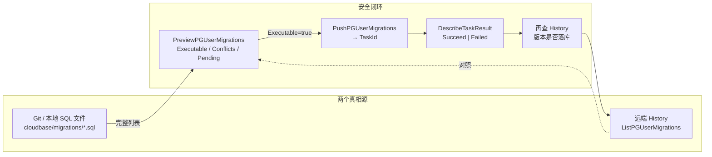

# Issue #857 复盘报告：前端视角下的数据库迁移心智模型

> 对应：[#857](https://github.com/TencentCloudBase/CloudBase-AI-Toolkit/issues/857)  
> 修复：[PR #859](https://github.com/TencentCloudBase/CloudBase-AI-Toolkit/pull/859) → `@cloudbase/cloudbase-mcp@2.25.5`  
> 对照源码：CloudBase CLI `tcb db pg migration *`、Supabase CLI/MCP、本仓库 `mcp/src/tools/databasePG.ts`  
> 读者：做过前端、开始碰 PG schema / MCP 迁移管线的开发者

---

## 0. 一句话结论

**不是「平台吞了任务」，是客户端把异步迁移契约用错了**：只推「这一条新迁移」+ 不轮询任务结果 → 平台返回了 `TaskId`，异步 worker 立刻因 plan 不可执行而失败，失败原因被客户端丢掉，于是看起来像「从来没执行」。

修好之后（2.25.5）路径可用。真正要学的，是**迁移系统为什么必须这样设计**，以及**对照 CLI / Supabase 我们还剩哪些坑**。

---

## 1. 前端开发者缺的那块知识（为什么会踩）

前端日常接触的 API 大多是：

```text
HTTP 200 + JSON body  ⇒  业务已经完成
```

迁移 API 不是这样。它更像「提交构建任务」：

```text
PushPGUserMigrations
  → 立刻返回 TaskId          ← 只代表「受理」，不代表「跑完」
  → 后台 worker 跑 SQL
  → 写 migration history
  → DescribeTaskResult 才能告诉你 Succeed / Failed + Reason
```

把 `TaskId` 当成成功，等价于把 CI 的「queued」当成「deployed」。  
这不是 CloudBase 独有；任何 **async job + history ledger** 的迁移系统都是这个形状。

第二块缺失：**迁移 plan 是「整本账」对比，不是「单张支票」**。

平台要回答的问题是：

> 你声称的本地/提交迁移集合，和远端 history 对得上吗？  
> 哪些已应用？哪些待应用？有没有缺页、篡改、乱序？

所以 Preview/Push 的 `Migrations` 入参语义是：

> **完整候选集合**（服务端自己跳过已应用的），  
> **不是**「只塞一条 pending」。

只塞一条 + 远端已有历史 → Conflicts 全是 `remote_history_not_found_locally` → `Executable=false` → worker Reason: `migration plan is not executable`。

这是 #857 的根因。

---

## 2. 迁移系统最小心智模型（请背这张图）



记住四条铁律：

| # | 铁律 | 违反时的症状 |
|---|------|--------------|
| 1 | Schema 变更走 migration，不默认裸跑 DDL | 环境不可复现、团队分叉 |
| 2 | 提交的是**完整集合**，服务端跳过已应用 | `remote_history_not_found_locally` / plan not executable |
| 3 | `TaskId` ≠ 成功；必须等任务终态 | 「返回成功但表不存在」 |
| 4 | Git 文件与远端 history 版本号必须对齐 | orphan / checksum_mismatch / repair 救火 |

前端类比：

- migration 文件 ≈ 前端的「路由 + 状态机」版本化 changelog  
- history 表 ≈ 线上已部署的 build 清单  
- `db push` / `migration up` ≈ 只部署「本地有、线上没有」的 diff  
- `repair` ≈ 改发布记录，**不重新跑构建**

---

## 3. Issue #857 时间线（纠错过程本身也值得学）

| 阶段 | 当时判断 | 实际 |
|------|----------|------|
| 现象 | applyMigration 返回 TaskId，表不存在，history 无记录 | 正确 |
| 初判 | 「异步任务通道黑洞 / 平台不执行」 | **错**：任务执行了，但是 Failed |
| 证据 | `DescribeTaskResult(task-89d4b5e7)` → `Failed` / `RunMigrations` / `migration plan is not executable` | 根因入口 |
| A/B | 只推 pending → Executable=false；hydrate 全量 → Succeed | 契约误用坐实 |
| 修复 | PR #859：hydrate + Preview gate + poll + verify | 2.25.5 已发版并实测通过 |

**方法论教训**：异步失败要先查 **task result**，不要只查「副作用是否出现」。  
副作用缺失有两种可能：没跑、跑了但失败——#857 是后者被客户端伪装成前者。

### 两个客户端 Bug（MCP 2.25.4）

1. **Payload 不完整（根因）**  
   `applyMigration` 只提交当前这一条；CLI `tcb db pg migration up` 提交本地**全部** SQL。

2. **不轮询任务（放大误判）**  
   从不调用 `DescribeTaskResult`；只靠短暂 `listMigrations` 核对 → 得到 `MIGRATION_NOT_APPLIED`，Reason 被丢弃。

### 修复后闭环（2.25.5）

1. `ListPGUserMigrations` 分页拉全量 → `DescribePGUserMigration` 取每条 `Query` → 拼上 pending  
2. `Preview`：`Executable !== true` → **fail closed**（`MIGRATION_NOT_EXECUTABLE`），不推坏 plan  
3. `Push` → `waitPgMigrationTask`（1.5s × **默认 10 min**，可配）  
4. 成功后再 `verifyMigrationApplied`（`MIGRATION_NOT_APPLIED` 仍是最后防线）

---

## 4. 三方对照：CloudBase CLI / CloudBase MCP / Supabase

### 4.1 能力矩阵

| 能力 | CloudBase CLI | CloudBase MCP (2.25.5) | Supabase CLI | Supabase MCP |
|------|---------------|------------------------|--------------|--------------|
| 本地目录约定 | **`cloudbase/migrations/`** | 技能提示 `migrations/`（**不强制写盘**） | `supabase/migrations/` | 不写本地 |
| 创建迁移 | `migration new` | Agent 手写文件（建议） | `migration new` / `db diff` | 无 |
| Preview | 有，冲突阻断 | `planMigration` + apply 内 gate | `db push` 前对比 | 无独立 preview |
| Apply 入参 | **本地全量文件** | **远端 hydrate + 1 条 pending** | 本地全量 pending | `name` + `query`（**服务端生成 timestamp**） |
| 任务等待 | poll 3s，最长 **10 min** | poll 1.5s，最长 **10 min**（可配 `taskPollTimeoutMs`；`waitForTask=false` 异步） | 同步/本地进程模型为主 | Management API |
| 任务状态查询 | CLI 内置 poll DescribeTaskResult | **`describeMigrationTask(taskId)`**（Status/Phase/Reason） | — | — |
| IncludeAll / 乱序 | `--include-all` | **`includeAll` on plan/apply**（默认 false） | 有 out-of-order 相关能力 | — |
| 拉取远端到本地 | `migration fetch` | `fetchMigration`（`force` 可选） | `db pull` | 无 |
| 修复 history | `migration repair`（不跑 SQL） | `repairMigration` | `migration repair` | 社区靠 CLI repair |
| DDL 旁路 | 不鼓励 | `execute` + `allowDdlViaExecute` | 文档禁止远程手改 | `execute_sql` 文档要求改走 apply |

### 4.2 CLI 正确契约（摘自 `up.ts`）

```253:269:/Users/bookerzhao/Projects/cloudbase/cloudbase-cli/src/commands/db/pgsql/migration/up.ts
        // 构造 push 输入：携带完整本地 migration 列表，远端已应用项会被服务端标记 skipped
        const pushInputs = migrations
        // ...
            const pushResult = await app.database.pushPGUserMigrations({
                EnvId: envId,
                Migrations: pushInputs,
                IncludeAll: includeAll
            })
```

外加 `waitTaskResult`：`Succeed` 返回，`Failed` 抛错带 Reason，超时 10 分钟。

### 4.3 MCP 修复策略（与 CLI「同目标、不同输入源」）

- CLI：**以本地 Git 为完整集合**（code-first）  
- MCP：**以远端 history + 当前这条 pending 为完整集合**（agent/remote-first）

两者都能让 Preview 看到「远端已有版本」，从而消除 `remote_history_not_found_locally`。  
但语义并不完全等价——见第 5 节剩余坑。

### 4.4 Supabase MCP 已踩的坑（我们要故意避开）

Supabase MCP `apply_migration` 入参只有：

```ts
{ project_id, name /* snake_case */, query /* SQL */ }
```

- **没有 version** → 服务端生成 timestamp  
- **不写本地文件** → 与 CLI code-first 双真相源分叉  
- 社区 issue（supabase/mcp#241）：远程 orphan 版本对不齐本地文件名，只能 `migration repair` 救火

CloudBase MCP **已经比 Supabase MCP 好一档**：强制显式 `migrationVersion`，技能要求先写本地文件。  
但若 Agent **只调 API 不落盘**，仍会重演「远程有、Git 无」——形态不同，病根相同。

---

## 5. 我们还有哪些坑？（对照 CLI / Supabase 的剩余差距）

下列是 **2.25.5 修好 #857 之后仍然存在** 的坑。按「踩中概率 × 杀伤力」排序。

### P0 — 心智 / 流程坑（人会反复犯）

1. **`TaskId` 成功幻觉**  
   任何自写脚本/旧客户端若只打印 Push 响应，#857 会复发。规则：**没有 DescribeTaskResult Succeed + history 可见，就不许说成功。**

2. **版本号必须严格大于 `LatestVersion`**  
   旧 probe `20260803203429` 在 Latest 已前进时还会叠加 `local_migration_before_latest_remote`。  
   习惯：先 `listMigrations`，再取「现在 UTC + 保证更大」的 14 位版本。

3. **`execute + allowDdlViaExecute + repairMigration` 旁路**  
   - `execute`：改真实 schema，**不写 history**  
   - `repair(applied)`：**只写 history，不跑 SQL**  
   两者组合能救命，也会制造「假账」与「真账」混杂（ato 已有大量本地文件不在远端 history 的漂移）。  
   规则：旁路后必须在 README/约定里标明「这些版本不可 replay」。

4. **本地目录不一致：`migrations/` vs `cloudbase/migrations/`**  
   - ~~MCP skill / hint：`migrations/<version>_<name>.sql`~~  
   - CLI 常量：`cloudbase/migrations`  
   - **已修复（2026-08-04）**：MCP `localFileHint` / skill / tool schema 已统一为 `cloudbase/migrations/<version>_<name>.sql`，与 CLI `MIGRATIONS_DIR` 对齐。若旧工作区仍有根目录 `migrations/`，需迁入 `cloudbase/migrations/` 再跑 CLI。  
   混用时：CLI `migration up` 会报「找不到本地目录」；Agent 以为已留档。  
   **这是产品级一致性债。**（历史问题描述保留）

### P1 — 产品契约坑（MCP 相对 CLI 仍弱）

5. **MCP 一次只 apply 一条；CLI 一次 apply 全部 pending**  
   追赶多版本时必须按版本升序多次调用。中间失败会停在半截——要有 list + 重试纪律。

6. **`IncludeAll` 未暴露** — **已修复（2026-08-04）**  
   ~~CLI 可用 `--include-all` 处理乱序；MCP hydrate 路径目前不传 `IncludeAll`。~~  
   MCP `planMigration` / `applyMigration` 现支持可选 `includeAll`（默认 false），Preview + Push 均传 `IncludeAll`，对齐 CLI `--include-all`。日常仍应选大于 `LatestVersion` 的 version。

7. **超时窗口偏短（90s vs CLI 10min）** — **已在后续迭代对齐**  
   默认轮询窗口改为与 CLI 一致的 **10 分钟**；可用 `taskPollTimeoutMs` 覆盖，或 `waitForTask=false` 立即返回 TaskId。  
   超时 / pending 后必须先 `describeMigrationTask(taskId)`（看 Status/Phase/Reason）再 `listMigrations`，禁止立刻重推同版本。  
   **`describeMigrationTask` 已补齐（2026-08-04）**：对外暴露 `DescribeTaskResult`，补上「只靠 listMigrations 看不到失败 Reason」的 #857 诊断缺口；默认仍是同步等待，异步不是默认路径。

8. **Hydrate 是 N+1 API**  
   每条远端历史一次 `DescribePGUserMigration`。history 变长后变慢、更易中途失败。  
   CLI 直接读本地文件，无此成本。长期应有「批量拉取 Query」或「服务端接受 pending-only + 内部 hydrate」。

9. **MCP 不强制写本地文件**  
   只返回 `localFileHint`。Agent 漏写 → 可复现性丢失（Supabase MCP 同款病根）。  
   理想：工具侧写盘，或 fail closed「工作区无对应文件则拒绝 apply」。

10. **无 `fetch` 对称能力** — **已修复（本迭代）**  
    CLI `migration fetch` 能把远端拉回本地对齐。~~MCP 只有 list/detail，Agent 要手写文件，易抄漏/改 checksum。~~  
    MCP 现已提供 `managePgDatabase(action=fetchMigration)`（可选 `migrationVersion` / `force=true`），写入 `cloudbase/migrations/`。

### P2 — Schema / 运维坑

11. **Checksum mismatch**  
    同 version SQL 与远端不一致 → Executable=false。修复应用 `fetch --force` 或新开 version，不要改已应用文件内容再推同号。

12. **Rollback 依赖 `Rollback` SQL**  
    若 apply 时没带 `rollbackSql`，`rollbackMigration` 能力受限。建表迁移应养成写 down 注释或 Rollback 字段的习惯。

13. **`repair` 永远不是 redo**  
    把它想成「改 git commit 记录」而不是「重新 deploy」。

14. **空库 vs 有历史的行为不对称**  
    空 history 时「只推一条」碰巧可用；有 history 后必须全量。这解释了「早期 demo 好使、项目长大就坏」——不是玄学，是契约。

---

## 6. 给你的实操手册（以后按这个做）

### 6.1 标准路径（推荐）

```text
1. listMigrations → 记下 LatestVersion
2. 选 version = max(now_utc, LatestVersion+ε) 的 14 位串
3. 写本地文件（路径与 CLI 对齐：`cloudbase/migrations/<v>_<name>.sql`）
4. planMigration（可选）→ 看 Executable / Conflicts
5. applyMigration(confirm=true) → 确认 success + taskResult.Status=Succeed + verified=true
6. listMigrations / migrationDetail 再确认一次
7. git commit 本地 SQL
```

### 6.2 失败时怎么读错误码

| errorCode | 含义 | 下一步 |
|-----------|------|--------|
| `MIGRATION_NOT_EXECUTABLE` | Preview 已判死刑，未 Push | 读 Conflicts；常换更大 version |
| `MIGRATION_TASK_FAILED` | 任务跑了但失败 | 读 Phase/Reason；修 SQL 后**新 version** |
| `MIGRATION_TASK_TIMEOUT` | 等不及 | 先 `describeMigrationTask` 再 `listMigrations`，勿盲重试 |
| `MIGRATION_TASK_PENDING` | `waitForTask=false` 已受理 | 同上：先查 task，再查 history |
| `MIGRATION_NOT_APPLIED` | 任务说完了但 history 没有 | 当严重事故查；可能竞态或平台异常 |
| `DDL_USE_APPLY_MIGRATION` | 想用 execute 跑 DDL | 改走 apply；旁路需显式 allow |

### 6.3 什么时候才允许旁路

仅当：apply 通道确认不可用、或一次性 ops、或修复 #857 类客户端 bug 的临时措施。  
旁路清单必须包含：执行的 SQL、是否 repair、为何不能 replay。

### 6.4 CLI 与 MCP 怎么选

| 场景 | 选 |
|------|----|
| 日常 Agent 建表改列 | MCP applyMigration（≥2.25.5） |
| 本地已有完整 migrations 树要一次追上 | **CLI `tcb db pg migration up`** |
| 乱序 / IncludeAll | MCP `includeAll=true` 或 CLI `--include-all` |
| 从远端把 history 拉回 Git | MCP `fetchMigration` 或 CLI `migration fetch` |
| CI 可复现发布 | CLI + Git（MCP 只作辅） |

---

## 7. 前端知识 → 迁移知识 对照表

| 你熟悉的前端概念 | 迁移世界对应物 |
|------------------|----------------|
| `npm run build` 成功 | Preview Executable=true（还没部署） |
| 上传到 CDN / 发布 | Push + Task Succeed |
| source map / build id | migrationVersion |
| `package-lock.json` | 本地 migrations 目录 |
| 线上实际运行的 bundle | 数据库真实 schema |
| 发布记录 / Sentry release | 远端 migration history |
| 热修线上 HTML 不改仓库 | `execute` 旁路（技术债） |
| cherry-pick 错乱的 commit | out-of-order / 需 IncludeAll |
| 改历史 commit hash | 改已应用 migration 内容（禁止） |
| 写 changelog 但不发版 | 只写 SQL 文件不 apply |
| 发版不写 changelog | 只 apply 不落 Git（Supabase MCP 坑） |

---

## 8. 建议的后续改进（产品侧）

1. **统一本地目录**：~~skill / MCP hint / CLI 全部改为 `cloudbase/migrations/`~~ **已完成** — MCP hint + skill 已对齐 CLI。  
2. **MCP 暴露 `includeAll`**，对齐 CLI。 — **已完成**  
3. **超时对齐 CLI（可配置，默认 ≥10min）**；超时文案强制「先 describeMigrationTask，再 list」。**已完成**（含 `describeMigrationTask` action）。  
4. **apply 前强制/自动写本地文件**（或校验文件存在）。  
5. **批量 Describe 或服务端 pending-only hydrate**，去掉 N+1。  
6. **文档写死**：Push 响应 ≠ 成功；附 Task 状态机。  
7. ~~**考虑 `fetch` MCP action**，降低 Agent 手抄 SQL 错误率。~~ **已完成** — `managePgDatabase(action=fetchMigration)`。  
8. 评估平台是否支持「只推 pending 且服务端自动补全 history」——若支持可简化客户端；在此之前 hydrate 是稳定路径。

---

## 9. 自检清单（每次改 schema 前打勾）

- [ ] MCP ≥ 2.25.5（或已含 hydrate+poll 的构建）  
- [ ] 已 `listMigrations`，version > LatestVersion  
- [ ] 本地 SQL 文件已写入且内容 = 将要 apply 的 SQL  
- [ ] 路径与团队约定一致（尽量 `cloudbase/migrations/`）  
- [ ] apply 返回 `success=true` 且 `taskResult.Status=Succeed` 且 `verified=true`  
- [ ] 未在失败后对同一 version 盲目重试  
- [ ] 未把 `allowDdlViaExecute` 当默认建表方式  
- [ ] Git 已提交对应 SQL  

---

## 10. 参考路径

| 材料 | 路径 / 链接 |
|------|-------------|
| Issue | https://github.com/TencentCloudBase/CloudBase-AI-Toolkit/issues/857 |
| Fix PR | https://github.com/TencentCloudBase/CloudBase-AI-Toolkit/pull/859 |
| MCP 实现 | `mcp/src/tools/databasePG.ts`（hydrate / waitPgMigrationTask） |
| CLI up | `cloudbase-cli/src/commands/db/pgsql/migration/up.ts` |
| CLI 目录常量 | `.../migration/constants.ts` → `cloudbase/migrations` |
| Skill | `config/source/skills/postgresql-development-cloudbase/SKILL.md` |
| 先验对照 | `AI-Workspace/output/reviews/2026-07-20-supabase-migrations-vs-cloudbase.md` |
| Supabase MCP | `apply_migration` = `{name, query}` only（无 version） |
| 故障原文 | `ato/docs/cloudbase-applymigration-async-bug-report-20260803.md` |
| 发版验证 | `ato/docs/mcp-2.25.5-applymigration-verified-20260803.md` |

---

## 附录 A：用三句话对外解释 #857

1. Push 接口「收单成功」≠「迁移成功」。  
2. 迁移计划必须包含远端已有历史（或完整本地树），不能只交新的一页。  
3. 客户端必须轮询任务结果；我们已在 2.25.5 按 CLI 契约修好。

## 附录 B：最小实验（理解用，勿在生产乱跑）

```text
# 错误姿势（旧 MCP）：Migrations=[only pending]
Preview → Executable=false, Conflicts=remote_history_not_found_locally
Push → TaskId
DescribeTaskResult → Failed: migration plan is not executable

# 正确姿势：Migrations=[...all remote queries..., pending]
Preview → Executable=true
Push → TaskId
DescribeTaskResult → Succeed
listMigrations → 新 version 可见，表存在
```

做完这组对比，迁移契约就会从「玄学」变成「可推理的状态机」。

## Tracking

- Shipped follow-ups land in PR https://github.com/TencentCloudBase/CloudBase-AI-Toolkit/pull/863 (`includeAll`, `fetchMigration`, `describeMigrationTask`, local-file gate, 10min poll, skills sync-metadata pin `e197199`).
- Overlapping PR #862 and stale AI auto-fix #861 were **closed as superseded** (2026-08-04 consolidation). Merge #863, then close #857.
- ATO pending triage: most CloudBase-MCP migration pendings are duplicates of work already on #863 / 2.25.5 — cancel list in `~/.ato/workspace/859f1a9e-ec50-4c40-8e3d-ec2d3460a5cc/artifacts/pg-migration-consolidation.md`.
