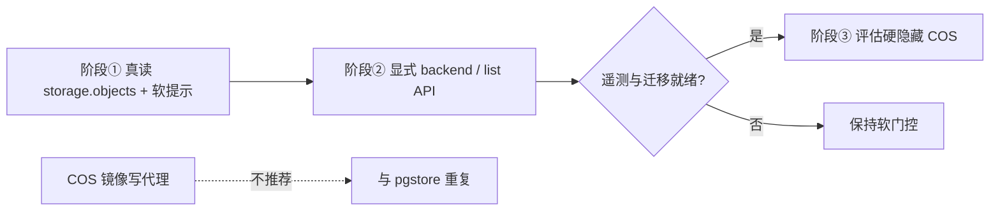

# 分析报告：PG 环境下云存储工具设计决策

**任务 ID：** `9326b7d4-a7e6-4fad-9bbc-0067a8cc2318`  
**关联任务：** `86d25d32`（PG 云存储展示优化前置决策）、`1d7e2656`（非 PG bucket 管理，范围不同）  
**范围：** 仅分析，不改 MCP 行为、不建表、不部署  
**分析日期：** 2026-08-25  
**客户样本：** 恒特美 `htm-test-1-d6gasntiq8990b59f`（灯塔近 48h：`manageStorage`/`queryStorage` 20 次，零 PG/SQL）

---

## 0. 先纠正一个关键前提

任务叙述里的「建 `storage_objects` 镜像表 + hook 同步 COS」与 **CloudBase PG 现状不完全一致**。

| 概念 | 现状（源码/skill 已核验） | 含义 |
|------|---------------------------|------|
| **Legacy COS 存储** | `queryStorage` / `manageStorage` → Manager SDK COS（`storage.ts`） | 元数据在对象存储侧，**不进 PG**；`EnvInfo.Storages[]` 暴露的是这套桶 |
| **pgstore（原生）** | `storage.buckets` / `storage.objects` + RLS；SDK `app.storage.from(bucket).upload(...)` | **元数据本来就在 PG**，模型对齐 Supabase Storage |
| **MCP `queryPgStorage`** | `storagePG.ts`，默认插件 `pg_storage` | 主要返回 **HTTP API/SDK 方案（plan）**，**不会真正列出** `storage.objects` |
| **共存** | `env.ts` RuntimeModeHints 明文写明 | PG 环境仍可继续用旧 COS / `app.uploadFile()`；两套存储并存 |

**恒特美根因重述：** AI 在 PG 环境里仍走 COS 工具面上传/列目录 → 合同文件落在 **legacy COS**，自然无法 `SELECT … JOIN` 业务表。这不是「缺一张镜像表」，而是 **路由到了错误后端**；若继续在 COS 上堆镜像，等于用自建管道重造一遍已存在的 pgstore。

本报告下文把三方案重新对齐到这一现实：

- **方案 A — 隐藏 COS 工具**：PG 模式下不注册 / 硬拒绝 `queryStorage`/`manageStorage`
- **方案 B — 换数据源**：保留工具名，让读路径查 `storage.objects`（任务中的「镜像表」在此解释为 **复用原生 pgstore 元数据表**，而非新建 COS 镜像）
- **方案 C — 维持现状**：描述文案警告 + 双插件并存（当前状态）

另单独评估任务提到的 **COS blob 写路径代理**（`pg_notify` → 云函数 → COS）——结论见 §2。

---

## 1. 三方案对比

### 1.1 对比表

| 维度 | A. 隐藏 COS 工具 | B. 换数据源（读 `storage.objects`） | C. 维持现状 |
|------|------------------|--------------------------------------|-------------|
| **AI 列表/关联体验** | 迫使改走 SQL / `queryPgStorage`；若不同时补强「真查询」，列表体验仍空洞 | **读路径**可对齐 Supabase「一条 SELECT」心智；JOIN 业务表可行（前提：文件已在 pgstore） | 警告易被忽略（恒特美实证）；列表仍是 COS 目录语义，无法 JOIN |
| **存量工作流（恒特美）** | **直接打断** 正在用的 `manageStorage`/`queryStorage` | 若只改读、不迁写：COS 上已有合同 **列表会变空/错桶**；若语义伪装成「同一路径」→ 高风险静默破坏 | **不打断**，问题继续 |
| **MCP 工具面** | PG 下工具面变干净，接近「SQL + SDK」；与 NoSQL 环境分叉 | 工具名稳定，但 **同名异义**（COS path vs pgstore key/bucket） | 双心智并存：`storage` + `pg_storage` |
| **写路径** | 隐藏后写只能走 SDK/HTTP/`queryPgStorage` plan；MCP 本机 upload 能力在 PG 场景消失 | 若只换读不换写：写仍走 COS → 元数据继续不同步；若读写都切 pgstore = 实质迁移 | 写仍 COS，元数据永不进 PG |
| **实现成本** | 低～中：RuntimeMode 门控 / 插件禁用 + 文档/评测分流 | 中～高：语义映射、bucket/key、权限、错误码、双后端探测 | 零代码；持续支持成本高 |
| **权限模型** | 隐藏 MCP ≠ 取消 COS ACL；SDK/控制台仍可写 COS | 读走 RLS（service_role/管理端 SQL）；写若仍 COS 则双权限平面继续分裂 | 双平面：COS ACL vs `storage.objects` RLS |
| **与 SDK/CLI 一致性** | MCP 与「PG 推荐 SDK」一致，但与「仍可用的 legacy uploadFile」不一致 | MCP 读像 SQL，写若仍 COS 则 **比现状更不一致** | MCP 与 Manager/COS CLI 一致，与 PG skill 推荐不一致 |
| **评测/回归** | `tests/storage-tools*.js`、STS、wxide e2e 大量依赖 COS 工具 → 需按 RuntimeMode skip/分流 | 同名工具行为变化 → 契约测试易误伤；需显式 `backend` 字段 | 无新增破坏 |
| **风险摘要** | 存量客户破坏性高 | 静默语义漂移风险最高 | 产品债继续累积 |

### 1.2 推荐方案

**推荐：不选纯 A / 纯 B / 纯 C，采用「渐进式 D」——以原生 pgstore 为准绳，分阶段补读能力 + 软门控，最后再评估硬隐藏。**

理由（决策优先级）：

1. **平台已有 Supabase 同构能力**（`storage.objects` + RLS + SDK），不应再投资「COS→PG 镜像写代理」。
2. **恒特美当前依赖 COS MCP 写路径**，立即隐藏（A）会制造事故；立即换数据源（B）会让「list」看不到他们已有文件。
3. **现状（C）已被灯塔数据证伪**：仅靠 description 警告不足以改变工具选择。
4. **缺口在 MCP 读能力**：`queryPgStorage` 今日几乎是 plan-only；AI 即使想走 SQL 心智，也缺一条低摩擦的「列出 pgstore 文件」工具路径（虽可用 `queryPgDatabase(action=sql)`，但发现成本高）。

**反对意见（应记录，避免过度自信）：**

- 反对「永远不隐藏」：若不设硬门控，模型会持续偏好熟悉的 `manageStorage`，pgstore adoption 慢。
- 反对「立刻换成 queryStorage 查 PG」：同名异义会破坏 NoSQL/混合环境评测与客户脚本；恒特美短期更痛。
- 反对「自建镜像表」：与 pgstore 双写，长期两套真相源。

### 1.3 对恒特美的即时产品含义（供 86d25d32 回填）

| 短期（不改平台存储拓扑） | 中期（推荐） |
|--------------------------|--------------|
| 继续用 COS 工具管理存量合同文件；列表体验保持 COS `cloudPath` 语义 | 新建 **pgstore bucket** + RLS；合同文件迁移到 `storage.objects`；业务表存 `bucket_id`/`name` 或 object id；列表/关联改 `queryPgDatabase` / 增强后的 PG 存储读工具 |
| 「文件与合同 SQL 关联」**在 COS 路径上不可得** | 迁移完成后可得，无需自建镜像 |

---

## 2. 写路径代理设计可行性

任务设想：`INSERT` 元数据 → `pg_notify` → 云函数 `LISTEN` → 代理上传 COS；下载用预签名 URL；`pending/ready` 状态机 + 失败补偿。

### 2.1 可行性结论

**结论：技术可做，但作为 CloudBase PG 主路径不推荐；投入/产出比差，且与已上线的 pgstore 产品能力重复。**

| 子项 | 评估 |
|------|------|
| **pg_notify → 函数上传** | 可行，但 CloudBase 无托管「常驻 LISTEN 进程」；需自建 CloudRun/常驻服务或轮询 outbox，**不能假设「云函数 LISTEN」开箱即用** |
| **预签名直传/下载** | 可行（COS / pgstore HTTP API 均支持类能力）；大文件应 **客户端直传**，避免 MCP/云函数中转 body |
| **大文件 / 分片** | MCP `manageStorage` 本机路径不适合超大文件；代理经函数更差（超时/内存）。分片需 COS multipart 或 pgstore HTTP 协议能力，复杂度高 |
| **pending/ready** | 必要：通知丢失、函数失败、部分上传都会产生脏行；需 outbox、重试、TTL 清理、人工 reconcile |
| **与 pgstore 关系** | pgstore **已经**是「PG 元数据 + 对象字节」的官方实现；自建代理 = 第二套存储子系统 |

**建议：**

- **不要**为恒特美或通用 PG 场景建设 COS 镜像写代理。
- 写路径官方答案：浏览器/服务端 → **pgstore SDK/HTTP**；MCP 侧保持「plan +（可选）管理端 SQL 元数据」；大文件不经 MCP 中转（现有 `queryPgStorage` 约束已正确：`mcpDoesNotStreamFileContent`）。
- 仅当存在 **必须保留 legacy COS 对象、又必须 SQL 索引** 的强约束客户时，才考虑 **一次性迁移/导入工具**（批处理扫 COS → 写入 pgstore 或业务表指针），而不是长期双写代理。

---

## 3. 权限与一致性 / 影响面

### 3.1 权限模型

```
┌─────────────────────────────┐     ┌──────────────────────────────────┐
│ Legacy COS                  │     │ pgstore                          │
│ managePermissions           │     │ RLS on storage.buckets/objects   │
│ resourceType=storage        │     │ managePgDatabase CREATE POLICY   │
│ READONLY/PRIVATE/CUSTOM     │     │ anon/authenticated/service_role  │
└─────────────────────────────┘     └──────────────────────────────────┘
        ↑ 互不影响（skill 已写明）
```

- **隐藏 MCP COS 工具后**：COS 侧 ACL **仍需**保留——控制台、CLI、`app.uploadFile()`、存量脚本仍可访问。
- **读切到 `storage.objects`**：管理端 MCP 通常以高权限执行 SQL，需注意 **勿把终端用户 RLS 误当成已在 MCP 侧生效**；对 AI 展示的「用户可见列表」与 service_role 全量列表要区分文档表述。
- **映射**：不存在 1:1 自动映射（COS ACL ≠ RLS policy）。迁移客户必须 **显式配置** storage RLS（见 `cloud-storage-web` Post-bucket 节）。

### 3.2 SDK / CLI / docs / skill

| 面 | 现状 | 若选 A/B 的同步义务 |
|----|------|---------------------|
| Web SDK | PG：`from(bucket).upload`；Legacy：`uploadFile` | skill 已分轨；MCP 变更须同步 `RuntimeModeHints.Storage` |
| MCP docs | `doc/mcp-tools.md` 已警告「PG 请用 queryPgStorage」 | A：更新插件默认/条件注册；B：必须写清 backend 与破坏性 |
| Skills | `postgresql-development` / `cloud-storage-web` 已强调 pgstore | 86d25d32 应补「文件库/合同」工作流：列表用 SQL，勿默认 manageStorage |
| CLI | `tcb` 存储命令偏 COS；PG SQL 走 `db execute` | 长期一致性靠文档，不靠 MCP 单独发明 |

### 3.3 评测集

已知依赖 COS 工具的自动化（非穷尽）：

- `tests/storage-tools.test.js`
- `tests/sts-resource-level-validation.test.js`
- `tests/wxide-mcp-e2e.test.js`
- `mcp/src/tools/storage-hosting-guidance.test.ts`

**影响：** 任何 RuntimeMode 硬隐藏或同名换源，必须加 **环境类型夹具** 或显式 `backend` 断言，否则 CI 与归因评测会红。禁止为过评测加别名分支（见 attribution guardrails）。

### 3.4 与任务 `1d7e2656` 的边界

| | 本任务 (9326b7d4) | 1d7e2656 |
|--|-------------------|----------|
| 环境 | **PG** | **非 PG** |
| 焦点 | COS 工具 vs pgstore/SQL 心智 | bucket 管理能力缺口 |
| 结论复用 | 「不要用 COS 镜像重造 pgstore」 | 非 PG 仍以 COS 工具为真源；互不吞并 |

---

## 4. 分阶段实施路径（供决策后立项）

> 以下为 **建议路径**，本任务不执行实现。每阶段可独立验收；依赖合并原则：展示优化（86d25d32）应消费本结论，勿在未决策前硬隐藏。

### 阶段① — 澄清后端 + 真读 `storage.objects`（低破坏）

| | |
|--|--|
| **目标** | AI 在 PG 环境能用一条清晰路径列出 pgstore 文件并 JOIN；减少误用 COS，但不切断存量 |
| **改动范围** | 增强 `queryPgStorage`（或文档化强制 `queryPgDatabase` 模板）真正 `SELECT` `storage.objects`；强化 `RuntimeModeHints` / tool description / skill「文件库」段落；对 `queryStorage` 在检测到 PG 时返回 **硬提示 nextActions**（仍可执行 COS，但结果带 `backend: "legacy-cos"`） |
| **明确不做** | 不隐藏工具；不建 COS 镜像表；不改 manageStorage 写语义 |
| **验收** | PG fixture 下可列出 pgstore 对象；COS list 响应含 backend 标记；恒特美类 COS 工作流仍可用；单测覆盖双后端提示 |

### 阶段② — 读路径产品化（可选「同名增强」而非静默换源）

| | |
|--|--|
| **目标** | 降低「文件列表」心智成本，同时避免同名静默换源 |
| **改动范围** | 优先扩展 `queryPgStorage(action=list|objects)`；若坚持保留 `queryStorage` 品牌，则 **增加显式参数** `backend: "pgstore"|"cos"`（默认 PG 环境为 pgstore 或强制必填），禁止无参数时静默切源 |
| **验收** | Schema/enum 测试；docs/tools.json 同步；旧调用在 PG 下得到可理解的迁移错误或双结果，而非空列表伪装成功 |

### 阶段③ — 再评估是否隐藏 COS 工具

| | |
|--|--|
| **目标** | 在有迁移指南与遥测后，决定是否对 **纯 PG 新业务** 硬门控 |
| **进入条件** | 灯塔显示 PG 环境 COS MCP 占比下降；有 COS→pgstore 迁移 runbook；评测集已分流 |
| **改动范围** | RuntimeMode=`postgresql` 时禁用 `storage` 插件或 `manageStorage` 写操作；保留 escape hatch（`CLOUDBASE_MCP_PLUGINS_ENABLED=storage`） |
| **验收** | PG 默认会话无 COS 写工具；显式 enable 可恢复；NoSQL 环境无回归；发布说明含 breaking change |

### 阶段路径示意



---

## 5. 决策摘要（给 Booker）

| 问题 | 结论 |
|------|------|
| PG 下是否立即隐藏 COS 工具？ | **否**（破坏恒特美等存量） |
| 是否把 queryStorage 静默改为查镜像/PG？ | **否**（同名异义 + 看不到 COS 存量） |
| 是否维持纯现状？ | **否**（警告无效） |
| 是否建 COS↔PG 写代理？ | **否**（用原生 pgstore；最多做一次性迁移） |
| **推荐** | **渐进式：①真读 `storage.objects` + 软门控 → ②显式 backend 产品化 → ③有条件再硬隐藏** |
| 回填 86d25d32 | 展示优化应基于 **pgstore/SQL 列表**，并提供 COS 存量迁移/分流说明，而不是改 COS list UI 假装可 JOIN |

---

## 6. 源码与文档锚点（核验清单）

- `mcp/src/tools/storage.ts` — COS `queryStorage`/`manageStorage`；description 已警告改用 `queryPgStorage`
- `mcp/src/tools/storagePG.ts` — `queryPgStorage` plan-only（uploadPlan/objectInfo/createBucket SQL 模板）
- `mcp/src/server.ts` — 默认同时启用 `storage` + `pg_storage`
- `mcp/src/tools/env.ts` — `RuntimeModeHints.Storage`：pgstore vs `Storages[]` legacy
- `config/source/skills/cloud-storage-web/SKILL.md` — `storage.objects` RLS
- `config/source/skills/postgresql-development-cloudbase/SKILL.md` — pgstore bucket 前置条件
- `tests/storage-tools.test.js` 等 — COS 工具回归面

---

## 7. 核对命令（本分析产物）

```bash
# 报告存在且含三方案与推荐
test -f specs/pg-storage-tooling-decision/analysis.md
grep -q "三方案对比" specs/pg-storage-tooling-decision/analysis.md
grep -q "推荐方案" specs/pg-storage-tooling-decision/analysis.md
grep -q "写路径代理" specs/pg-storage-tooling-decision/analysis.md
grep -q "阶段①" specs/pg-storage-tooling-decision/analysis.md
grep -q "9326b7d4" specs/pg-storage-tooling-decision/analysis.md
```
