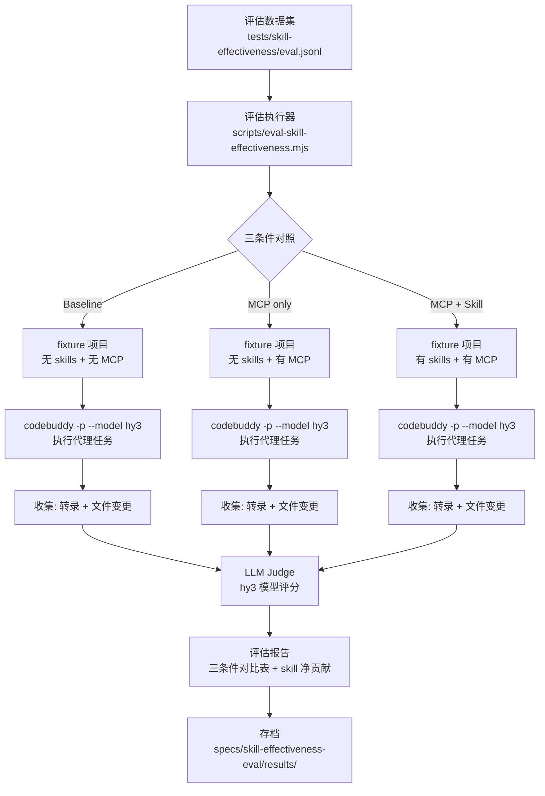

# 技术方案设计：Skill Effectiveness 端到端评估

## 架构



## 技术栈

| 组件 | 选型 | 理由 |
|------|------|------|
| 代理执行 | CodeBuddy CLI headless（`codebuddy -p --model hy3-ioa`） | CI 中已有，hy3 免费，`--output-format json` 可收集转录 |
| LLM judge | 同一 hy3 模型，不同 prompt | 免费，无需额外平台 |
| fixture 项目 | 最小可运行项目模板（package.json + 入口文件 + TODO） | 隔离三条件，可复现 |
| 评估脚本 | Node.js（复用 eval-skill-inject.mjs 框架） | 与现有评估体系一致 |
| CI | GitHub Actions workflow（cron + workflow_dispatch） | 不每 PR 跑，成本控制 |

## 核心设计

### 1. 评估数据集设计

文件：`tests/skill-effectiveness/eval.jsonl`

```json
{
  "id": "pg-rls",
  "scenario": "PostgreSQL RLS",
  "prompt": "创建一个 articles 表，包含 title、content、created_at 字段，并设置行级安全策略，让用户只能读写自己的数据。用户身份通过 JWT 的 sub 字段标识。",
  "fixtureDir": "tests/skill-effectiveness/fixtures/pg-rls",
  "primaryRequirements": [
    "创建了 articles 表，包含 title、content、created_at 字段",
    "表有 owner 列（DEFAULT auth.uid()），用于标识数据归属",
    "启用了 RLS（ALTER TABLE articles ENABLE ROW LEVEL SECURITY）",
    "创建了 SELECT 策略（USING (owner = auth.uid())）",
    "创建了 INSERT 策略（WITH CHECK (owner = auth.uid())）"
  ],
  "secondaryRequirements": [
    "使用了 managePgDatabase(action=\"applyMigration\") 而非 manageMysqlDatabase",
    "owner 列用 DEFAULT auth.uid()，INSERT 时不手动传 owner",
    "没有使用 _openid（这是 NoSQL 概念，PG 不适用）",
    "没有使用 db.collection()（NoSQL API）"
  ],
  "skillsExpected": ["postgresql-development"],
  "category": "database",
  "differentiator": "baseline 会建表但不知道 PG 要用 auth.uid() + RLS；MCP only 可能用 MySQL API 或 _openid；只有 skill 知道 PG 的正确安全模式"
}
```

### 2. Case 设计原则

好的 case 必须满足三个条件：

1. **baseline 能完成基础部分** — 代理训练数据中有足够的知识完成基本任务（如建表、写表单）。如果三条件都是 0 分，case 无法区分 skill 的贡献。
2. **CloudBase 特有要求只有读 skill 才会知道** — 这是区分点。如 `security_invoker`、`auth.uid()`、`scf_bootstrap`、安全域名检查等，训练数据中不会有。
3. **有客观证据可验证** — SQL 语句、工具调用记录、配置文件内容，LLM judge 能直接检查。

### 3. 五个核心场景详细设计

#### Case 1: `pg-rls` — PostgreSQL 行级安全

| 维度 | 设计 |
|------|------|
| **Prompt** | "创建一个 articles 表，包含 title、content、created_at 字段，并设置行级安全策略，让用户只能读写自己的数据。用户身份通过 JWT 的 sub 字段标识。" |
| **baseline 能做什么** | 建表 SQL（CREATE TABLE articles...），可能加个 user_id 列 |
| **CloudBase 特有要求** | ① owner 列用 `DEFAULT auth.uid()` 而非手动传 ② 必须 `ENABLE ROW LEVEL SECURITY` ③ SELECT 策略用 `USING (owner = auth.uid())` ④ INSERT 策略用 `WITH CHECK` ⑤ 用 `managePgDatabase` 而非 `manageMysqlDatabase` |
| **区分点** | baseline 不知道 `auth.uid()` 函数；MCP only 可能用 MySQL API 或 `_openid`；只有 skill 知道 PG 正确的安全模式 |
| **Primary 验证** | 表结构 + owner 列 + RLS 启用 + SELECT/INSERT 策略 |
| **Secondary 验证** | 用对 managePgDatabase + DEFAULT auth.uid() + 没用 _openid + 没用 db.collection |
| **Fixture** | 空 Vite 项目 + `src/lib/db.js`（含 TODO） |

#### Case 2: `web-auth` — Web 用户名密码登录

| 维度 | 设计 |
|------|------|
| **Prompt** | "实现一个 Web 登录页面，用户名是 admin（非邮箱格式），密码是 admin123。用 CloudBase 认证。" |
| **baseline 能做什么** | 写一个 HTML 登录表单 + 基本的提交逻辑 |
| **CloudBase 特有要求** | ① 用户名非邮箱格式 → 必须用 `usernamePassword` 而非 `emailPassword` ② 必须先 `queryAppAuth(action="getLoginConfig")` 检查 provider 状态 ③ 如果未启用，先 `manageAppAuth(action="patchLoginStrategy", patch={usernamePassword: true})` ④ 登录用 `auth.signInWithPassword({username, password})` 而非 `signInWithEmailAndPassword` ⑤ 不能用 `signUpWithEmailAndPassword` |
| **区分点** | baseline 会写表单但不知道 CloudBase 的 provider 配置流程；MCP only 有工具但不知道 usernamePassword 和 emailPassword 的区别；只有 skill 知道"非邮箱格式 → usernamePassword"这个判断 |
| **Primary 验证** | 登录页面实现 + provider 启用 + 登录 API 调用正确 |
| **Secondary 验证** | 先 query 再 patch 的顺序 + 用 signInWithPassword 而非 Email 方法 + 没用 signUpWithEmailAndPassword |
| **Fixture** | Vite + React 项目 + `src/pages/Login.jsx`（含 TODO） |

#### Case 3: `storage-upload` — 前端文件上传

| 维度 | 设计 |
|------|------|
| **Prompt** | "实现一个前端图片上传功能，用户选择图片后上传到 CloudBase 云存储，上传成功后显示图片预览。" |
| **baseline 能做什么** | 写一个 file input + 预览逻辑 |
| **CloudBase 特有要求** | ① 必须先检查安全域名 `envQuery(action="domains")` ② 如果当前 host:port 不在白名单，必须 `envDomainManagement(action="create")` 添加 ③ 上传用 `app.uploadFile()` 或 `app.storage.from()` ④ 上传后要保存返回的 `fileID` ⑤ 上传失败不能静默跳过后续操作（如 DB 插入） |
| **区分点** | baseline 会写 file input 但不知道安全域名检查；MCP only 有工具但不知道要先检查 domains；只有 skill 知道"本地 dev server 的 host:port 需要加入白名单" |
| **Primary 验证** | 上传功能实现 + 安全域名检查 + fileID 保存 |
| **Secondary 验证** | 用了 envQuery(action="domains") + 失败处理 + 没有静默跳过 |
| **Fixture** | Vite 项目 + `src/components/Upload.jsx`（含 TODO） |

#### Case 4: `http-function` — HTTP 云函数

| 维度 | 设计 |
|------|------|
| **Prompt** | "创建一个 HTTP 云函数，接收 POST 请求，返回 JSON 格式的 {success: true, data: ...}。" |
| **baseline 能做什么** | 写一个 Node.js HTTP 服务 |
| **CloudBase 特有要求** | ① 必须有 `scf_bootstrap` 文件 ② 必须监听端口 `9000` ③ Node.js 用原生 `http.createServer((req, res) => {...})` 而非 `exports.main` ④ 必须手动解析 `req.url` 和请求体（流式） ⑤ 用 `manageFunctions(action="createFunction")` 部署 |
| **区分点** | baseline 会写 HTTP 服务但不知道 scf_bootstrap 和端口 9000；MCP only 有工具但不知道 Event 函数和 HTTP 函数的区别；只有 skill 知道 HTTP 函数的正确结构 |
| **Primary 验证** | scf_bootstrap 存在 + 端口 9000 + 返回 JSON |
| **Secondary 验证** | 用 http.createServer 而非 exports.main + 手动解析请求体 + 用 manageFunctions 部署 |
| **Fixture** | 空目录 + `cloudfunctions/api/`（含 TODO） |

#### Case 5: `nosql-rules` — NoSQL 安全规则

| 维度 | 设计 |
|------|------|
| **Prompt** | "创建一个 posts 集合，配置安全规则：所有登录用户可读，只有创建者可写。用 CloudBase 文档数据库。" |
| **baseline 能做什么** | 可能写前端权限检查代码（如 if userId === post.author） |
| **CloudBase 特有要求** | ① 安全规则是"验证器"不是"过滤器"——写入时验证，读取时不过滤 ② 用 `managePermissions(resourceType="noSqlDatabase")` 配置规则 ③ 规则中用 `auth.openid` 标识用户 ④ 不能在前端代码中硬编码权限检查（应由安全规则保障） ⑤ 集合创建用 `writeNoSqlDatabaseStructure` |
| **区分点** | baseline 会在前端做权限检查（错误做法）；MCP only 可能用错的 resourceType；只有 skill 知道"验证器 vs 过滤器"的区别和安全规则的正确配置方式 |
| **Primary 验证** | 集合创建 + 安全规则配置 + 规则逻辑正确（读放开、写限制创建者） |
| **Secondary 验证** | 用了 managePermissions + 用 auth.openid + 没有前端硬编码权限 + 理解验证器模式 |
| **Fixture** | Vite 项目 + `src/lib/db.js`（含 TODO） |

### 4. Case 区分度预期

每个 case 在三条件下的预期表现：

| Case | Baseline 预期 | MCP only 预期 | MCP + Skill 预期 | 区分度 |
|------|--------------|---------------|-----------------|--------|
| pg-rls | 建表但无 RLS / 用 _openid | 可能用 MySQL API / 有 RLS 但策略错 | 正确用 auth.uid() + RLS + 策略 | **高** |
| web-auth | 写表单但用 email 登录 | 有工具但不知 usernamePassword | 先 query → patch → signInWithPassword | **高** |
| storage-upload | 写 file input 但无域名检查 | 有工具但不知先查 domains | 先 envQuery → envDomainManagement → uploadFile | **中** |
| http-function | 写 HTTP 服务但无 scf_bootstrap | 有工具但用 exports.main | scf_bootstrap + 端口 9000 + http.createServer | **高** |
| nosql-rules | 前端硬编码权限检查 | 可能用错的 resourceType | managePermissions + 验证器模式 | **中** |

区分度为"中"的 case（storage-upload、nosql-rules）如果实际跑出来三条件差异不明显，可在后续迭代中调整 prompt 或验证标准。

### 5. fixture 项目设计

每个场景一个最小项目模板，目录结构：

```
tests/skill-effectiveness/fixtures/pg-rls/
├── package.json          # 最小依赖
├── src/
│   └── lib/
│       └── db.js         # 入口文件，含 TODO 标记
├── README.md             # 场景说明
└── .expected/            # 预期结果（供 judge 参考）
    ├── schema.sql        # 预期的 SQL 结构
    └── policy.sql        # 预期的 RLS 策略
```

fixture 设计原则：
- **最小化**：只包含任务所需的最小文件，不干扰代理判断
- **有 TODO 标记**：用 `// TODO: ...` 明确标记代理需要完成的位置
- **有 .expected 目录**：存放预期结果（SQL、配置等），供 LLM judge 参考
- **无 CloudBase 依赖**：fixture 项目本身不预装 @cloudbase/js-sdk，让代理决定如何安装

### 4. 三条件对照实现

通过 fixture 项目的不同配置实现条件隔离：

```
条件 1: Baseline（无 skills + 无 MCP）
  fixture 项目/
  ├── package.json
  ├── src/index.js
  └── （无 .mcp.json，无 .codebuddy/skills/）

条件 2: MCP only（无 skills + 有 MCP）
  fixture 项目/
  ├── package.json
  ├── src/index.js
  └── .mcp.json           # 配置 cloudbase MCP server

条件 3: MCP + Skill（有 skills + 有 MCP）
  fixture 项目/
  ├── package.json
  ├── src/index.js
  ├── .mcp.json           # 配置 cloudbase MCP server
  └── .codebuddy/skills/  # 复制相关 SKILL.md 文件
      └── postgresql-development/SKILL.md
```

**关键点**：
- 条件 3 的 skills 通过复制 SKILL.md 到 `.codebuddy/skills/` 实现，不依赖 hooks
- 这测试的是"skill 内容本身是否有用"，不是"hooks 注入是否有效"
- hooks 注入效果已有 `eval:skill-inject` 评估（F1=0.93），不需要重复

### 5. 代理执行流程

每个场景每个条件执行一次：

```bash
# 复制 fixture 到临时目录
cp -r tests/skill-effectiveness/fixtures/pg-rls /tmp/eval/pg-rls-baseline

# 如果是 MCP + Skill 条件，复制 skills
cp -r config/source/skills/postgresql-development /tmp/eval/pg-rls-skill/.codebuddy/skills/

# 如果是 MCP only 或 MCP + Skill 条件，配置 MCP
cat > /tmp/eval/pg-rls-mcp/.mcp.json << 'EOF'
{
  "mcpServers": {
    "cloudbase": {
      "command": "npx",
      "args": ["@cloudbase/cloudbase-mcp@latest"]
    }
  }
}
EOF

# 执行代理
cd /tmp/eval/pg-rls-baseline
codebuddy -p "$(cat prompt.txt)" -y --output-format json --permission-mode acceptEdits --model hy3-ioa > result.json 2>&1

# 收集结果
# - result.json: 代理转录
# - git diff: 文件变更（在执行前 git init && git add -A && git commit）
```

**超时控制**：单次执行 timeout 1200s（20 分钟），与 issue-auto-processor 一致。

### 6. LLM Judge 设计

用 hy3 模型作为 judge，输入代理的转录和文件变更，输出评分。

**Judge prompt 模板**：

```
你是一个代码审查专家。请评估 AI 代理完成以下任务的质量。

## 用户任务
{prompt}

## 评估标准

### 主要需求（核心交付物）
{primaryRequirements}

### 次要需求（安全检查、工作流合规）
{secondaryRequirements}

## 代理输出
### 代理转录
{agentTranscript}

### 文件变更
{fileDiff}

## 评估要求
1. 检查具体证据（SQL 语句、工具调用、代码文件），不要只看代理说"我会做"
2. 对每个需求判断"通过"或"未通过"，并引用具体证据
3. 如果无法判断，标注"不确定"

## 输出格式（JSON）
{
  "score": 0-100,
  "primaryResults": [
    { "requirement": "...", "passed": true/false, "evidence": "..." }
  ],
  "secondaryResults": [
    { "requirement": "...", "passed": true/false, "evidence": "..." }
  ],
  "overallAssessment": "..."
}
```

**Judge 执行**：

```bash
codebuddy -p "$(cat judge-prompt.txt)" -y --output-format json --model hy3-ioa > judge-result.json
```

### 7. 评估报告格式

输出到 `specs/skill-effectiveness-eval/results/{date}.md`：

```markdown
# Skill Effectiveness 评估报告 - 2026-07-16

## 总览

| 场景 | Baseline | MCP only | MCP + Skill | Skill 净贡献 |
|------|----------|----------|-------------|-------------|
| PG RLS | 40% | 60% | 80% | +20% |
| Web Auth | 30% | 50% | 70% | +20% |
| Storage Upload | 35% | 55% | 75% | +20% |
| HTTP Function | 45% | 65% | 85% | +20% |
| NoSQL Rules | 40% | 60% | 80% | +20% |
| **平均** | **38%** | **58%** | **78%** | **+20%** |

## 详细结果

### PG RLS
#### Baseline
- Score: 40/100
- 主要需求: 1/3 通过
- 次要需求: 0/3 通过
- 问题: 未启用 RLS，使用了 NoSQL API

#### MCP only
- Score: 60/100
...

#### MCP + Skill
- Score: 80/100
...
```

### 8. CI Workflow 设计

文件：`.github/workflows/skill-effectiveness-eval.yml`

```yaml
name: Skill Effectiveness Evaluation

on:
  schedule:
    - cron: '0 3 */14 * *'  # 每 2 周凌晨 3 点
  workflow_dispatch:         # 手动触发

jobs:
  evaluate:
    runs-on: ubuntu-latest
    timeout-minutes: 120
    env:
      CODEBUDDY_AUTH_TOKEN: ${{ secrets.CODEBUDDY_AUTH_TOKEN }}
      CODEBUDDY_API_KEY: ${{ secrets.CODEBUDDY_API_KEY }}
      CODEBUDDY_INTERNET_ENVIRONMENT: ${{ vars.CODEBUDDY_INTERNET_ENVIRONMENT }}
    steps:
      - uses: actions/checkout@v4
      - uses: actions/setup-node@v4
        with:
          node-version: '20'
      - run: npm ci
      - run: npm install -g @tencent-ai/codebuddy-code@latest
      - name: Run evaluation
        run: node scripts/eval-skill-effectiveness.mjs
      - name: Archive results
        uses: actions/upload-artifact@v4
        with:
          name: eval-results-${{ github.run_id }}
          path: specs/skill-effectiveness-eval/results/
```

## 成本估算

| 项目 | 数量 | 单次耗时 | 总耗时 |
|------|------|---------|--------|
| 代理执行 | 5 场景 × 3 条件 = 15 次 | ~10-20 分钟 | ~2.5-5 小时 |
| LLM judge | 15 次 | ~2-5 分钟 | ~30-75 分钟 |
| 总计 | 30 次调用 | | ~3-6 小时 |

- hy3 模型免费，无 API 费用
- CI 并行执行可缩短（3 个 job 并行 = ~1-2 小时）
- timeout 设为 120 分钟（2 小时），并行模式下足够

## 测试策略

1. **单元测试**：评估脚本逻辑（数据集解析、结果对比、报告生成）
2. **集成测试**：用 1 个场景跑完整流程，验证脚本不报错
3. **冒烟测试**：CI 手动触发跑 1 个场景，确认端到端可用
4. **首次 baseline**：5 个场景全跑，记录基线数据

## 安全性

1. **认证隔离**：CI 使用 `CODEBUDDY_AUTH_TOKEN`，不暴露到日志
2. **fixture 隔离**：评估在临时目录执行，不污染项目源码
3. **MCP 隔离**：评估用 MCP 连接的是测试环境，不是生产环境
4. **结果脱敏**：报告中不包含敏感信息（token、envId 等）

## 风险与缓解

| 风险 | 缓解措施 |
|------|---------|
| codebuddy CLI 输出格式不稳定 | 复用 issue-auto-processor 的 `extract-result-text` 解析逻辑 |
| hy3 模型 judge 评分不稳定 | 同一结果跑 2 次 judge 取平均；低置信度结果标注人工复查 |
| 代理执行超时 | 单次 timeout 1200s；超时记为 0 分并标注 |
| fixture 项目 MCP 连接失败 | 执行前验证 MCP 可用性，失败时跳过并标注 |
| 三条件隔离不彻底 | fixture 目录完全独立，执行前 `git clean` |

## 实施计划

1. **Phase 1**：创建评估数据集 + fixture 项目模板（5 个场景）
2. **Phase 2**：实现评估执行器脚本（`scripts/eval-skill-effectiveness.mjs`）
3. **Phase 3**：实现 LLM judge 脚本
4. **Phase 4**：手动跑 1 个场景验证端到端流程
5. **Phase 5**：跑完整 5 个场景，记录 baseline
6. **Phase 6**：CI workflow 接入

## 参考

- 需求文档：`specs/skill-effectiveness-eval/requirements.md`
- 现有评估脚本：`scripts/eval-skill-inject.mjs`
- CodeBuddy CLI headless 调用示例：`.github/workflows/issue-auto-processor-simple.yml:419`
- Supabase 评估方法论：https://supabase.com/blog/supabase-agent-skills#how-we-test-it
- OpenAI Agent Skills 评估框架：https://developers.openai.com/blog/eval-skills
