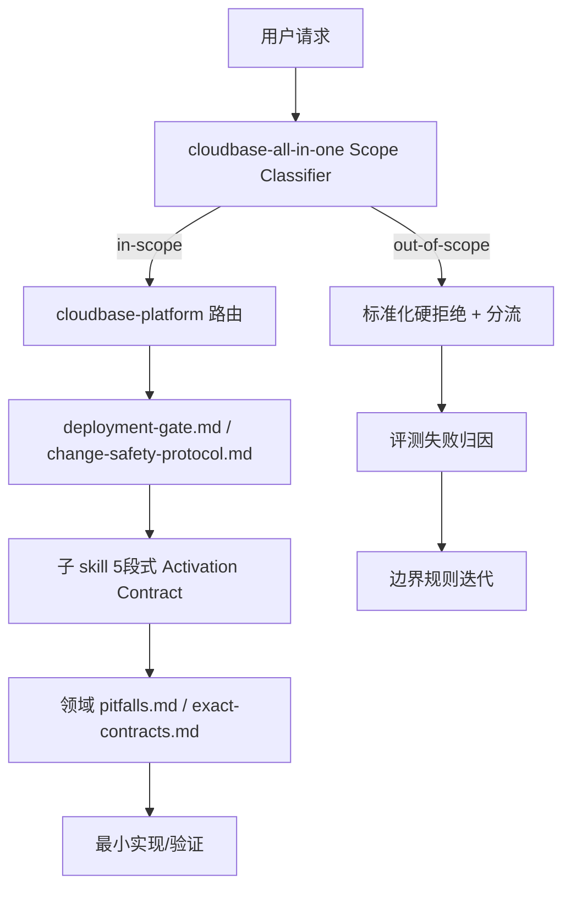

# 技术方案设计

## 设计目标

基于质量反馈报告（30 条负向对话提炼的 7 个 Skill 问题），本方案目标是**同时解决 4 个 P0 问题，并严格满足两个硬约束**：

- **熵减**：显著降低 Agent 决策不确定性（误路由、模糊前置条件、随意修补、无尽 correction 循环）。
- **Token 减**：所有改进必须通过结构化、复用、按需加载实现，典型任务的净 token 增量应为负或接近零。

核心思路不是“增加更多知识”，而是建立**极短、极硬、可复用的防御层**，让 Agent 在关键路径上更早做出正确决定、更少自由发挥。

## 设计原则（必须严格遵守）

1. **单一语义源**：所有改动以 `config/source/skills/` 为准，`config/.claude/skills/` 等为自动镜像。
2. **极致前置防御 + 早期退出**：把边界判定、部署门禁、变更安全做到最早位置，使用确定性语言。
3. **微协议复用**：高价值防御逻辑抽取为 <200 tokens 的独立文件，通过 1 行引用被多 skill 复用。
4. **表格与负面示例优先**：决策表、编号步骤、真实负面案例比长段落解释同时实现熵减和 token 减。
5. **Lazy Loading**：主 SKILL.md 只保留高信号 Activation Contract + 决策表 + 1 行引用，深度内容全部下沉到 references/。
6. **可验证**：方案必须能通过加载 token 对比 + 历史失败案例重放进行量化验证。

## 非目标

1. 不一次性重写所有子 skill 内容，只强化入口合同、协议引用和关键 gotcha。
2. 不修改构建脚本的整体打包策略（与 skill-activation-optimization 保持一致）。
3. 不引入运行时分类器或外部服务，全部通过静态规则 + 结构化 Markdown 实现。
4. P1 中的“非技术用户支持”和“复杂业务逻辑排查”暂不纳入本轮范围。

## 当前问题与约束映射

| 质量反馈问题 | 主要根因 | 熵减需求 | Token 减需求 | 本轮方案 |
|--------------|----------|----------|--------------|----------|
| #1 边界判断缺失 | 缺少硬拒绝规则 + 真实负面案例 | 早期明确 out-of-scope 判定 | 短决策表 + 负面示例 | 强化 Scope Classifier + 5 段式 Activation Contract |
| #2 部署前置条件缺失 | 知识分散、无统一前置检查 | 强制一次性前置声明 | 单一极小门禁文件 | 新增 `deployment-gate.md` + 1 行强制引用 |
| #3 SDK 精确知识不足 | 陷阱知识缺失或埋没 | 症状可精确匹配 | 陷阱卡片按需加载 | 新增/强化 `pitfalls.md`，主文件只留速查表 |
| #4 变更无影响评估与验证 | 缺少强制协议 | 结构化影响声明 + 升级条件 | 极短可复用协议 | 新增 `change-safety-protocol.md`（最高优先级） |

## 目标架构：轻量防御层 + 按需展开

新增两个核心微协议文件是本次设计的最小杠杆点。

## 核心交付物设计

### 1. change-safety-protocol.md（最高优先级，解决 #4）

**位置**：`config/source/skills/shared/change-safety-protocol.md`

**设计要点（严格控 token）**：
- 目标体积：120-160 tokens。
- 结构：4 步编号 + 1 条升级规则。
- 必须区分“微小修改”（可跳过）与“结构/逻辑/权限/接口变更”（强制）。
- 提供标准化“影响范围一句话声明”模板。
- 被 `cloudbase-all-in-one` 做极低成本内联支持（保证单 skill 环境也能生效）。

**预期效果**：把“400+轮纠错”“同一问题修5-8次”的 case 强制转化为“影响声明 → 确认 → 最小验证 → 超限根因分析”的确定路径。

### 2. deployment-gate.md（解决 #2）

**位置**：`config/source/skills/cloudbase-platform/deployment-gate.md`

**设计要点**：
- 目标体积：200-250 tokens。
- 按场景组织极简表格：静态托管 / CloudRun / 自定义域名 / 小程序上传 / Cloud Functions 公网 等。
- 每条只写：检查动作 | 不满足后果 | 建议动作。
- 提供“一句话前置声明”模板。
- 在 `cloudbase-platform`、`cloudbase-cli`、`cloud-functions` 的 Activation Contract 中增加 1-2 行强制引用。

**关键覆盖项**（来自报告）：
- 套餐版本功能差异（自定义域名、HTTP 服务最低要求）
- ICP 备案 + SSL 证书绑定
- CloudRun 端口一致性 + 健康检查 + scf_bootstrap
- 静态托管特殊配置（Content-Disposition 等）
- miniprogram-ci 上传 IP 白名单
- MCP 未配置时的引导

### 3. Scope Classifier + 统一 5 段式 Activation Contract（解决 #1）

**主入口强化**：
- 在 `config/source/skills/SKILL.md`（cloudbase-all-in-one）顶部增加极短 Scope Classifier 决策表。
- 明确列出 5-6 个必须硬拒绝的真实负面模式（报告中已有的 Conv 案例可匿名化后使用）。

**5 段式 Activation Contract 模板**（所有子 skill 逐步对齐）：
1. Use this first when（正向）
2. Hard exclusions + 必须拒绝场景（含 1-2 真实负面案例）
3. Mandatory next read（精确文件路径 + standalone fallback）
4. Common mistakes / gotchas（高频真实坑）
5. One-line refusal / handoff template

此模板在现有 Activation Contract 基础上仅增加有限 token，但大幅提升熵减能力。

### 4. 精确知识的低 token 组织方式（解决 #3 + #6）

- 推荐在高频领域（cloud-functions、auth-tool、no-sql-*、miniprogram-development、ai-model-*）新增或强化 `references/pitfalls.md` 或 `exact-contracts.md`。
- 严格卡片格式：Symptom（现象）→ Root Cause（1-2句）→ Correct Pattern → Quick Verification。
- 主 SKILL.md 只保留“高频陷阱速查表”（6-8 条），点击即跳转。

小程序方向优先补充：可选链兼容性、TDesign ::after 机制、Canvas + 云存储权限、小游戏特有坑。

## 实施优先级与分层

**P0（本轮必须完成）**：
- change-safety-protocol.md + 在关键 skill 落地引用
- Scope Classifier + 5 段式模板在 cloudbase-all-in-one 和 cloudbase-platform 落地
- deployment-gate.md + 强制引用

**P1（可并行或后续）**：
- 各领域 pitfalls 卡片补充（优先小程序 + 认证 + 云函数）
- 历史失败案例到边界规则的沉淀机制

## 风险与缓解

- **风险**：协议过于刚性影响简单任务体验。
  - **缓解**：明确“微小修改”豁免规则；协议本身极短，不会显著增加 token。
- **风险**：新增文件在纯 one-skill 安装场景加载不到。
  - **缓解**：在 Standalone Install Note 中说明 fallback 路径；核心协议在主要入口做最小内联兜底。
- **风险**：与 skill-activation-optimization 产生冲突。
  - **缓解**：本次设计完全兼容其“强化入口合同、不改打包策略”的原则，可视为其在质量反馈驱动下的具体落地扩展。

## 验证策略

1. **Token 量化**：对比典型 CloudBase 任务（Web 登录 + 数据库 + 部署）在改动前后的加载 token 数。
2. **熵减量化**：用报告中的典型 Conv ID 案例重放，统计：
   - 误路由在第一轮就被识别的比例
   - 同一根因问题迭代次数分布（目标 ≥3 次 case 大幅下降）
   - 部署类任务是否在开始前输出完整前置声明
3. **定性审查**：由维护者 + 评测团队共同 review 新协议和边界规则的实际执行效果。

## 与现有工作的关系

- 本方案是 `specs/skill-activation-optimization/` 的自然延续和质量反馈驱动的具体落地。
- 共享“强化 Activation Contract、优先入口与 gotcha、不改整体打包策略”的设计原则。
- 新增的两个微协议文件可被未来更多场景复用，形成长期防御资产。
- 我们在 `cloudbase-all-in-one` 和各实现 skill 中植入的 guardrails（Change Safety Protocol + Deployment Gate）是该 spec 中“must-read”和“高价值约束”理念的进一步具体化。

本次设计以最小新增文件 + 精准引用方式，在严格的熵减和 token 减约束下，系统性解决质量反馈中的核心痛点。
