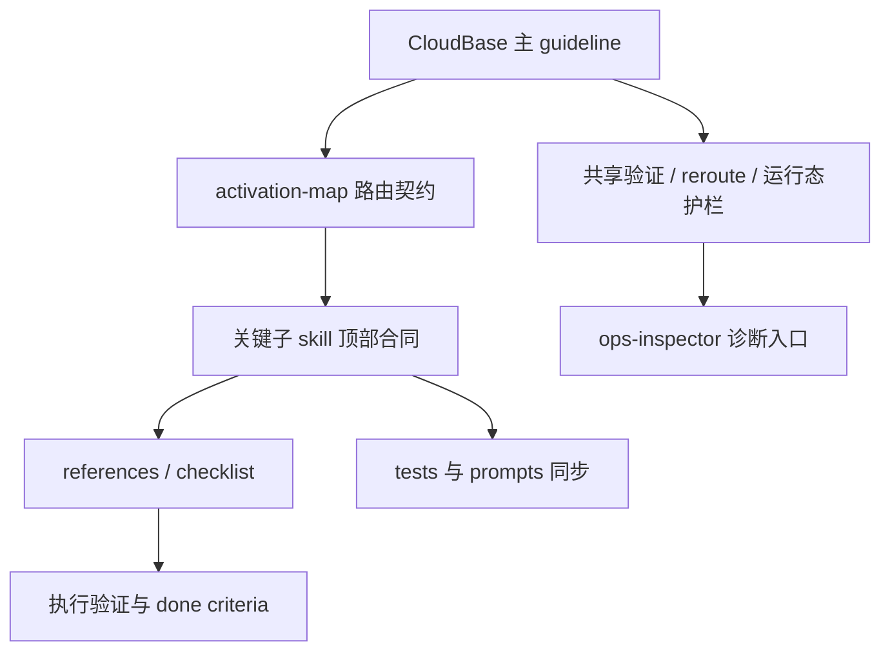

# 技术方案设计

## 概述

本方案在现有 CloudBase skills collection 上做增量改造，目标是以最小扩散成本提升高频场景下的执行稳定性。核心做法不是新增平行 skill 框架，而是把共性护栏收敛到主 guideline 与 routing contract，再让关键子 skill 通过浅层 `references/` 与 `checklist.md` 承接场景化执行。

本轮聚焦三个方向：

1. 给核心 skill 增加可执行验证闭环
2. 给主 guideline 与关键 skill 增加任务拆分 / reroute / 路由决策入口
3. 给高风险场景增加最小运行态风险护栏

## 设计目标

- 提高 Agent 在 Web、云函数、HTTP API、小程序场景下的 first-read 正确率
- 让“改完如何验证”成为可执行合同，而不是弱提醒
- 在不增加主 `SKILL.md` 体积失控的前提下强化运行态意识
- 保持 repo-managed CloudBase source skills 的 frontmatter、边界、fallback、渐进披露与测试契约一致

## 非目标

- 不重写整个 skills collection
- 不手改 `config/.claude/skills/`、`.generated/compat-config/` 或其他兼容镜像
- 不扩大到数据库专项重构或全量 prompts 重做
- 不改变 all-in-one / compat 的整体构建机制，只在 source 与必要产物层做同步

## 现状分析

### 1. 验证闭环分散但不够强

- `web-development` 已有 `browser-testing.md`，但主 skill 对“何时必须验证、何时才能算完成”的表达还可以更硬。
- `cloud-functions` 与 `http-api` 已有 `checklist.md`，但当前更偏实现前检查，交付前验证与运行态观察还不够完整。
- `miniprogram-development` 已把 CloudBase 集成拆到 `references/cloudbase-integration.md`，但缺少对应的预览调试 reference，导致链路不闭合。

### 2. 路由合同已存在，但子 skill 仍可进一步收束

- `config/source/guideline/cloudbase/activation-map.yaml` 已提供稳定 skill id 的路由契约。
- `config/source/guideline/cloudbase/SKILL.md` 已有高优先级场景路由表。
- 但核心子 skill 还可以进一步对齐“何时 first-read / 何时 reroute / 何时不要继续往下写”的合同强度。

### 3. 运行态护栏缺少统一落点

- `ops-inspector` 已承接诊断与巡检，但与开发类 skill 的交接条件还可以更明确。
- 函数访问路径、HTTP API 高风险调用、小程序预览/发布后的观察步骤，需要形成更直接的跳转或 done criteria。

## 设计原则

1. **单一语义源**
   - 共享规则优先写进 `config/source/guideline/cloudbase/SKILL.md` 与 `activation-map.yaml`
   - 子 skill 仅保留本地场景判断与最小提醒

2. **渐进披露优先**
   - 主 `SKILL.md` 保持短、硬、可路由
   - 深层验证步骤与运行态观察优先进入 `references/` 或 `checklist.md`

3. **契约可测试**
   - 通过 `tests/skill-quality-standards.test.js` 与 `tests/skill-activation-routing.test.js` 锁定关键边界、reference 存在性和护栏语义

4. **对外语义同步**
   - 如果 source skill 文案语义变化触发 prompts 产物差异，则同步更新 `doc/prompts/*.mdx`

## 目标结构

## 文件改造策略

### 1. 主 guideline 与 activation map

#### `config/source/guideline/cloudbase/SKILL.md`

新增或强化以下内容：

- 对复杂跨模块任务的 reroute 提醒，明确何时先走 `spec-workflow`
- 对验证闭环的全局原则说明，例如不同平台改动必须完成对应最小验证
- 对运行态风险的全局提示，例如访问路径、权限、日志、预览结果和 smoke 检查
- 与 `ops-inspector` 的切换条件

#### `config/source/guideline/cloudbase/activation-map.yaml`

对高频场景的 `beforeAction`、`commonMistakes`、必要时的 `thenRead` 做小范围增强，使任务拆分入口与运行态提醒可测试。

### 2. 核心子 skill

#### `web-development/SKILL.md`

- 强化“已有设计 vs 需要先设计”的判断
- 引入更明确的 spec reroute 条件
- 明确改完后要通过 `browser-testing.md` 复测关键流
- 把运行态护栏限制在 Web 相关的 smoke / interaction / route 级别

#### `cloud-functions/SKILL.md`

- 在 Event / HTTP 分流后增加交付前验证动作
- 强化 HTTP 函数访问路径、权限、日志观察提醒
- 明确何时需要切到 `ops-inspector`

#### `http-api/SKILL.md`

- 收紧 raw HTTP API 与自建业务 HTTP 服务的边界
- 增加复杂跨模块需求走 `spec-workflow` 的 reroute 条件
- 把 OpenAPI 校验后的请求验证、鉴权与风险观察写成更明确的闭环

### 3. 小程序链路补齐

#### `miniprogram-development/SKILL.md`

- 强化 CloudBase 与非 CloudBase 场景分流
- 增加预览 / 调试 / 发布链路入口的清晰提示
- 明确复杂流程何时先做 spec

#### `miniprogram-development/references/devtools-debug-preview.md` [NEW]

提供以下内容：

- WeChat Developer Tools 的调试、预览、真机验证流程
- `project.config.json`、`appid`、`miniprogramRoot` 等检查项
- `miniprogram-ci` 作为无 DevTools 的替代路径
- 发布前 / 修改后最小验证清单与常见误区

### 4. 运行态护栏收束

#### `ops-inspector/SKILL.md`

- 明确它是运行态诊断落点，而不是开发实现入口
- 增加“哪些开发类 skill 触发后应转诊断”的规则描述

#### 相关 `checklist.md` / `browser-testing.md` / `cloudbase-integration.md`

- 增加更可执行的 done criteria
- 增加验证记录或观察要点
- 保证运行态提醒与主 guideline 一致，但不重复大段共性规则

## 测试策略

### 1. 质量测试

扩展 `tests/skill-quality-standards.test.js`：

- 断言新增 reference 文件存在
- 断言关键 skill 含有验证闭环、spec reroute 或运行态护栏的关键文案
- 断言小程序 skill 仍保持平台边界正确

### 2. 路由测试

必要时扩展 `tests/skill-activation-routing.test.js`：

- 锁定高频场景的 `firstRead`、`doNotUse` 和关键 `beforeAction`
- 确保新增或增强的路由语义不漂移

### 3. Prompts 同步

- 修改 source skill 后检查 `doc/prompts/web-development.mdx`
- 检查 `doc/prompts/cloud-functions.mdx`
- 检查 `doc/prompts/http-api.mdx`
- 检查 `doc/prompts/miniprogram-development.mdx`
- 若需要，执行 `node scripts/generate-prompts-data.mjs && node scripts/generate-prompts.mjs`

## 风险与缓解

### 风险 1：共享规则再次被复制到多个 skill

- **缓解**：共性规则先写主 guideline；子 skill 只留本地化提醒和 reference 路由。

### 风险 2：新增 reference 后与主 skill 语义不一致

- **缓解**：用质量测试锁定 reference 存在性与关键语义，改动时同步审阅主 skill 与 reference。

### 风险 3：prompts 公开面与 source 语义漂移

- **缓解**：把 prompts 作为本轮末尾的同步检查面，必要时重新生成并提交差异。

## 实施顺序

1. 产出 `specs/skill-guardrails-upgrade/` 三份文档
2. 收敛主 guideline 与 activation map 的共性护栏
3. 改写 `web-development`、`cloud-functions`、`http-api`
4. 补齐 `miniprogram-development` 缺失 reference 并加强预览验证链路
5. 联动 `ops-inspector` 与 checklist 固化运行态观察规则
6. 更新测试与 prompts，同步检查漂移
