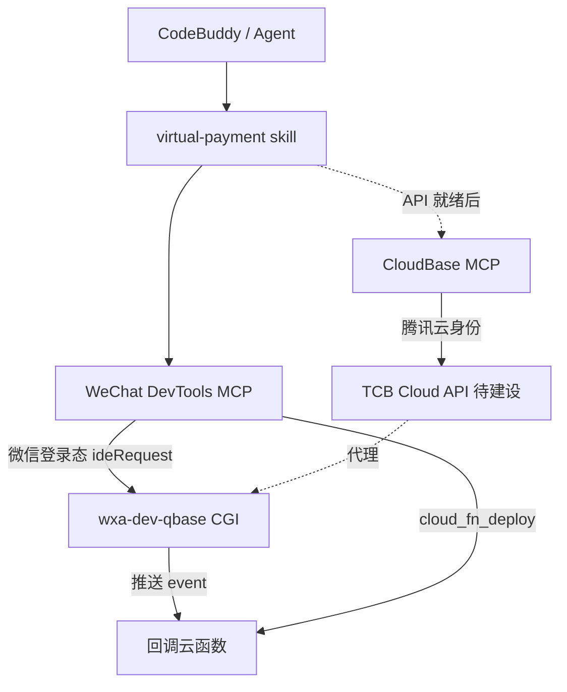

# 技术方案：虚拟支付消息推送 / 云调用 / 商户查询 MCP

## 1. 目标与非目标

**目标：** 让 agent 通过 MCP 批量、幂等地完成虚拟支付回调配置与 OpenAPI 绑定，并查询米大师应用信息；配套 skill。

**非目标（本阶段）：** 实现代码、微信公众平台商户后台自动化开户、普通微信支付下单流程改造。

## 2. 架构与分工



| 层 | 职责 |
| --- | --- |
| WeChat IDE Skills/MCP | **默认执行面**：消息推送、云调用、xpay 查询；登录=扫码 |
| CloudBase MCP | **补齐**：无 DevTools 时；依赖 TCB 代理 API |
| CloudBase Skills | 知识与顺序，不替代执行 |

依据：`config/source/skills/miniprogram-development/references/wxide-vs-cloudbase-mcp.md`。

## 3. 工具命名与参数风格

### 3.1 微信 IDE 暴露名（snake_case，≤30）

对齐 `main/.../mcp.config.ts` 与 `cloudbase-tools.ts`：

| 暴露名 | 语义 |
| --- | --- |
| `query_msg_push` | 查询消息推送配置 / 合法事件约束 |
| `manage_msg_push` | 订阅、删除、启停、切模式（写，需确认） |
| `query_cloud_call` | 查询云函数 OpenAPI 白名单 |
| `manage_cloud_call` | 绑定/解绑（写，需确认） |
| `query_xpay_config` | 查询虚拟支付商户/米大师信息（只读） |

公共入参：`appid: string`（必填，与现有 wechatide 一致）、`env`/`env_id`（环境 ID）。

CloudBase MCP 对齐名（API 就绪后）：

| CloudBase | 对齐 |
| --- | --- |
| `queryMessagePush` / `manageMessagePush` | ← msg push |
| `queryCloudCall` / `manageCloudCall` | ← cloud call |
| `queryVirtualPaymentConfig` | ← xpay config |

### 3.2 Schema 草案（Zod）

```ts
export const XPAY_EVENT_TYPES = [
  "xpay_goods_deliver_notify",
  "xpay_coin_pay_notify",
  "xpay_complaint_notify",
  "xpay_subscribe_signing_result_notify",
  "xpay_subscribe_pay_fail_notify",
  "xpay_subscribe_ios_refund_query_notify",
  "xpay_refund_notify",
] as const;

export const XPAY_OPENAPI_PATHS = [
  "/xpay/query_order",
  "/xpay/refund_order",
  "/xpay/query_user_balance",
  "/xpay/currency_pay",
  "/xpay/cancel_currency_pay",
  "/xpay/present_currency",
  "/xpay/notify_provide_goods",
  "/xpay/start_upload_goods",
  "/xpay/query_upload_goods",
  "/xpay/start_publish_goods",
  "/xpay/query_publish_goods",
  "/xpay/start_download_order",
  "/xpay/query_download_order",
  "/xpay/download_bill",
  "/xpay/download_ios_settlement_bill",
  "/xpay/create_withdraw_order",
  "/xpay/query_withdraw_order",
  "/xpay/query_biz_balance",
  "/xpay/get_complaint_list",
  "/xpay/response_complaint",
  "/xpay/complete_complaint",
  "/xpay/upload_vp_file",
] as const;

// query_msg_push
z.object({
  appid: z.string(),
  env: z.string().optional(),
  action: z.enum(["list", "listSupportedEvents"]),
});

// manage_msg_push
z.object({
  appid: z.string(),
  env_id: z.string(), // = envId
  function_name: z.string(),
  action: z.enum([
    "subscribe",      // default: all XPAY_EVENT_TYPES if event_types omitted
    "unsubscribe",
    "setEnable",      // enable/disable one or many
    "ensureCloudFunctionMode",
  ]),
  event_types: z.array(z.enum(XPAY_EVENT_TYPES)).optional(),
  enable: z.boolean().optional(), // setEnable
  confirm: z.boolean().optional(), // if host requires, mirror CloudBase write tools
});

// query_cloud_call
z.object({
  appid: z.string(),
  env_id: z.string(),
  function_name: z.string(),
  action: z.enum(["list"]),
});

// manage_cloud_call
z.object({
  appid: z.string(),
  env_id: z.string(),
  function_name: z.string(),
  action: z.enum(["bind", "unbind"]),
  api_list: z.array(z.enum(XPAY_OPENAPI_PATHS)).min(1),
  confirm: z.boolean().optional(),
});

// query_xpay_config
z.object({
  appid: z.string(),
  action: z.enum(["info"]).default("info"),
});
```

说明：

- `event_types` / `api_list` 在 description 中的固定取值 **必须** 使用 `z.enum`（项目 mcp_tool_schema_rules）
- 若产品允许订阅「constraints 内任意 event」（非仅 xpay），另增 `allow_any_supported_event: boolean` + `event_types: z.array(z.string())` 分支；默认关闭，避免 agent 误订全量

## 4. API 调用链

### 4.1 消息推送（已存在，IDE MCP 可封装）

| 步骤 | CGI | 备注 |
| --- | --- | --- |
| 读配置 | `POST .../getappconfig` `{type:1}` | 解析 `config.callbacks`，带 `version` |
| 读合法事件 | `POST .../route/getcallbacksupportlist` | 校验 xpay 七类均在列表中 |
| 写配置 | `POST .../uploadappconfig` | 全量 overwrite + version |
| 云托管模式 | `get/set containercallbackconfig` | `ensureCloudFunctionMode` 时设 `qbase_open:false` |

**幂等算法（subscribe）：**

1. GET list + version  
2. `targets = event_types ?? XPAY_EVENT_TYPES`  
3. 对每个 event：移除同 `(msgType=event, event)` 的旧条目；若已存在完全相同 env+function 则跳过添加  
4. 若集合无变化 → 直接成功（不 POST）  
5. 否则 POST overwrite，失败则提示 version conflict 并建议重试  

### 4.2 云调用

| 步骤 | 接口 | 状态 |
| --- | --- | --- |
| 读 | `POST .../getfuncconfig` `{func_name, env}` → `api_whitelist` | 已存在 |
| 写 | **待** `setfuncconfig` 或等价 | **缺口** |
| 降级 | 改本地 `config.json` `permissions.openapi` + `cloud_fn_deploy` | 评审可选 |

不要把 `usecloudaccesstoken`（云托管令牌）当成虚拟支付云函数绑定。

### 4.3 虚拟支付商户

| 步骤 | 接口 | 状态 |
| --- | --- | --- |
| 普通商户 | `getmchbyappid` / `getapplywxpaylist` / `getauthstate` | 已存在，**不可**冒充虚拟支付 |
| 米大师/xpay | **待** 查询 CGI / Cloud API | **缺口** |

UI：在 `globalsettings` 微信支付 Card 旁增加「虚拟支付」子区，数据源接新查询。

## 5. 鉴权边界

| 调用方 | 身份 | 可调 |
| --- | --- | --- |
| WeChat IDE MCP | 小程序开发者扫码 / IDE ticket | qbase CGI（与控制台相同） |
| CloudBase MCP | 腾讯云 API Key / 设备码 | 仅 TCB Cloud API；**禁止**直接打 `servicewechat.com` |
| Agent | 无独立密钥 | 只通过 MCP |

写操作：对齐 `cloudbase-tools.ts`，走用户确认（`runWithUserConfirmation`）。

## 6. 与 wxide CloudBase wrap 层关系

当前 `cloudbase-tools.ts` 只包装 `@cloudbase/cloudbase-mcp` 的 nosql/storage，且 `requestFn` 打 tcb。

**推荐：** 消息推送/云调用/xpay 作为 **wechatide 原生 tools**（与 `cloud_fn_deploy` 同层），不要塞进 `createCloudBaseToolDefs` 白名单，直到 CloudBase MCP 包内也有同名工具且存在 TCB API。

## 7. Agent skill 草案

路径建议：`config/source/skills/miniprogram-virtual-payment/SKILL.md`（源）  
配套 reference：工具参数表 + 回调云函数应答示例（验签、发货幂等）。

顺序（强制）：

1. 确认 AppID / envId / 虚拟支付已开通（`query_xpay_config`）  
2. `manage_msg_push(action=ensureCloudFunctionMode)`  
3. 创建回调云函数代码 → `cloud_fn_deploy`  
4. `manage_msg_push(action=subscribe)`（默认 7 事件）  
5. `manage_cloud_call(action=bind, api_list=[...])`  
6. 小程序端 `wx.requestVirtualPayment`（或文档现行 API）  
7. 云函数处理 notify，调用 `/xpay/notify_provide_goods` 等  

与现有 `cloudbase-wechat-integration`（普通微信支付/集成中心）分流：虚拟支付触发词走本 skill。

## 8. 测试策略

- 单测：幂等 merge、version 冲突、enum 拒绝非法 path  
- 契约测：mock qbase CGI body  
- e2e（阶段 4）：真实 AppID；扩展 wxide e2e 文档新分组  
- schema 生成：`scripts/tools.json` / `doc/mcp-tools.md`（CloudBase 侧）

## 9. 安全性

- 不在日志/返回中打印支付密钥、session_key  
- 写操作需确认  
- 不调用未文档化的公众平台管理接口  
- 云函数回调必须校验微信签名（skill 强制提醒）

## 10. 文档同步

- `doc/ide-setup/wechat-devtools.mdx`：增加虚拟支付 MCP 小节（实现后）  
- 分工文档：补充「支付回调配置属 IDE MCP」  
- 插件清单变更时按 `doc_freshness_rules` 检查
