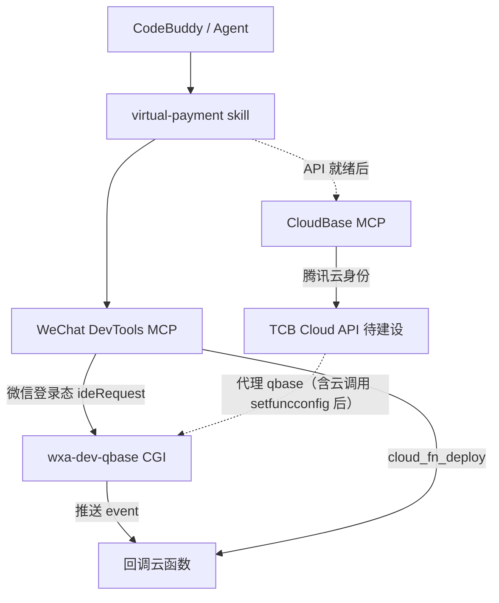

# 技术方案：消息推送配置 MCP（通用，微信 IDE 核心交付）

## 1. 目标与非目标

**目标：** 让 agent 通过微信开发者工具 MCP 批量、幂等地完成**消息推送配置**（通用工具 `cloud_msg_push_query` / `cloud_msg_push_manage`，虚拟支付 7 事件为默认场景）；云调用绑定与虚拟支付商户展示分别由**后端链路**与**控制台团队**承接；配套 skill。

**非目标（本阶段）：** 实现代码、微信公众平台商户后台自动化开户、普通微信支付下单流程改造、**微信 IDE MCP 的云调用工具（含只读，v1 不做，归属后端链路）**、**微信 IDE MCP 的虚拟支付商户查询工具（归属控制台团队）**。

## 2. 架构与分工



| 层 | 职责 |
| --- | --- |
| WeChat IDE Skills/MCP | **核心交付 = 消息推送配置**（通用，`cloud_msg_push_query` / `cloud_msg_push_manage`）；登录=扫码 |
| CloudBase MCP | **补齐 + 后端链路执行面**：消息推送对齐、云调用绑定（读+写，依赖 `setfuncconfig` 或等价）、虚拟支付商户只读查询（接口就绪后）；依赖 TCB 代理 API |
| 控制台（weda-alternative） | 虚拟支付商户展示 UI |
| CloudBase Skills | 知识与顺序，不替代执行 |

依据：`config/source/skills/miniprogram-development/references/wxide-vs-cloudbase-mcp.md`。
分工裁定：Booker 2026-08-20 —— 消息推送工具**通用化**（不限虚拟支付）；云调用绑定归属**微信云开发后端开发**，微信 IDE MCP 不提供任何云调用工具；虚拟支付商户展示归属**控制台团队**，微信 IDE MCP 不提供商户查询工具。

## 3. 工具命名与参数风格

### 3.1 微信 IDE 暴露名（snake_case，≤30）

对齐 `main/.../mcp.config.ts` 的 `EMcpToolName` 与 `cloudbase-tools.ts` 的 `EXPOSED_TOOL_NAME` 映射（内部 camelCase → 暴露 `cloud_*`）：

| 暴露名 | 语义 |
| --- | --- |
| `cloud_msg_push_query` | 查询消息推送配置 / 合法事件约束（通用，只读） |
| `cloud_msg_push_manage` | 订阅、删除、启停、切模式（写，需确认；通用事件，xpay 为默认集合） |

公共入参：`appid: string`（必填，与现有 wechatide 一致）、`env`/`env_id`（环境 ID）。

> **v1 边界（Booker 2026-08-20 裁定）：** 微信 IDE MCP **只提供消息推送两个工具**。云调用（含只读查询）与虚拟支付商户查询均不在微信侧范围——云调用归属后端链路（CloudBase MCP 承接），商户展示归属控制台团队。

CloudBase MCP 对齐名（API 就绪后）：

| CloudBase | 对齐 | 归属 |
| --- | --- | --- |
| `queryMessagePush` / `manageMessagePush` | ← msg push（通用） | 双端对齐（微信 IDE `cloud_msg_push_query`/`cloud_msg_push_manage`） |
| `queryCloudCall` / `manageCloudCall` | ← cloud call（读+写） | **后端链路主执行面**（微信 IDE 不提供） |

> **不做（Booker 2026-08-20 裁定）：** 虚拟支付商户查询工具（`queryVirtualPaymentConfig` / `query_xpay_config`）**从设计移除**——商户展示完全归属控制台（weda-alternative）团队，微信 IDE MCP 与 CloudBase MCP 均不提供该查询工具。

### 3.2 Schema 草案（Zod）

```ts
// 虚拟支付默认事件集合（event_types 缺省时使用）
export const XPAY_EVENT_TYPES = [
  "xpay_goods_deliver_notify",
  "xpay_coin_pay_notify",
  "xpay_complaint_notify",
  "xpay_subscribe_signing_result_notify",
  "xpay_subscribe_pay_fail_notify",
  "xpay_subscribe_ios_refund_query_notify",
  "xpay_refund_notify",
] as const;

// 云调用 OpenAPI 路径枚举（仅 CloudBase MCP 侧使用，微信 IDE 不涉及）
export const XPAY_OPENAPI_PATHS = [
  "/xpay/query_order",
  "/xpay/refund_order",
  "/xpay/query_user_balance",
  "/xpay/currency_pay",
  "/xpay/cancel_currency_pay",
  "/xpay/present_currency",
  "/xpay/notify_provide_goods",
  "/xpay/start_upload_goods",
  "/xpay/query_upload_goods",
  "/xpay/start_publish_goods",
  "/xpay/query_publish_goods",
  "/xpay/start_download_order",
  "/xpay/query_download_order",
  "/xpay/download_bill",
  "/xpay/download_ios_settlement_bill",
  "/xpay/create_withdraw_order",
  "/xpay/query_withdraw_order",
  "/xpay/query_biz_balance",
  "/xpay/get_complaint_list",
  "/xpay/response_complaint",
  "/xpay/complete_complaint",
  "/xpay/upload_vp_file",
] as const;

// cloud_msg_push_query —— 查询消息推送配置 / 合法事件约束（只读）
z.object({
  appid: z.string(),
  env: z.string().optional(),
  action: z.enum(["list", "listSupportedEvents"]),
});

// cloud_msg_push_manage —— 通用消息推送（不限于虚拟支付）
// event_types 省略 → 默认 XPAY_EVENT_TYPES（虚拟支付默认场景）
// event_types 传入 → 支持任意合法事件（由 listSupportedEvents 返回全量约束）
z.object({
  appid: z.string(),
  env_id: z.string(), // = envId
  function_name: z.string(),
  action: z.enum([
    "subscribe",      // default: XPAY_EVENT_TYPES if event_types omitted
    "unsubscribe",
    "setEnable",      // enable/disable one or many
    "ensureCloudFunctionMode",
  ]),
  event_types: z.array(z.string()).optional(), // 任意合法事件；缺省=xpay 默认集合
  enable: z.boolean().optional(), // setEnable
  confirm: z.boolean().optional(), // if host requires, mirror CloudBase write tools
});
```

> **微信 IDE MCP 仅暴露以上两个工具。** 云调用（`queryCloudCall`/`manageCloudCall`）为 CloudBase MCP 侧工具，API 就绪后注册，schema 草案如下（仅 CloudBase MCP 侧）：

```ts
// manage_cloud_call —— CloudBase MCP 侧（后端链路），setfuncconfig 或等价接口就绪后注册
// z.object({
//   appid/env_id/function_name: ...,
//   action: z.enum(["bind", "unbind"]),
//   api_list: z.array(z.enum(XPAY_OPENAPI_PATHS)).min(1),
//   confirm: z.boolean().optional(),
// });
```

> **不做（Booker 2026-08-20 裁定）：** 虚拟支付商户查询工具（`query_xpay_config` / `queryVirtualPaymentConfig`）已从设计移除，无 schema。

说明：

- `event_types` 用 `z.string()`（开放类型）并依赖 `listSupportedEvents` 提供合法集合；若产品要求强校验，可在服务端/调用时校验非法值并提示。**不要**用 `z.enum(XPAY_EVENT_TYPES)` 收窄——工具是通用的，xpay 只是默认集合（mcp_tool_schema_rules 第 2 条：枚举来自契约，非 xpay 事件同样是合法契约值）
- `api_list` 在 CloudBase MCP 侧 `manage_cloud_call` 中 **必须** 使用 `z.enum(XPAY_OPENAPI_PATHS)`（固定枚举，mcp_tool_schema_rules 第 1 条）

## 4. API 调用链

### 4.1 消息推送（已存在，IDE MCP 可封装）

| 步骤 | CGI | 备注 |
| --- | --- | --- |
| 读配置 | `POST .../getappconfig` `{type:1}` | 解析 `config.callbacks`，带 `version` |
| 读合法事件 | `POST .../route/getcallbacksupportlist` | 校验 xpay 七类均在列表中 |
| 写配置 | `POST .../uploadappconfig` | 全量 overwrite + version |
| 云托管模式 | `get/set containercallbackconfig` | `ensureCloudFunctionMode` 时设 `qbase_open:false` |

**幂等算法（subscribe）：**

1. GET list + version  
2. `targets = event_types ?? XPAY_EVENT_TYPES`（缺省=虚拟支付默认集合；传入则为任意合法事件）  
3. 对每个 event：移除同 `(msgType=event, event)` 的旧条目；若已存在完全相同 env+function 则跳过添加  
4. 若集合无变化 → 直接成功（不 POST）  
5. 否则 POST overwrite，失败则提示 version conflict 并建议重试  

### 4.2 云调用（后端链路，微信 IDE MCP 不提供任何工具）

| 步骤 | 接口 | 状态 | 归属 |
| --- | --- | --- | --- |
| 读 | `POST .../getfuncconfig` `{func_name, env}` → `api_whitelist` | 已存在 | CloudBase MCP 读 |
| 写 | **待** `setfuncconfig` 或等价 | **缺口** | **CloudBase MCP（后端链路）** |
| 降级 | 改本地 `config.json` `permissions.openapi` + `cloud_fn_deploy` | 评审可选 | 后端/CloudBase MCP |

不要把 `usecloudaccesstoken`（云托管令牌）当成虚拟支付云函数绑定。

### 4.3 虚拟支付商户（控制台团队负责，MCP 均不提供查询）

| 步骤 | 接口 | 状态 |
| --- | --- | --- |
| 普通商户 | `getmchbyappid` / `getapplywxpaylist` / `getauthstate` | 已存在，**不可**冒充虚拟支付 |
| 米大师/xpay | **待** 查询 CGI / Cloud API | **缺口** |

UI：控制台（weda-alternative）在 `globalsettings` 微信支付 Card 旁增加「虚拟支付」子区，数据源接新查询。**微信 IDE MCP 与 CloudBase MCP 均不提供商户查询工具**（Booker 2026-08-20 裁定）。

## 5. 鉴权边界

| 调用方 | 身份 | 可调 |
| --- | --- | --- |
| WeChat IDE MCP | 小程序开发者扫码 / IDE ticket | qbase CGI（与控制台相同） |
| CloudBase MCP | 腾讯云 API Key / 设备码 | 仅 TCB Cloud API；**禁止**直接打 `servicewechat.com` |
| Agent | 无独立密钥 | 只通过 MCP |

写操作：对齐 `cloudbase-tools.ts`，走用户确认（`runWithUserConfirmation`）。

## 6. 与 wxide CloudBase wrap 层关系

当前 `cloudbase-tools.ts` 只包装 `@cloudbase/cloudbase-mcp` 的 nosql/storage，且 `requestFn` 打 tcb。

**推荐：** 消息推送（`cloud_msg_push_query`/`cloud_msg_push_manage`）作为 **wechatide 原生 tools**（与 `cloud_fn_deploy` 同层），通过 `EXPOSED_TOOL_NAME` 映射暴露为 `cloud_*` 名；不要塞进 `createCloudBaseToolDefs` 白名单，直到 CloudBase MCP 包内也有同名工具且存在 TCB API。云调用绑定（`manage_cloud_call`）**不进入微信 IDE**，由 CloudBase MCP 承接（后端链路）。虚拟支付商户查询**不做**（归属控制台团队，Booker 2026-08-20 裁定）。

## 7. Agent skill 草案

路径建议：`config/source/skills/miniprogram-virtual-payment/SKILL.md`（源）  
配套 reference：工具参数表 + 回调云函数应答示例（验签、发货幂等）。

顺序（强制）：

1. 确认 AppID / envId / 虚拟支付已开通（控制台确认；微信侧无查询工具）  
2. `cloud_msg_push_manage(action=ensureCloudFunctionMode)`  
3. 创建回调云函数代码 → `cloud_fn_deploy`  
4. `cloud_msg_push_manage(action=subscribe)`（默认 7 事件；其他事件传入 `event_types`）  
5. 小程序端 `wx.requestVirtualPayment`（或文档现行 API）  
6. 云函数处理 notify，调用 `/xpay/notify_provide_goods` 等  
7. 云调用 OpenAPI 绑定（如需）→ **CloudBase MCP `manage_cloud_call`（后端链路，待 API 就绪）**，微信 IDE 侧不涉及  

与现有 `cloudbase-wechat-integration`（普通微信支付/集成中心）分流：虚拟支付触发词走本 skill。

## 8. 测试策略

- 单测：幂等 merge、version 冲突、enum 拒绝非法 path  
- 契约测：mock qbase CGI body  
- e2e（阶段 4）：真实 AppID；扩展 wxide e2e 文档新分组  
- schema 生成：`scripts/tools.json` / `doc/mcp-tools.md`（CloudBase 侧）

## 9. 安全性

- 不在日志/返回中打印支付密钥、session_key  
- 写操作需确认  
- 不调用未文档化的公众平台管理接口  
- 云函数回调必须校验微信签名（skill 强制提醒）

## 10. 文档同步

- `doc/ide-setup/wechat-devtools.mdx`：增加虚拟支付 MCP 小节（实现后）  
- 分工文档：补充「支付回调配置属 IDE MCP」  
- 插件清单变更时按 `doc_freshness_rules` 检查
